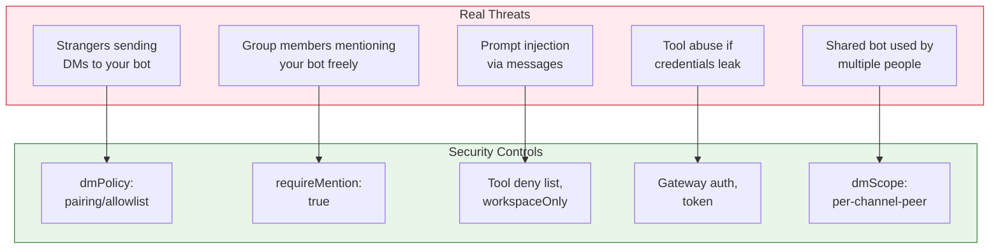
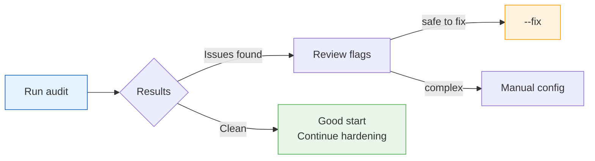
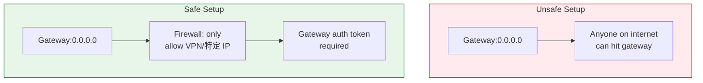
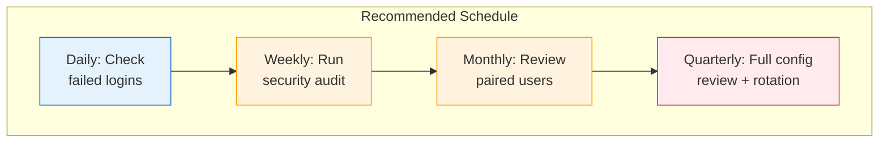
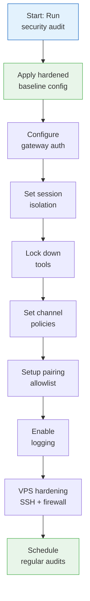

# OpenClaw Security Hardening Checklist
## Lock Down Your Gateway in 60 Seconds, Then Go Deeper

> **Reading Time:** 14 minutes
> **Difficulty:** Beginner to Intermediate
> **Gateway:** OpenClaw v2025+

---

## Why This Guide Exists

OpenClaw connects frontier AI models to real messaging apps and real tools. That is powerful. It is also a responsibility.

This guide is not about paranoia. It is about being deliberate. Who can message your bot. Where the bot can act. What the bot can touch.

The official docs explain the trust model clearly: OpenClaw assumes **one trusted operator per gateway**. If you need hostile-user isolation, you split by trust boundary.

Most people running OpenClaw are solo operators. This guide is written for that reality. We will start with the quick wins, then go deeper into each layer.

All commands and configs are verified against the official OpenClaw documentation at docs.openclaw.ai.

---

## The Threat Model in Plain Language

Before hardening anything, you need to understand what you are actually protecting against.



The goal is not a perfectly secure setup. There is no such thing. The goal is to make each access decision intentional.

---

## Step 1: Run the Security Audit (30 Seconds)

The fastest thing you can do right now is run the built-in audit:

```bash
openclaw security audit
openclaw security audit --deep
openclaw security audit --fix
openclaw security audit --json
```

What each flag does:

| Flag | What it does |
|------|-------------|
| `--deep` | Goes further, checks more surfaces |
| `--fix` | Auto-fixes common issues (narrow, safe fixes) |
| `--json` | Output in JSON for automation |

The `--fix` flag is intentionally narrow. It will:
- Flip open group policies to allowlists
- Restore `logging.redactSensitive: "tools"`
- Tighten state/config/include-file permissions
- Use Windows ACL resets instead of chmod on Windows

It flags common footguns:
- Gateway auth exposure
- Browser control exposure
- Elevated allowlists
- Filesystem permissions issues
- Permissive exec approvals
- Open-channel tool exposure



---

## Step 2: Apply the Hardened Baseline (60 Seconds)

The official docs provide a hardened baseline config that works for most single-user setups. Add this to your `openclaw.json`:

```json
{
  "gateway": {
    "mode": "local",
    "bind": "loopback",
    "auth": {
      "mode": "token",
      "token": "replace-with-long-random-token"
    }
  },
  "session": {
    "dmScope": "per-channel-peer"
  },
  "tools": {
    "profile": "messaging",
    "deny": [
      "group:automation",
      "group:runtime",
      "group:fs",
      "sessions_spawn",
      "sessions_send"
    ],
    "fs": {
      "workspaceOnly": true
    },
    "exec": {
      "security": "deny",
      "ask": "always"
    },
    "elevated": {
      "enabled": false
    }
  },
  "channels": {
    "whatsapp": {
      "dmPolicy": "pairing",
      "groups": {
        "*": {
          "requireMention": true
        }
      }
    }
  }
}
```

What this does:

- **Gateway mode local, bind loopback** — Only accessible from localhost, not exposed to the internet
- **Token auth** — Every API call needs a token. Use a long random string, not something guessable
- **dmScope per-channel-peer** — If more than one person DMs your bot, each person gets their own isolated session. No cross-contamination
- **Tools profile messaging** — Start with the messaging tool set, then selectively add more
- **Deny list** — Blocks automation groups, runtime access, filesystem access, and session manipulation tools
- **fs workspaceOnly** — File operations can only touch the workspace, not system files
- **exec deny, ask always** — Any exec command needs explicit approval every single time
- **elevated disabled** — No privilege escalation
- **WhatsApp dmPolicy pairing** — People must be paired before they can DM. No open DMs from strangers
- **requireMention in groups** — Bot only responds when mentioned, not to every message

---

## Step 3: Gateway Authentication Deep Dive

The gateway auth is your first line of defense. It controls who can access the gateway API.

### Auth Modes

OpenClaw supports several auth modes:

| Mode | When to use |
|------|-------------|
| `token` | Simple, effective. Use a long random token |
| `password` | For smaller deployments |
| `trusted-proxy` | Behind a reverse proxy that handles auth |
| `device` | For mobile nodes pairing |

### Generate a Strong Token

Never use a simple password. Generate a long random token:

```bash
# Generate a 64-character random token
openssl rand -hex 32

# Or use node
node -e "console.log(require('crypto').randomBytes(32).toString('hex'))"
```

Store this token securely. If you are on a VPS, add it to your environment variables, not in a config file that might get committed to git.

### Protect the Gateway Port

If your gateway needs to be accessible remotely:

```json
{
  "gateway": {
    "bind": "0.0.0.0",
    "auth": {
      "mode": "token",
      "token": "your-long-random-token-here"
    }
  }
}
```

Then protect the port with a firewall. Only expose the gateway port to specific IPs, or put it behind a VPN.



---

## Step 4: Session Isolation

If multiple people can message your bot, session isolation is critical.

### The Problem

If you have a shared bot and do not set `dmScope`, all DMs go into the same session. Person A's conversation context leaks into Person B's conversation. That is usually not what you want.

### The Fix

```json
{
  "session": {
    "dmScope": "per-channel-peer"
  }
}
```

Available options:

| Option | Behavior |
|--------|----------|
| `main` | All DMs share one session. Fine for single user |
| `per-peer` | Isolate by sender across all channels |
| `per-channel-peer` | Isolate by channel plus sender. Recommended for most |
| `per-account-channel-peer` | Most strict. Isolate by account, channel, and sender |

### Verify with Security Audit

```bash
openclaw security audit
```

This will flag if DM isolation is not configured in a multi-user setup.

---

## Step 5: Tool Access Control

Tools are the most powerful part of OpenClaw. They let the bot execute commands, read files, browse the web, and more. Each tool is a potential attack surface.

### Tool Profiles

OpenClaw has predefined tool profiles:

| Profile | What it includes |
|---------|-----------------|
| `messaging` | Safe set for messaging-only use |
| `browsing` | Messaging plus web browsing |
| `coding` | File operations, exec, code tools |
| `full` | Everything. Handle with care |

Start narrow, widen as needed:

```json
{
  "tools": {
    "profile": "messaging"
  }
}
```

### Deny Specific Tools

Even within a profile, you can deny specific tools:

```json
{
  "tools": {
    "deny": [
      "group:automation",
      "group:runtime",
      "group:fs",
      "sessions_spawn",
      "sessions_send",
      "exec"
    ]
  }
}
```

### Filesystem Hardening

If your bot needs filesystem access, lock it down:

```json
{
  "tools": {
    "fs": {
      "workspaceOnly": true,
      "deny": ["/etc", "/root", "/home/*/.ssh"],
      "allow": []
    }
  }
}
```

`workspaceOnly: true` means the bot can only read/write files inside the workspace directory. It cannot access system files, SSH keys, or other sensitive locations.

### Exec Hardening

Exec is the most dangerous tool. It runs shell commands on your server.

```json
{
  "tools": {
    "exec": {
      "security": "deny",
      "ask": "always"
    }
  }
}
```

Even when allowed, require approval every time:

```json
{
  "tools": {
    "exec": {
      "allow": [],
      "ask": "always"
    }
  }
}
```

---

## Step 6: Channel-Specific Policies

Each channel has its own security policy. Here are the key ones:

### WhatsApp

```json
{
  "channels": {
    "whatsapp": {
      "dmPolicy": "pairing",
      "groups": {
        "*": {
          "requireMention": true
        }
      }
    }
  }
}
```

`dmPolicy` options:

| Policy | Behavior |
|--------|----------|
| `open` | Anyone can DM. Use only for public bots |
| `pairing` | Users must be paired first. Recommended |
| `allowlist` | Only specific users can DM |

### Telegram

```json
{
  "channels": {
    "telegram": {
      "dmPolicy": "pairing",
      "groups": {
        "*": {
          "requireMention": true
        }
      }
    }
  }
}
```

### Discord

Discord has more complex permission requirements. If you are running a public Discord bot, use strict allowlists:

```json
{
  "channels": {
    "discord": {
      "dmPolicy": "allowlist",
      "allowlist": ["user-id-1", "user-id-2"]
    }
  }
}
```

---

## Step 7: Pairing and Allowlist Management

Pairing is how you grant access to specific users. Think of it like an SSH authorized_keys list.

### Pair a User

```bash
openclaw pair --name "Fanani" --channel telegram --id 220924719
```

### List Paired Users

```bash
openclaw pair list
```

### Revoke Access

```bash
openclaw pair revoke --name "Fanani"
```

### When to Use Allowlist vs Pairing

| Method | Use case |
|--------|---------|
| `pairing` | Personal bot. Only you and trusted people can access |
| `allowlist` | Team bot. Explicit list of approved user IDs |
| `open` | Public bot. Everyone can message. Handle with extreme care |

---

## Step 8: Logging and Monitoring

You cannot protect what you cannot see. Enable comprehensive logging:

```json
{
  "logging": {
    "level": "info",
    "redactSensitive": "tools",
    "handlers": {
      "file": {
        "path": "/var/log/openclaw/gateway.log"
      }
    }
  }
}
```

`redactSensitive: "tools"` prevents sensitive data from appearing in logs.

### What to Monitor

- Failed authentication attempts
- Unusual exec commands
- Access from new IPs
- Session anomalies

### Regular Audit Schedule



---

## Step 9: SSH and VPS Hardening

Your OpenClaw gateway runs on a VPS. The VPS itself needs hardening.

### SSH Hardening

```bash
# Disable password authentication
sudo sed -i 's/PasswordAuthentication yes/PasswordAuthentication no/' /etc/ssh/sshd_config

# Disable root login
sudo sed -i 's/PermitRootLogin yes/PermitRootLogin no/' /etc/ssh/sshd_config

# Use a non-standard port
sudo sed -i 's/#Port 22/Port 2222/' /etc/ssh/sshd_config

# Restart SSH
sudo systemctl restart sshd
```

### Firewall Setup

```bash
# Allow only necessary ports
sudo ufw allow 2222/tcp   # SSH
sudo ufw allow 80/tcp    # HTTP
sudo ufw allow 443/tcp   # HTTPS
sudo ufw deny 8080/tcp   # Block gateway port from public

# Enable firewall
sudo ufw enable
```

### Fail2Ban

Install fail2ban to block brute force attacks:

```bash
sudo apt install -y fail2ban
sudo systemctl enable fail2ban
sudo systemctl start fail2ban
```

---

## Step 10: Formal Verification (For the Paranoid)

OpenClaw has a formal verification project using TLA+. This is a machine-checked security regression suite.

```bash
# Clone the models repo
git clone https://github.com/vignesh07/openclaw-formal-models

cd openclaw-formal-models

# Java 11+ required (TLC runs on JVM)
make gateway-exposure-v2
make nodes-pipeline
make pairing
```

This verifies:
- Gateway exposure requires token auth
- Node exec pipeline needs allowlist plus approval
- Pairing requests respect TTL and pending-request caps

This is advanced stuff. If you are running a high-security deployment, this gives you mathematical confidence in the security model.

---

## The Complete Hardening Checklist

Here is everything in one place:



| Check | Status |
|-------|--------|
| Ran `openclaw security audit` | [ ] |
| Applied hardened baseline config | [ ] |
| Set gateway auth token | [ ] |
| Configured dmScope per-channel-peer | [ ] |
| Set tools profile to messaging | [ ] |
| Denied dangerous tool groups | [ ] |
| Enabled fs workspaceOnly | [ ] |
| Set exec to deny + ask always | [ ] |
| Configured channel dmPolicies | [ ] |
| Set requireMention in groups | [ ] |
| Reviewed paired users | [ ] |
| Enabled logging with redactSensitive | [ ] |
| Hardened SSH (password auth off, non-standard port) | [ ] |
| Set up firewall | [ ] |
| Installed fail2ban | [ ] |

---

## For More Information

- [OpenClaw Security Documentation](https://docs.openclaw.ai/security)
- [Official Security Audit Command](https://docs.openclaw.ai/security#quick-check-openclaw-security-audit)
- [Hardened Baseline Config](https://docs.openclaw.ai/security#hardened-baseline-in-60-seconds)
- [Formal Verification Models](https://github.com/vignesh07/openclaw-formal-models)
- [OpenClaw Sessions Management](https://docs.openclaw.ai/sessions)

Need a VPS to run your hardened OpenClaw Gateway? We recommend SumoPod:

**[Get SumoPod VPS](https://blog.fanani.co/sumopod)** — Fast, affordable, and perfect for running OpenClaw 24/7 with proper security.

For Indonesian-language guide:

**[Baca versi Bahasa Indonesia](https://blog.fanani.co/tech/openclaw-security-hardening/)** — Panduan hardening lengkap dalam Bahasa Indonesia.

---

## Related Tutorials

- [OpenClaw Session Maintenance Guide](/tutorials/openclaw-session-maintenance.md)
- [Auto-Reply Bot Setup](/tutorials/auto-reply-bot-guide.md)
- [WhatsApp Customer Care for SMEs](/tutorials/whatsapp-customer-care-umkm.md)

---

*This guide is verified against the official OpenClaw security documentation (docs.openclaw.ai). All commands and configs confirmed against official source.*

**Last Updated:** April 2026
**Version:** 1.0
**Author:** Radian IT Team
