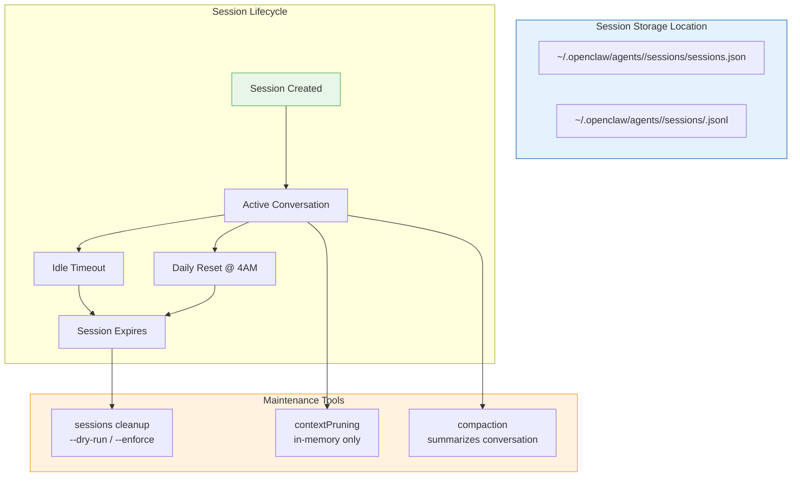
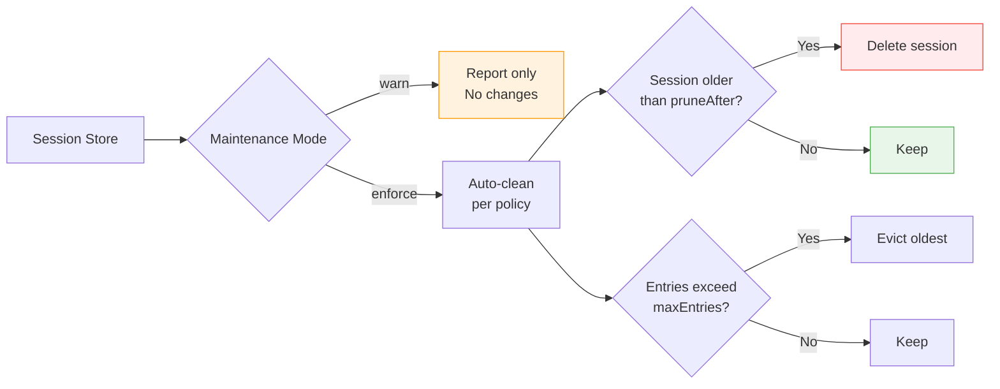
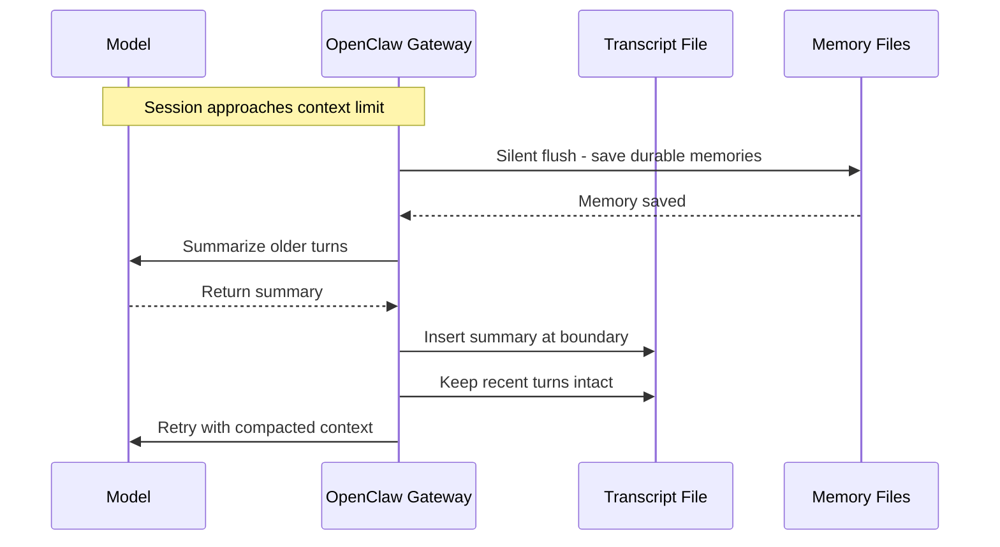
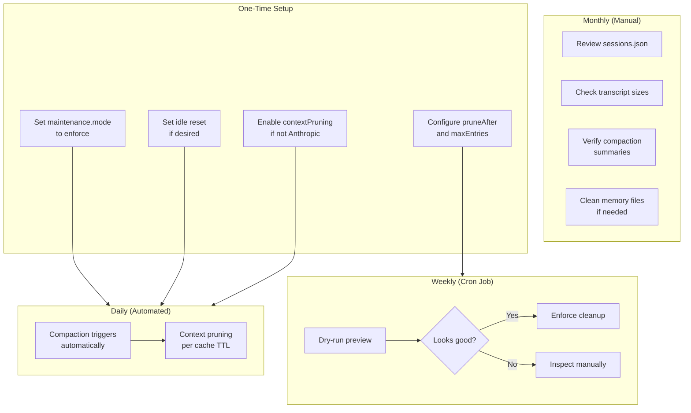

# OpenClaw Session Maintenance Guide
## Cleanup, Compaction, and Pruning for a Healthy Gateway

> **Reading Time:** 12 minutes
> **Difficulty:** Beginner to Intermediate
> **Applicable to:** OpenClaw Gateway v2025+

---

## The Problem with Messy Sessions

Your OpenClaw Gateway has been running for weeks. Sessions pile up. Some transcripts reference files that no longer exist. The session store feels bloated. And every time you check `/status`, you see a wall of ghost entries you cannot make sense of.

This is not unusual. It happens to everyone who runs OpenClaw long enough.

The good news: OpenClaw ships with built-in tools to clean all of this up safely. No third-party scripts, no risky manual deletions. Just well-designed maintenance commands that let you preview before you commit.

This guide covers everything verified from the official OpenClaw documentation, plus additional maintenance techniques that complement the built-in tools.

---

## How OpenClaw Sessions Work

Before touching anything, it helps to understand where sessions live and how they are structured.



**Two files per session:**
- `sessions.json` — index of all sessions (metadata, timestamps, active flag)
- `<sessionId>.jsonl` — full transcript in JSON Lines format

Both live under `~/.openclaw/agents/<agentId>/sessions/`.

---

## Method 1: The Official Cleanup Command

This is the primary maintenance tool. It prunes old sessions, cleans orphan entries, and bounds storage size.

### Dry Run First (Always)

Never run the enforcement version without previewing first:

```bash
# Preview what would be cleaned (safe)
openclaw sessions cleanup --dry-run

# Preview across ALL agents
openclaw sessions cleanup --all-agents --dry-run

# Preview AND fix orphan entries (transcript file is gone but index remains)
openclaw sessions cleanup --dry-run --fix-missing
```

The output tells you exactly which sessions would be removed and why. Read it carefully before proceeding.

### Safe Cleanup with Orphan Fix

```bash
# Full preview with orphan detection
openclaw sessions cleanup --all-agents --dry-run --fix-missing
```

If the dry run looks correct, apply it:

```bash
# Actually enforce the cleanup
openclaw sessions cleanup --all-agents --enforce --fix-missing
```

### Normal Maintenance Without Orphan Fix

```bash
# Standard enforcement (keeps orphan entries intact)
openclaw sessions cleanup --all-agents --enforce
```

### Protect Specific Sessions

If you want to keep a particular session from being evicted:

```bash
openclaw sessions cleanup --enforce --active-key <session-key>
```

You can find the session key from `openclaw sessions --json`.

---

## Method 2: Configure Automatic Maintenance

Instead of running cleanup manually, set it and forget it. OpenClaw supports automatic session maintenance via configuration.

Add this to your `openclaw.json`:

```json
{
  "session": {
    "maintenance": {
      "mode": "enforce",
      "pruneAfter": "30d",
      "maxEntries": 500
    }
  }
}
```

What each setting does:

| Setting | Default | Description |
|---------|---------|-------------|
| `mode` | `"warn"` | `"warn"` = report only, `"enforce"` = auto-clean |
| `pruneAfter` | `"30d"` | Delete sessions inactive after X days |
| `maxEntries` | `500` | Cap total sessions per agent |



---

## Method 3: Session Compaction

Compaction is different from cleanup. It does not delete sessions. Instead, it summarizes long conversations into compact entries, preserving the full history on disk while keeping the active context lean.

### How Compaction Works

1. When a session approaches the model's context limit, OpenClaw summarizes older turns into a concise summary
2. The summary is saved in the transcript file
3. Recent messages stay intact
4. The model sees a leaner context on the next turn



### Compaction Settings

```json
{
  "agents": {
    "defaults": {
      "compaction": {
        "mode": "safeguard",
        "targetTokens": 4000
      }
    }
  }
}
```

You can also use a different model for summarization (useful if your primary model is small or local):

```json
{
  "agents": {
    "defaults": {
      "compaction": {
        "model": "openrouter/anthropic/claude-sonnet-4-6"
      }
    }
  }
}
```

### Manual Compaction

You can also trigger compaction manually:

```
/compact
```

This compacts the current session immediately without waiting for the context limit.

### Compaction vs Pruning

| | Compaction | Pruning |
|-|-----------|---------|
| **What it does** | Summarizes conversation | Trims tool results |
| **Saves to disk** | Yes | No (in-memory only) |
| **Scope** | Entire conversation | Tool results only |
| **Trigger** | Context limit reached | Cache TTL expires |

They work together. Pruning keeps tool output lean between compaction cycles.

---

## Method 4: Context Pruning

Pruning trims old tool results from memory before each LLM call. Unlike compaction, this only affects the in-memory context and does not modify the transcript file.

### Enable Pruning

Pruning is auto-enabled for Anthropic profiles. For other providers:

```json
{
  "agents": {
    "defaults": {
      "contextPruning": {
        "mode": "cache-ttl",
        "ttl": "5m"
      }
    }
  }
}
```

How it works:

1. Wait for the cache TTL to expire (default 5 minutes)
2. Find old tool results
3. **Soft-trim** oversized results (keep head and tail, insert `...`)
4. **Hard-clear** the rest and replace with a placeholder
5. Reset the TTL so follow-up requests reuse the fresh cache

### Legacy Image Cleanup

OpenClaw also has automatic cleanup for legacy sessions that stored raw image blocks in history. It:
- Preserves the 3 most recent completed turns byte-for-byte
- Replaces older image blocks with `[image data removed - already processed by model]`
- This stops repeated image payloads from busting prompt caches

---

## Method 5: Manual Session Inspection and Deletion

Sometimes you need to see exactly what is there and remove things yourself.

### Inspect All Sessions

```bash
# List all sessions in JSON format
openclaw sessions --json

# Filter by active minutes
openclaw sessions --active 60
```

### Check Gateway Status

```bash
openclaw status
```

This shows the session store path, recent activity, and compaction count.

### Delete a Specific Session Manually

```bash
# Find the session ID from --json output
# Then remove from sessions.json index
# And delete the .jsonl transcript file

# Example: remove session s_abc123
rm ~/.openclaw/agents/radit/sessions/s_abc123.jsonl
# Then edit sessions.json to remove the entry
```

### DM Isolation (Prevent Session Mess)

If multiple people DM your bot and you do not want them sharing context:

```json
{
  "session": {
    "dmScope": "per-channel-peer"
  }
}
```

Available options:

| Option | Behavior |
|--------|----------|
| `main` | All DMs share one session (default) |
| `per-peer` | Isolate by sender across channels |
| `per-channel-peer` | Isolate by channel + sender (recommended) |
| `per-account-channel-peer` | Isolate by account + channel + sender |

Run `openclaw security audit` to verify your setup.

---

## Method 6: Daily and Idle Reset

Instead of waiting for sessions to expire, force a fresh start:

### Chat Commands

```
/new          # Start a new session
/new <model>  # Start new session with specific model
/reset        # Reset current session
/status       # Show context usage, model, compaction count
/context list # Show what is in the system prompt
```

### Idle Reset Config

Set sessions to automatically reset after a period of inactivity:

```json
{
  "session": {
    "reset": {
      "idleMinutes": 60
    }
  }
}
```

When both daily reset (default 4 AM) and idle reset are configured, whichever expires first wins.

---

## Method 7: Redis Cache Cleanup (If Using Redis)

If you have Redis memory storage configured, cached session data may also build up:

```bash
# Connect to Redis
redis-cli

# Check current keys
redis-cli KEYS "*session*"

# Clear session cache (use with caution)
redis-cli FLUSHDB

# Or selectively delete
redis-cli DEL "session:<session-id>"
```

### Check Redis Memory Usage

```bash
redis-cli INFO memory | grep used_memory_human
```

Redis is optional for OpenClaw but if you have it running alongside, it deserves its own maintenance routine.

---

## Method 8: Cron-Based Automated Maintenance

Schedule cleanup to run automatically so you never have to think about it:

```bash
# Add to crontab
# Run cleanup every Sunday at 2 AM
0 2 * * 0 /usr/bin/openclaw sessions cleanup --all-agents --enforce --fix-missing >> /var/log/openclaw-cleanup.log 2>&1

# Run dry-run every day at 1 AM (log only, no action)
0 1 * * * /usr/bin/openclaw sessions cleanup --all-agents --dry-run --fix-missing >> /var/log/openclaw-dryrun.log 2>&1
```

---

## Putting It All Together

Here is the recommended maintenance routine:



### Recommended Config

```json
{
  "session": {
    "dmScope": "per-channel-peer",
    "reset": {
      "idleMinutes": 60
    },
    "maintenance": {
      "mode": "enforce",
      "pruneAfter": "30d",
      "maxEntries": 500
    }
  },
  "agents": {
    "defaults": {
      "contextPruning": {
        "mode": "cache-ttl",
        "ttl": "5m"
      },
      "compaction": {
        "mode": "safeguard",
        "targetTokens": 4000
      }
    }
  }
}
```

---

## Quick Reference Cheat Sheet

| Command | What It Does |
|---------|-------------|
| `openclaw sessions --json` | List all sessions |
| `openclaw sessions cleanup --dry-run` | Preview cleanup |
| `openclaw sessions cleanup --enforce` | Run cleanup |
| `openclaw sessions cleanup --fix-missing` | Remove orphan entries |
| `openclaw status` | Gateway status |
| `openclaw security audit` | Verify DM isolation |
| `/new` | Start new session |
| `/compact` | Manual compaction |
| `/status` | Current session info |

---

## For More Information

- [OpenClaw Sessions Documentation](https://docs.openclaw.ai/sessions)
- [Session Pruning](https://docs.openclaw.ai/concepts/session-pruning)
- [Compaction](https://docs.openclaw.ai/concepts/compaction)
- [Gateway Configuration](https://docs.openclaw.ai/gateway/configuration)

Need a VPS to run your OpenClaw Gateway? We recommend SumoPod:

**[Get SumoPod VPS](https://blog.fanani.co/sumopod)** — Fast, affordable, and perfect for running OpenClaw 24/7.

For Indonesian-language guide:

**[Baca versi Bahasa Indonesia](https://blog.fanani.co/tech/openclaw-session-maintenance/)** — Tutorial lengkap cara membersihkan session OpenClaw.

---

## Related Tutorials

- [Auto-Reply Bot Setup](/tutorials/auto-reply-bot-guide.md)
- [WhatsApp Customer Care for SMEs](/tutorials/whatsapp-customer-care-umkm.md)
- [Telegram Notifications Automation](/tutorials/telegram-notifications.md)

---

*This guide is verified against the official OpenClaw documentation (docs.openclaw.ai). Commands tested on OpenClaw v2025+.*

**Last Updated:** April 2026
**Version:** 1.0
**Author:** Radian IT Team
