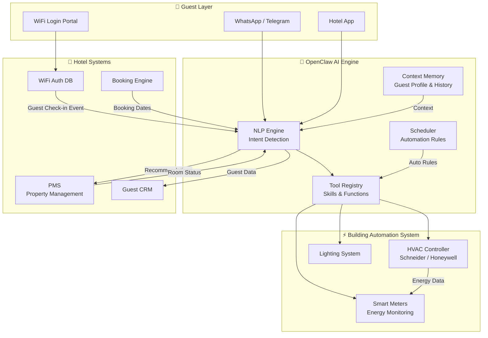
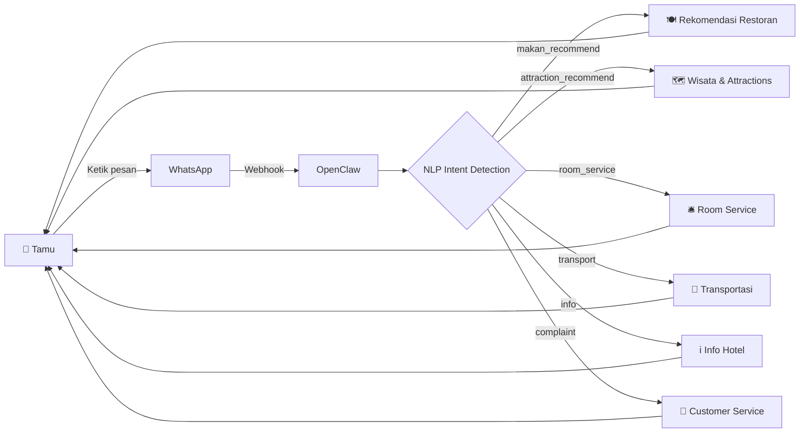
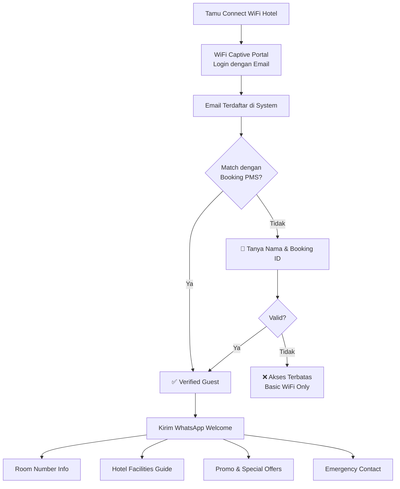
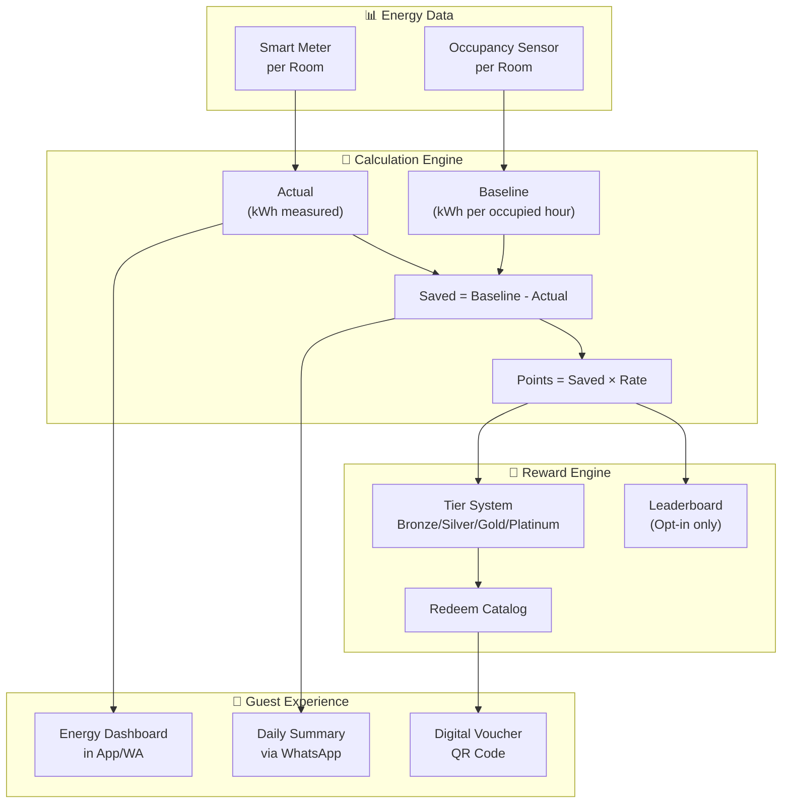
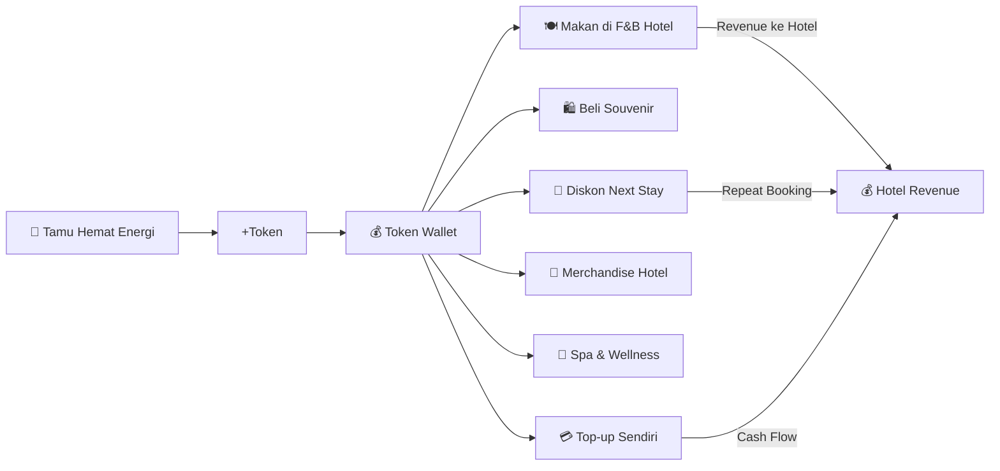
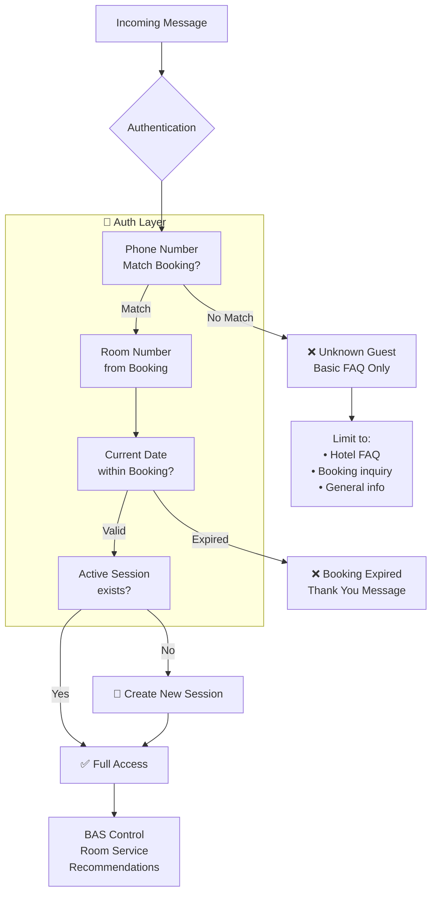
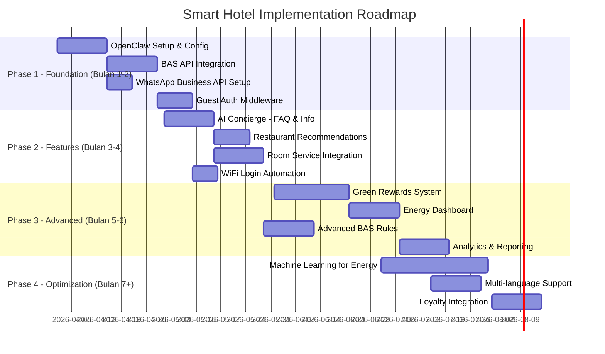
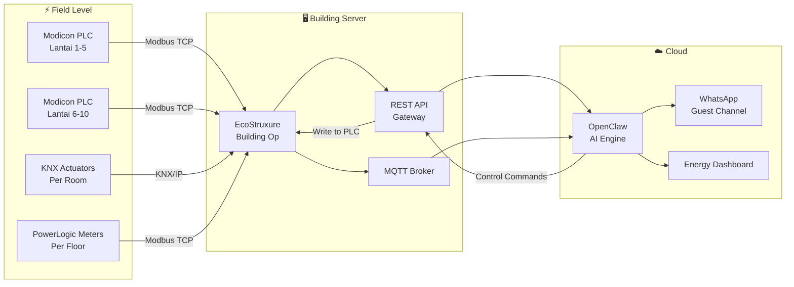

Sebelum masuk ke tutorial, quick disclosure: setup OpenClaw butuh VPS yang solid. Gue pake [Sumopod](https://blog.fanani.co/sumopod) — VPS KVM dengan harga bersahabat dan performa yang nge-gas. Cek link di atas kalau butuh rekomendasi VPS.

---

## 🔥 Masalah Nyata di Industri Hotel

Mari gue gambaran scenario yang sering banget terjadi di hotel-hotel Indonesia:

- Tamu check-in jam 14:00, AC dinyalakan penuh. Tamu keluar jalan-jalan sampai jam 22:00. **8 jam AC nyala buat nganginin kamar kosong.**
- Satu hotel 200 kamar, rata-rata occupancy 70%. Bayangin berapa kWh yang terbuang cuma buat nganginin kamar yang nggak ada orang-nya.
- Tamu baru di kota, pengen cari makan enak dekat hotel. Tanya resepsionis → dapat jawaban generik "Ada mall di sebelah sana". **Zero personalization.**
- Housekeeping schedule tetap, nggak peduli tamu lagi tidur atau nggak.

Menurut data dari Schneider Electric's Building Performance Index, **HVAC (AC) mengonsumsi 40-60% total energi hotel**. Ini bukan angka kecil. Dan sebagian besar pemborosan terjadi karena **manual control** yang nggak adaptif.

Di sisi lain, guest experience juga kurang. Tamu modern pengen instant, personalized, dan seamless. Nggak mau tanya-tanya manual. Mau ketik di WhatsApp, langsung dapet jawaban.

**Nah, di titik inilah OpenClaw masuk sebagai game changer.**

━━━━━━━━━━━━

## 🏗️ Arsitektur Besar — Gimana Caranya Kerja?

Sebelum masuk ke kode, gue mau jelasin big picture-nya dulu. Jadi nggak nyebur ke technical tanpa paham konsep.



**Alur kerja sederhananya:**

1. Tamu connect WiFi → email tercatat → match booking → kirim WhatsApp welcome
2. Tamu chat di WhatsApp → OpenClaw tangkap intent → eksekusi action
3. BAS kirim data energi ke OpenClaw → OpenClaw analisis → trigger otomasi
4. Semua interaksi tercatat di memory → personalization makin akurat

━━━━━━━━━━━━

## ⚡ BAS Integration — Jangan Ganggu Tamu, Otomasi di Balik Layar

Ini point paling penting dari diskusi tadi, dan gue mau highlight banget:

> **❌ SALAH:** Ngirim WhatsApp ke tamu "Matikan AC Anda untuk hemat energi"
> **✅ BENAR:** BAS otomatis turunkan AC saat tamu keluar kamar, naikkan lagi saat tamu mendekati hotel

Jangan pernah ganggu tamu dengan urusan listrik. Mereka udah bayar. Mereka pengen nyaman. **Otomasi energi harus invisible** — bekerja di background tanpa tamu sadari.

### Gimana cara deteksi tamu keluar/masuk kamar?

Ada beberapa pendekatan:

**▓▓▓▓▓▓▓▓▓▓▓░░░░░░░░░ 60% — Smart Door Lock**

Door lock dengan sensor occupancy. Setiap kali pintu dibuka/tutup, event dikirim ke BAS. Logika sederhana:

```python
# BAS Rule: Door lock event handler
async def handle_door_event(room_id: str, event: str):
    if event == "door_opened":
        # Guest entered room → restore comfort settings
        await bas.set_hvac_mode(room_id, "comfort")
        await bas.set_lighting(room_id, "welcome_scene")
        
    elif event == "all_guests_left":
        # Wait 15 minutes, then switch to eco mode
        await asyncio.sleep(900)
        if not await bas.is_room_occupied(room_id):
            await bas.set_hvac_mode(room_id, "eco")
            await bas.set_lighting(room_id, "off")
```

**▓▓▓▓▓▓▓▓▓▓▓▓▓░░░░░░░░ 70% — PIR Motion Sensor**

Sensor gerak di dalam kamar. Nggak ada gerakan selama X menit → kamar dianggap kosong.

**▓▓▓▓▓▓▓▓▓▓▓▓▓▓░░░░░░░░ 80% — BLE/WiFi Presence**

Track HP tamu yang konek ke WiFi hotel. Signal strength dari access point bisa tentukan tamu masih di kamar atau nggak.

**▓▓▓▓▓▓▓▓▓▓▓▓▓▓▓░░░░░░░ 90% — Hybrid (Recommended)**

Gabungkan semua di atas. Door lock + PIR + WiFi presence = akurasi tinggi dengan false positive minimal.

### 📡 WiFi CSI — Advanced Presence Detection

Di diskusi komunitas, ada yang suggest **WiFi CSI (Channel State Information)** sebagai metode sensing occupancy. Ini teknologi yang menarik secara teknis, tapi gue punya pendapat kuat soal ini.

**Apa itu WiFi CSI?**

WiFi CSI memanfaatkan perubahan kecil pada sinyal WiFi (amplitudo dan fase) untuk mendeteksi posisi, pergerakan, dan aktivitas manusia — bahkan menembus dinding. Bedanya dengan RSSI yang cuma ukur kekuatan sinyal, CSI ngasih data detail level subcarrier. Jadi secara teori bisa jadi "sensor lingkungan ramah privasi".

**Tapi gue WARNING berat soal ini:**

> ⚠️ **Jangan pake WiFi buat sensing penghuni di kamar hotel.**

Kenapa? Karena CSI itu TERLALU sensitif. Ini yang bakal terjadi:

- 1 orang masuk kamar → terdeteksi ✅
- 2 orang di kamar → terdeteksi ✅ (tapi ini PRIVACY INVASION)
- Tamu gerak di dalam kamar → pattern movement terekam ✅ (lagi-lagi PRIVACY)
- Tamu di toilet → tetap terdeteksi ✅ (INI SUDAH CREEPY)

**Masalah besar:** Kalau tamu tahu WiFi mereka dipake buat track gerakan di dalam kamar, lawsuit datang. No question. Di banyak yurisdiksi, ini masuk kategori illegal surveillance.

**Kapan CSI boleh dipake?**
- ✅ Lobby area (public space)
- ✅ Meeting room (bisa track occupancy buat scheduling)
- ✅ Corridor (traffic flow optimization)
- ❌ Kamar tamu (ABSOLUTELY NOT)
- ❌ Kamar mandi (HELL NO)
- ❌ Spa/gym locker room (NOPE)

**Bottom line:** CSI itu teknologi keren buat smart building. Tapi di konteks hotel, batasi ke area public saja. Buat kamar, stick dengan door lock + PIR — itu sudah cukup dan respectful.

### Konek OpenClaw ke BAS

Ini bagian yang seru. OpenClaw bisa konek ke BAS lewat beberapa protocol:

| Protocol | Use Case | Konek via |
|----------|----------|-----------|
| **Modbus TCP** | Schneider, Honeywell, Siemens | OpenClaw Skill → TCP socket |
| **BACnet/IP** | Standar industri gedung | OpenClaw Skill → BACnet lib |
| **MQTT** | IoT sensor modern | OpenClaw Skill → MQTT broker |
| **REST API** | Cloud-based BAS | OpenClaw Skill → HTTP calls |
| **KNX** | Smart building standard | OpenClaw Skill → KNX gateway |

Gue sendiri lagi plan konek Schneider BAS dengan OpenClaw. Awalnya plan lewat n8n sebagai middleware, tapi OpenClaw sendiri udah cukup powerful sebagai orchestrator.

Contoh skill OpenClaw untuk BAS control:

```yaml
# skills/bas-control/SKILL.md
name: bas-control
description: Control Building Automation System via Modbus/MQTT
version: 1.0.0

triggers:
  - pattern: "matikan ac kamar {room}"
    action: bas.set_hvac(room, "off")
  
  - pattern: "status kamar {room}"
    action: bas.get_room_status(room)
  
  - pattern: "laporan energi hari ini"
    action: bas.get_daily_energy_report()

endpoints:
  - name: schneider-bas
    protocol: modbus-tcp
    host: 192.168.1.100
    port: 502
```

━━━━━━━━━━━━

## 📱 Layer Tamu — AI Concierge via WhatsApp

Nah, sekarang ke bagian yang tamu rasain. Ini **front-facing** — interaksi langsung antara tamu dan AI assistant.



### Apa aja yang bisa dilakukan AI Concierge?

**▓▓▓▓▓▓▓▓▓▓▓▓▓▓▓▓░░░░░░ 80% — Fitur Utama:**

| Kategori | Contoh Query | Response |
|----------|-------------|----------|
| 🍽️ Kuliner | "Makan enak dekat sini dong" | Daftar restoran + rating + jarak + rekomendasi berdasarkan preferensi |
| 🗺️ Wisata | "Tempat wisata yang wajib dikunjungi" | Itinerary + transport + estimasi waktu |
| 🛎️ Room Service | "Minta extra towel" | Forward ke housekeeping + tracking |
| 🚗 Transport | "Cari grab ke airport" | Link booking + estimasi harga + jadwal |
| 📋 Info Hotel | "Jam breakfast berapa?" | FAQ instant dari knowledge base |
| 🎯 Komplain | "AC kamar saya rusak" → Forward ke maintenance + real-time tracking |
| 🧖 Spa & Wellness | "Ada pijat dekat hotel?" | Rekomendasi + booking link |
| 🏪 Shopping | "Mau beli oleh-oleh khas" | Rekomendasi toko + peta |

Yang menarik dari OpenClaw: **bisa pake RAG (Retrieval Augmented Generation)**. Hotel upload semua info mereka (menu restoran, brosur spa, peta lokal), dan OpenClaw bisa jawab berdasarkan data real, bukan halusinasi.

### Contoh Conversational Flow

```
Tamu: Selamat malam, ada tempat makan seafood yang enak dekat hotel?

AI Concierge: Selamat malam! 🌊 Ada beberapa rekomendasi seafood dekat hotel:

1. 🦐 Rumah Makan Pantai Indah (800m, 10 min jalan kaki)
   Rating: 4.6⭐ | Harga: 50-150rb/pax | Signature: Ikan Bakar Rica-rica
   
2. 🦀 Seafood 88 (1.2km, 5 min naik grab)
   Rating: 4.4⭐ | Harga: 80-200rb/pax | Signature: Kepiting Saus Padang
   
3. 🐟 Dapur Laut (1.5km, 7 min naik grab)
   Rating: 4.8⭐ | Harga: 100-250rb/pax | Signature: Cumi Goreng Tepung
   
Mau gue bantu reservasi atau pesan grab ke salah satunya?

Tamu: Yang pertama dong, mau reservasi untuk 2 orang jam 8

AI Concierge: Siap! 🎉 Gue reservasikan di Rumah Makan Pantai Indah:
- 👥 2 orang
- 🕗 Jam 20:00 WITA
- 📅 Hari ini, 4 April 2026

Mau pesan dulu juga atau bayar di tempat?

Tamu: Bayar di tempenya aja

AI Concierge: Done! ✅ Konfirmasi reservasi udah dikirim ke WA restoran. 
Kalo mau cancel, bilang aja sebelum jam 19:00 ya. Selamat makan! 🦐
```

Liat bagaimana natural-nya? Nggak kayak bot generik. Ini karena OpenClaw bisa di-set persona dan tone-nya.

━━━━━━━━━━━━

## 📶 WiFi Login → Welcome Automation

Ini salah satu fitur yang paling impactful tapi sering terlewat.

**Alurnya:**



**Teknis implementasi:**

```python
# WiFi portal handler - ketika tamu login via email
async def handle_wifi_login(email: str, mac_address: str):
    # 1. Query PMS untuk match booking
    booking = await pms.find_booking_by_email(email)
    
    if not booking:
        return {"status": "guest_not_found", "wifi": "basic_access"}
    
    # 2. Set full WiFi access
    await wifi_controller.set_access(mac_address, "full", duration=booking.duration)
    
    # 3. Get guest phone number from booking
    phone = booking.guest_phone
    
    # 4. Create OpenClaw session for this guest
    session = await openclaw.create_session(
        chat_id=phone,
        channel="whatsapp",
        metadata={
            "room_number": booking.room_number,
            "check_in": booking.check_in,
            "check_out": booking.check_out,
            "guest_name": booking.guest_name,
            "booking_id": booking.id
        }
    )
    
    # 5. Send welcome message
    await openclaw.send_message(session, {
        "template": "hotel_welcome",
        "params": {
            "name": booking.guest_name,
            "room": booking.room_number,
            "wifi_password": "premium_access_enabled",
            "breakfast_time": "06:30 - 10:00",
            "pool_hours": "07:00 - 21:00",
            "gym_hours": "24 hours"
        }
    })
    
    # 6. Schedule eco-mode activation for this room
    await bas.schedule_eco_mode(booking.room_number, booking.check_out)
    
    return {"status": "verified", "session": session.id}
```

**Hasilnya:** Tamu baru aja connect WiFi, langsung dapet WhatsApp welcome lengkap. Nggak perlu repot tanya resepsionis. Seamless. Modern.

━━━━━━━━━━━━

## 🌿 Green Hotel Reward System

Ini ide yang menarik dari diskusi: reward tamu yang hemat energi. Tapi gue mau bikin pendekatan yang lebih realistis.

### Kenapa Reward System Itu Tricky?

Jujur aja, kalau tamu udah bayar full, nanya mereka buat hemat energi itu... challenging. Tapi bisa di-framing secara positif:

**▓▓▓▓▓▓▓▓▓▓▓▓▓▓▓▓░░░░░░ 80% — Pendekatan yang Realistis:**

1. **Eco Mode Opt-In** — Tamu PILIH sendiri mau ikut program green hotel
2. **Transparent Energy Dashboard** — Tamu bisa lihat berapa energi yang dihemat
3. **Gamification** — Poin, badge, level
4. **Tangible Rewards** — Voucher F&B, late check-out, spa discount, loyalty points

### Arsitektur Reward System



### Contoh Implementasi

```python
# Green Hotel Reward Calculator
class GreenRewardEngine:
    BASELINE_KWH_PER_HOUR = {
        "standard": 2.5,    # AC, lights, TV
        "deluxe": 3.5,      # Bigger room, more fixtures
        "suite": 5.0        # Multiple rooms
    }
    
    POINT_RATE = 10  # points per kWh saved
    
    TIERS = {
        "bronze": 0,
        "silver": 100,
        "gold": 500,
        "platinum": 1500
    }
    
    def calculate_stay_rewards(self, room_type: str, hours_occupied: int, 
                                actual_kwh: float) -> dict:
        baseline = self.BASELINE_KWH_PER_HOUR[room_type] * hours_occupied
        saved = max(0, baseline - actual_kwh)
        points = int(saved * self.POINT_RATE)
        
        # Determine tier
        tier = "bronze"
        for name, threshold in self.TIERS.items():
            if points >= threshold:
                tier = name
        
        # Calculate monetary value
        point_value = {
            "bronze": 50,    # Rp 50 per point
            "silver": 75,
            "gold": 100,
            "platinum": 150
        }
        
        return {
            "baseline_kwh": baseline,
            "actual_kwh": actual_kwh,
            "saved_kwh": saved,
            "savings_percent": (saved / baseline * 100) if baseline > 0 else 0,
            "points_earned": points,
            "tier": tier,
            "voucher_value_rp": points * point_value[tier]
        }
```

### WhatsApp Daily Summary

```
🌿 Green Hotel Report — Kamar 204

Kemarin kamu hemat 3.2 kWh listrik! 🎉
▓▓▓▓▓▓▓▓▓▓▓▓▓▓▓▓░░░░░░ 80% lebih hemat dari rata-rata

📊 Energy Summary:
⚡ Total: 5.1 kWh
🌿 Baseline: 8.3 kWh
✅ Hemat: 3.2 kWh
💰 Setara: Rp 4.800

🏆 Green Points: +32 poin
📊 Total: 156 poin (Silver Tier 🥈)

🎁 Rewards yang bisa kamu redeem:
• Late check-out sampai jam 14:00 (50 poin)
• Diskon 20% spa treatment (80 poin)
• Gratis 1 minuman di lobby bar (30 poin)

Ketik "redeem [nomor]" untuk klaim reward!
```

### Token Economy — Lebih dari Sekadar Poin

Di diskusi, ada ide yang menarik: bukan cuma poin biasa, tapi **token system** yang punya nilai ekonomi. Dan ini bisa diimplementasikan tanpa blockchain (nggak perlu rug-pull 🤣).

**Konsep Token Hotel:**

Token itu pada dasarnya **loyalty currency yang di-issued oleh hotel**. Bukan crypto, bukan blockchain — cuma digital token yang dikelola hotel. Tapi dengan twist: nilainya bisa naik seiring demand.



**Mekanisme Token:**

| Aspek | Detail |
|-------|--------|
| **Cara dapet** | Hemat energi, opt-in eco mode, review positif, referral |
| **Cara pakai** | F&B, souvenir, merchandise, diskon kamar, spa |
| **Nilai dasar** | 1 token = Rp 1,000 (dapat ditentukan hotel) |
| **Appreciation** | Harga token bisa naik saat high season (demand tinggi) |
| **Top-up** | Tamu bisa beli tambahan token (opsional) |
| **Transfer** | Bisa dikirim ke tamu lain di hotel yang sama |
| **Expiry** | Berlaku 1 tahun dari diterbitkan |

**Kenapa ini lebih dari sekadar poin biasa?**

Poin loyalty konvensional itu membosankan. "Kumpulkan 1000 poin, dapet free drink." Tamu nggak excited. Tapi kalau sistem-nya kayak game — ada token, ada wallet, bisa di-top-up, nilainya naik turun — itu beda. Tamu jadi aktif participate.

Contoh conversational flow:

```
Tamu: Gue mau tuker token buat makan di restoran hotel

AI Concierge: 💰 Token Wallet kamu:
   Balance: 245 tokens
   Value: Rp 245,000

Restoran Hotel tersedia:
1. Nasi Goreng Spesial — 35 tokens (Rp 35,000)
2. Sate Ayam Madura — 45 tokens (Rp 45,000)
3. Grilled Salmon — 120 tokens (Rp 120,000)
4. Seafood Platter — 200 tokens (Rp 200,000)

Pilih menu yang mau dituker?

Tamu: Nomor 3 dong

AI Concierge: ✅ 120 tokens dituker untuk Grilled Salmon
Sisa balance: 125 tokens

Pesanan udah dikirim ke kitchen. Estimasi 15-20 menit.
Mau dine-in atau room service?

Tamu: Room service

AI Concierge: 🛎️ Done! Grilled Salmon menuju kamar 204.
Bon pembayaran: 120 tokens (fully paid, no cash needed).
Selamat menikmati! 🐟
```

**Revenue Impact:** Tamu yang punya token cenderung spending di hotel (bukan di luar). Token本质上 bikin captive economy di dalam hotel. F&B revenue naik, souvenir laku, repeat booking meningkat.

━━━━━━━━━━━━

## 🔒 Security — Isolasi Kamar & Validasi Tamu

Ini CRITICAL. Hotel harus memastikan:

1. Tamu cuma bisa kontrol kamar sendiri
2. Tamu cuma akses data selama masa booking
3. Cross-room access mustahil



**Implementasi middleware OpenClaw:**

```python
# Middleware: Hotel guest authentication
async def authenticate_hotel_guest(message, context):
    phone = message.sender
    now = datetime.now()
    
    # 1. Check if phone matches any active booking
    booking = await pms.get_active_booking(phone, now)
    
    if not booking:
        # Unknown guest — limit access
        return {
            "authenticated": False,
            "access_level": "public",
            "allowed_tools": ["hotel_faq", "booking_inquiry", "contact_info"]
        }
    
    # 2. Check if booking is still valid
    if now < booking.check_in or now > booking.check_out + timedelta(hours=12):
        return {
            "authenticated": False,
            "access_level": "expired",
            "allowed_tools": ["hotel_faq", "contact_info"],
            "message": "Terima kasih telah menginap! Semoga perjalanan menyenangkan 🙏"
        }
    
    # 3. Full authentication
    return {
        "authenticated": True,
        "access_level": "full",
        "guest_data": {
            "name": booking.guest_name,
            "room": booking.room_number,
            "room_type": booking.room_type,
            "check_in": booking.check_in,
            "check_out": booking.check_out,
            "vip": booking.is_vip
        },
        "allowed_tools": ["bas_control", "room_service", "recommendations", 
                         "transport", "complaints", "green_rewards"]
    }
```

━━━━━━━━━━━━

## 💰 Analisis Biaya & ROI

Sebagai orang engineering, gue suka ngitung-ngitung. Ini analisis kasar untuk hotel 200 kamar:

### Biaya Implementasi

| Komponen | Estimasi Biaya | Keterangan |
|----------|---------------|------------|
| OpenClaw Setup (VPS) | Rp 500rb-1jt/bulan | VPS + OpenClaw license |
| BAS Integration | Rp 20-50jt (one-time) | Tergantung brand & scope |
| WhatsApp Business API | Rp 500rb-2jt/bulan | Tergantung volume |
| WiFi Portal Modifikasi | Rp 5-10jt (one-time) | Email capture + API |
| Smart Sensors | Rp 500rb-2jt/kamar | Motion + door + power |
| Custom Development | Rp 15-30jt | Skill development, API, UI |
| **Total Setup** | **Rp 40-90jt** | One-time |
| **Monthly Ops** | **Rp 1-3.5jt** | Recurring |

### Potensi Penghematan Energi

```
📊 Skenario Hotel 200 Kamar, 70% Occupancy

Baseline Energy (tanpa automasi):
  AC: 200 × 70% × 24h × 2.5kWh = 8,400 kWh/hari
  Lighting: 200 × 70% × 12h × 0.5kWh = 840 kWh/hari
  Total: ~9,240 kWh/hari

Dengan BAS + OpenClaw:
  Eco mode saat kamar kosong (est. 8 jam/hari):
  - AC: 200 × 70% × (16h comfort + 8h eco) × avg 1.8kWh = 6,048 kWh/hari
  - Lighting: Auto-off saat kosong → 600 kWh/hari
  Total: ~6,648 kWh/hari

Penghematan: 2,592 kWh/hari (28%)
Biaya listrik: Rp 1,500/kWh
Hemat per hari: Rp 3,888,000
Hemat per bulan: ~Rp 116,640,000
```

▓▓▓▓▓▓▓▓▓▓▓▓▓▓▓▓░░░░░░ 80% ROI dalam 1-2 bulan dari sisi energi saja!

Belum termasuk:
- Revenue increase dari better guest experience
- Operational efficiency (less manual work)
- Brand value (green hotel certification)

━━━━━━━━━━━━

## 🛠️ Setup OpenClaw untuk Smart Hotel

Sekarang masuk ke bagian teknis — gimana cara setup OpenClaw untuk use case ini.

### Step 1: Install & Konfigurasi OpenClaw

```bash
# Di VPS khusus hotel (atau shared)
npm install -g openclaw
openclaw init hotel-assistant
cd hotel-assistant

# Setup environment
cat > .env << 'EOF'
OPENCLAW_MODEL=anthropic/claude-sonnet-4-20250514
OPENCLAW_CHANNEL=whatsapp
WHATSAPP_WEBHOOK_URL=https://your-hotel.com/api/whatsapp
BAS_API_URL=http://192.168.1.100:502
PMS_API_URL=https://your-pms.com/api
GREEN_REWARD_ENABLED=true
EOF
```

### Step 2: Buat Hotel-Specific Skills

```
skills/
├── bas-control/
│   ├── SKILL.md
│   └── scripts/
│       ├── hvac-control.py      # AC on/off/eco
│       ├── lighting-control.py  # Lights on/off/dim
│       └── energy-report.py     # Energy usage report
├── hotel-concierge/
│   ├── SKILL.md
│   └── scripts/
│       ├── restaurant-search.py # Local restaurant DB
│       ├── attraction-guide.py  # Tourist attractions
│       ├── transport-booking.py # Grab/Gojek integration
│       └── hotel-faq.py         # FAQ knowledge base
├── green-rewards/
│   ├── SKILL.md
│   └── scripts/
│       ├── reward-calculator.py # Points calculation
│       ├── tier-checker.py      # Tier determination
│       └── daily-report.py      # WhatsApp summary
└── guest-auth/
    ├── SKILL.md
    └── scripts/
        ├── auth-middleware.py    # Guest authentication
        ├── booking-validator.py  # Booking date check
        └── session-manager.py    # Session management
```

### Step 3: Konfigurasi Channel Routing

```yaml
# openclaw.config.yaml
channels:
  whatsapp:
    provider: whatsapp-business-api
    webhook: /api/whatsapp
    
routing:
  # Public: anyone can access
  - match: ".*"
    condition: "!authenticated"
    tools:
      - hotel_faq
      - booking_inquiry
      - emergency_contact
      
  # Guest-only: authenticated hotel guests
  - match: ".*"
    condition: "authenticated"
    tools:
      - bas_control
      - room_service
      - recommendations
      - green_rewards
      - complaint
      - transport
      
  # Admin-only: hotel staff
  - match: ".*"
    condition: "admin"
    tools:
      - bas_control
      - room_service
      - recommendations
      - green_rewards
      - complaint
      - transport
      - energy_dashboard
      - guest_management
      - staff_notifications
```

### Step 4: Heartbeat Automation

OpenClaw heartbeat bisa digunakan untuk monitoring otomatis:

```yaml
# HEARTBEAT.md
## Smart Hotel Daily Checks

### Energy Monitoring (Every 2 hours)
- Run: `python3 skills/bas-control/scripts/energy-report.py --summary`
- Alert if: Any room using >150% baseline
- Alert if: Total hotel energy > 110% of budget

### Guest Welcome (Real-time)
- Trigger: WiFi login event
- Run: `python3 skills/guest-auth/scripts/session-manager.py --welcome`
- Send welcome message + create session

### Room Status Sync (Every 30 min)
- Run: `python3 skills/guest-auth/scripts/booking-validator.py --sync`
- Auto-expire sessions for checked-out guests
- Prepare welcome for expected check-ins

### Green Rewards Summary (Daily 09:00)
- Run: `python3 skills/green-rewards/scripts/daily-report.py --all`
- Send individual summary to participating guests
- Update hotel energy dashboard
```

━━━━━━━━━━━━

## 🏭 Use Cases di Luar Hotel

Konsep ini nggak cuma buat hotel lho. Bisa diterapkan ke banyak vertical:

### 🏢 Serviced Apartments & Co-Living

Sama kayak hotel tapi longer stay. Guest bisa:
- Kontrol apartemen via WhatsApp
- Report maintenance
- Terima notifikasi paket
- Booking fasilitas (gym, meeting room)

### 🏥 Rumah Sakit

- Pasien kontrol kamar (AC, lampu, TV) tanpa bergerak
- Notifikasi jadwal obat
- Request makanan diet khusus
- Info dokter jaga

### 🏭 Office Building

- Tenant kontrol kantor area
- Meeting room booking via chat
- Energy monitoring per tenant
- Facility request & tracking

### 🎓 Kampus / University

- Mahasiswa kontrol asrama
- Info jadwal kelas
- Pemesanan makanan kantin
- Library & facility booking

### 🏘️ Smart Residential

- Penghuni kontrol rumah
- Integrasi dengan smart home
- Community announcements
- Maintenance request

━━━━━━━━━━━━

## 📋 Roadmap Implementasi

Kalau gue jadi project manager untuk implementasi ini, gue bagi jadi fase:



**▓▓▓▓▓▓▓▓▓▓▓▓▓▓▓▓░░░░░░ 80% Estimasi Total: 5-7 bulan sampai full production.**

━━━━━━━━━━━━

## 🔥 Tips dari Pengalaman

Gue udah main-main dengan OpenClaw untuk beberapa use case, dan ini tips yang bisa gue kasih:

### 1. Mulai dari Simple

Jangan langsung ke BAS integration. Mulai dari:
- ✅ FAQ bot dulu (paling gampang)
- ✅ WiFi → welcome message (quick win, impact besar)
- ✅ Room service request

Setelah basic layer jalan, baru tambah BAS integration dan green rewards.

### 2. Persona Matters

Set AI persona sesuai brand hotel. Luxury hotel beda tone-nya dengan budget hotel:

```yaml
# Luxury hotel persona
persona: |
  Kamu concierge premium di [Hotel Name]. Bahasa formal tapi warm.
  Selalu gunakan "Bapak/Ibu". Rekomendasi harus curated dan eksklusif.
  
# Budget hotel persona  
persona: |
  Kamu asisten seru di [Hotel Name]. Santai, casual, friendly.
  Bisa pake "mas/mbak". Rekomendasi fokus value for money.
```

### 3. Human Handoff

AI nggak bisa handle semua. Pastikan ada escalation path:

```
Tamu: "AC kamar saya bocor!"

AI: Maaf atas ketidaknyamanannya 🙏 Gue langsung forward ke tim maintenance.
     Estimasi mereka datang dalam 10-15 menit. 
     Ada yang lain bisa gue bantu?
     
     [Auto-forward ke maintenance group dengan room number + issue]
```

### 4. Data Privacy

Ini penting banget:
- Jangan simpan chat history tamu setelah check-out
- Clear semua session data setelah 24 jam post check-out
- Comply dengan data protection regulations
- Guest harus opt-in untuk green reward data tracking

### 5. Multi-Language

Indonesia itu turis mancanegara. Minimal support:
- Bahasa Indonesia (default)
- English
- Japanese (optional, tergantung market)
- Mandarin (optional, banyak turis Tiongkok)

OpenClaw bisa auto-detect language dan switch response accordingly.

━━━━━━━━━━━━

## 📊 OpenClaw vs Alternatif

Gue yakin ada yang nanya "kenapa nggak pake [tool lain]?" Jadi gue bikin perbandingan:

| Fitur | OpenClaw | Dialogflow CX | Rasa | Custom Bot |
|-------|----------|---------------|------|------------|
| BAS Integration | ✅ Native via Skills | ⚠️ Perlu custom | ⚠️ Perlu custom | ✅ Full control |
| WhatsApp Integration | ✅ Native | ✅ Native | ✅ Native | ⚠️ Manual |
| Multi-Channel | ✅ WA, TG, Discord, Signal | ✅ WA, TG | ✅ WA, TG | ⚠️ Custom |
| Heartbeat/Automation | ✅ Built-in | ❌ Perlu external | ❌ Perlu external | ❌ Custom |
| RAG/Knowledge Base | ✅ Built-in | ✅ Native | ✅ Native | ⚠️ Custom |
| Self-Evolving | ✅ Auto-improve | ❌ Manual | ❌ Manual | ❌ Manual |
| Cost | 💰 Medium | 💸 Expensive | 💰 Medium | 💸 Dev time |
| Flexibility | ✅✅✅ Maximum | ⚠️ Limited | ⚠️ Limited | ✅✅ Full |

**Bottom line:** OpenClaw menang di flexibility dan automation capability. Untuk hotel yang butuh BAS integration + AI concierge + automation dalam satu platform, OpenClaw jawabannya.

━━━━━━━━━━━━

## 🎯 Saran Penggunaan OpenClaw untuk Hotel

Berdasarkan diskusi dan analisis gue, ini rekomendasi use case OpenClaw untuk hotel:

### Tier 1: Quick Wins (1-2 minggu setup)

| # | Use Case | Impact | Effort |
|---|----------|--------|--------|
| 1 | FAQ Bot via WhatsApp | 🔥🔥🔥 | 💚 Low |
| 2 | WiFi → Welcome Message | 🔥🔥🔥🔥 | 💚 Low |
| 3 | Room Service Request | 🔥🔥🔥 | 💛 Medium |
| 4 | Hotel Info & Directions | 🔥🔥 | 💚 Low |

### Tier 2: Core Features (1-2 bulan setup)

| # | Use Case | Impact | Effort |
|---|----------|--------|--------|
| 5 | BAS Integration (AC/Light) | 🔥🔥🔥🔥🔥 | ❤️ High |
| 6 | Restaurant Recommendations | 🔥🔥🔥🔥 | 💛 Medium |
| 7 | Transport Booking (Grab/Gojek) | 🔥🔥🔥 | 💛 Medium |
| 8 | Guest Auth & Session Management | 🔥🔥🔥🔥 | 💛 Medium |

### Tier 3: Advanced (3-6 bulan setup)

| # | Use Case | Impact | Effort |
|---|----------|--------|--------|
| 9 | Green Rewards System | 🔥🔥🔥🔥 | ❤️ High |
| 10 | Energy Dashboard | 🔥🔥🔥🔥 | ❤️ High |
| 11 | Predictive HVAC (ML) | 🔥🔥🔥🔥🔥 | ❤️❤️ Very High |
| 12 | Multi-language Support | 🔥🔥🔥 | 💛 Medium |

### Tier 4: Nice to Have

| # | Use Case | Impact | Effort |
|---|----------|--------|--------|
| 13 | Loyalty Program Integration | 🔥🔥🔥 | 💛 Medium |
| 14 | Voice Assistant (Room) | 🔥🔥🔥🔥 | ❤️ High |
| 15 | AR Navigation in Hotel | 🔥🔥 | ❤️❤️ Very High |
| 16 | Predictive Maintenance | 🔥🔥🔥🔥 | ❤️❤️ Very High |

━━━━━━━━━━━━

## 🔌 Schneider BAS Integration — Deep Dive

Gue personally familiar sama Schneider Electric BAS karena background gue di bidang engineering. Di diskusi tadi, gue mention kalau lagi plan konek Schneider software dengan OpenClaw — dan ini bukan hype, ini rencana yang udah gue riset.

### Kenapa Schneider?

Schneider itu pemain besar di BAS dunia. Di Indonesia, mayoritas hotel bintang 4-5 pake Schneider untuk HVAC, lighting control, dan energy management. Product line mereka yang relevan:

| Product | Fungsi | Konek via |
|---------|--------|----------|
| **EcoStruxure Building Operation** | Central management platform | REST API / Web Services |
| **SmartStruxure** | Cloud-based building management | MQTT / REST |
| **Modicon PLC** | Field-level controller | Modbus TCP |
| **KNX Actuators** | Lighting & shade control | KNX / IP |
| **PowerLogic** | Energy metering & monitoring | Modbus TCP / REST |

### Arsitektur Integrasi Schneider × OpenClaw



### Contoh: Modbus TCP Communication dari OpenClaw

OpenClaw skill bisa baca/tulis register Modbus langsung ke PLC. Ini contoh read temperature dari room sensor:

```python
# skills/bas-control/scripts/modbus_client.py
from pymodbus.client import ModbusTcpClient
import asyncio

class SchneiderBASClient:
    def __init__(self, host: str = "192.168.1.100", port: int = 502):
        self.client = ModbusTcpClient(host, port)
        
    # Register mapping (sesuaikan dengan project)
    REGISTERS = {
        "room_temp": 1000,        # Holding register
        "room_humidity": 1001,
        "ac_mode": 1010,           # 0=off, 1=cool, 2=heat, 3=auto
        "ac_setpoint": 1011,       # °C
        "ac_fan_speed": 1012,      # 0-3
        "light_level": 1020,       # 0-100%
        "light_scene": 1021,       # 0=off, 1=welcome, 2=sleep
        "occupancy": 1030,         # 0/1
        "door_status": 1031,       # 0=closed, 1=open
        "energy_kwh": 1040,        # Accumulated kWh
        "power_watts": 1041,       # Real-time Watts
    }
    
    async def get_room_status(self, room_number: int) -> dict:
        """Read all sensor values for a specific room"""
        base = (room_number - 1) * 50  # 50 registers per room
        
        self.client.connect()
        result = self.client.read_holding_registers(
            address=base, count=50, slave=1
        )
        self.client.close()
        
        if result.isError():
            raise Exception(f"Modbus error: {result}")
        
        regs = result.registers
        return {
            "room": room_number,
            "temperature": regs[0] / 10,       # 1 decimal
            "humidity": regs[1] / 10,
            "ac_mode": regs[10],
            "ac_setpoint": regs[11] / 10,
            "light_level": regs[20],
            "occupancy": bool(regs[30]),
            "door_open": bool(regs[31]),
            "energy_kwh": regs[40] / 100,
            "power_watts": regs[41],
        }
    
    async def set_eco_mode(self, room_number: int):
        """Switch room to eco mode — AC off, lights off"""
        base = (room_number - 1) * 50
        
        self.client.connect()
        # AC off
        self.client.write_register(address=base + 10, value=0, slave=1)
        # Lights off
        self.client.write_register(address=base + 20, value=0, slave=1)
        self.client.close()
        
        return {"status": "eco_mode", "room": room_number}
    
    async def set_comfort_mode(self, room_number: int, setpoint: float = 24.0):
        """Switch room to comfort mode — AC on, welcome lights"""
        base = (room_number - 1) * 50
        
        self.client.connect()
        # AC cool mode
        self.client.write_register(address=base + 10, value=1, slave=1)
        # Setpoint 24°C
        self.client.write_register(address=base + 11, value=int(setpoint * 10), slave=1)
        # Welcome light scene
        self.client.write_register(address=base + 21, value=1, slave=1)
        self.client.close()
        
        return {"status": "comfort_mode", "room": room_number, "setpoint": setpoint}
```

### IoT Alternatif: MQTT-Based Smart Sensors

Kalau hotel-nya belum punya BAS (misalnya hotel bintang 2-3), bisa mulai dari IoT sensors yang lebih murah:

| Sensor | Harga/Unit | Fungsi |
|--------|-----------|--------|
| DHT22 + ESP32 | Rp 75rb | Temperature & humidity |
| PIR HC-SR501 + ESP32 | Rp 50rb | Motion detection |
| ACS712 + ESP32 | Rp 80rb | Current measurement |
| Sonoff TH Elite | Rp 150rb | Smart thermostat with relay |
| Shelly Plus 1PM | Rp 200rb | Smart switch with power metering |

**Setup MQTT:"

```yaml
# skills/bas-control/scripts/mqtt_config.yaml
broker: mqtt://192.168.1.200:1883

rooms:
  101:
    temperature: hotel/room/101/temp
    humidity: hotel/room/101/humidity
    motion: hotel/room/101/motion
    ac_power: hotel/room/101/ac/watts
    light_power: hotel/room/101/light/watts
    door: hotel/room/101/door
    
  102:
    temperature: hotel/room/102/temp
    # ... etc
```

**Point penting:** Mulai dari IoT sederhana ini, hotel bisa upgrade ke Schneider BAS secara bertahap. OpenClaw nggak peduli backend-nya apa — yang penting ada data dan ada kontrol. Migrasi tinggal ganti skill, nggak perlu rebuild sistem.

━━━━━━━━━━━━

## 📡 Monitoring & Analytics Dashboard

Data tanpa visualisasi itu useless. Hotel management butuh dashboard yang ngasih insight real-time.

### Metrik yang Perlu Dimonitor

```mermaid
flowchart TD
    subgraph Realtime["⚡ Real-time Dashboard"]
        E1["Total Energy<br/>kWh & Cost"]
        E2["Per-Floor Energy<br/>Breakdown"]
        E3["Per-Room Status<br/>Occupied/Vacant/Eco"]
        E4["HVAC Load<br/""]
        E5["Guest Activity<br/>Check-in/out"]
        E6["AI Interactions<br/>Volume & Type"]
    end
    
    subgraph Historical["📊 Historical Analytics"]
        H1["Daily/Weekly/Monthly<br/>Energy Trend"]
        H2["Occupancy vs Energy<br/>Correlation"]
        H3["Green Rewards<br/>Participation Rate"]
        H4["Guest Satisfaction<br/>Score Trend"]
        H5["Popular AI Requests<br/>Top Categories"]
        H6["Cost Savings<br/>vs Baseline"]
    end
    
    subgraph Alerts["🔔 Smart Alerts"]
        A1["Room Energy Spike<br/>> 150% Baseline"]
        A2["HVAC Fault<br/>Sensor Offline"]
        A3["Guest Complaint<br/>Urgent"]
        A4["Check-out Today<br/>Prepare Welcome"]
        A5["Eco Mode Failed<br/>Manual Override"]
    end
    
    Realtime --> DASH["Hotel Management Dashboard"]
    Historical --> DASH
    Alerts --> DASH
```

### Contoh Dashboard Data Flow

OpenClaw heartbeat bisa push data ke dashboard setiap interval:

```python
# skills/bas-control/scripts/dashboard-updater.py
import requests
import json
from datetime import datetime

class DashboardUpdater:
    def __init__(self, dashboard_api: str):
        self.api = dashboard_api
        
    async def push_realtime_data(self, bas_client, hotel_rooms: int):
        """Collect and push real-time data to dashboard"""
        snapshot = {
            "timestamp": datetime.now().isoformat(),
            "total_rooms": hotel_rooms,
            "rooms": []
        }
        
        total_power = 0
        occupied = 0
        eco_mode = 0
        
        for room in range(1, hotel_rooms + 1):
            status = await bas_client.get_room_status(room)
            total_power += status["power_watts"]
            
            if status["occupancy"]:
                occupied += 1
            if status["ac_mode"] == 0 and not status["occupancy"]:
                eco_mode += 1
                
            snapshot["rooms"].append(status)
        
        snapshot["summary"] = {
            "total_power_kw": round(total_power / 1000, 2),
            "occupied_rooms": occupied,
            "vacant_eco_rooms": eco_mode,
            "occupancy_rate": round(occupied / hotel_rooms * 100, 1),
            "estimated_daily_cost_rp": round(total_power / 1000 * 24 * 1500),
        }
        
        # Push to Supabase / API
        requests.post(f"{self.api}/energy-snapshot", json=snapshot)
        
        return snapshot["summary"]
```

### Laporan Harian untuk Management

Setiap pagi, OpenClaw bisa generate laporan otomatis dan kirim ke group WhatsApp manajemen hotel:

```
📊 Hotel Energy Report — 4 April 2026

▓▓▓▓▓▓▓▓▓▓▓▓▓▓▓▓░░░░░░ 80% Performance Score

⚡ Energy Summary:
• Total: 4,521 kWh (vs baseline 6,280 kWh)
• Hemat: 1,759 kWh (28%)
• Estimasi hemat: Rp 2,638,500 💰

🏨 Room Status:
• Occupied: 142 / 200 (71%)
• Eco mode: 38 kamar
• Maintenance: 3 kamar
• Vacant: 17 kamar

🤖 AI Concierge Stats:
• Total interactions: 847
• Paling populer: Restaurant recommendations (234)
• Rata-rata response time: 1.2 detik
• Satisfaction rating: 4.7/5 ⭐

🌿 Green Rewards:
• Peserta aktif: 89 tamu (63%)
• Total poin diberikan: 12,450
• Estimasi penghematan tamu: 892 kWh

⚠️ Alerts:
• Room 305: AC fault — perlu teknisi
• Room 712: Energy spike 180% — check tamu
• 8 tamu check-out hari ini — prepare rooms
```

Laporan kayak gini ini biasanya butuh orang khusus bikin tiap hari. Dengan OpenClaw, **otomatis dan gratis**. Value-nya gede banget buat manajemen.

━━━━━━━━━━━━

## 🏢 Studi Kasus: Implementasi di Hotel Bintang 4

Supaya lebih gamblang, gue gambar skenario implementasi nyata.

### Profil Hotel

- **Tipe:** Hotel bintang 4, kota tier 2 (misal Balikpapan, Makassar, Surabaya)
- **Kamar:** 150 kamar
- **Occupancy rata-rata:** 65-75%
- **F&B Revenue:** 35% total revenue
- **Problem:** Energy cost naik 15% YoY, guest complaint rating 3.2/5

### Fase Implementasi

**Bulan 1-2: Foundation**
- Setup OpenClaw di VPS (1 hari)
- Integration WhatsApp Business API (3 hari)
- FAQ bot dari existing knowledge base (1 minggu)
- WiFi login → welcome message automation (3 hari)
- **Quick win:** Guest bisa tanya info hotel via WhatsApp 24/7

**Bulan 3-4: BAS + Concierge**
- Install IoT sensors di 50 kamar (pilot) — 2 minggu
- BAS integration via MQTT — 2 minggu
- Restaurant & attraction recommendation engine — 1 minggu
- Room service request system — 1 minggu
- **Hasil:** Energy turun 15% di 50 kamar pilot, guest satisfaction naik ke 4.0/5

**Bulan 5-6: Scale + Green Rewards**
- Rollout sensors ke semua 150 kamar — 3 minggu
- Launch green rewards program — 2 minggu
- Energy dashboard untuk management — 1 minggu
- **Hasil:** Total energy turun 25%, 40% tamu ikut green rewards, F&B revenue naik 10% (karena recommendation engine)

### ROI Projection

```
💰 ROI Analysis — Hotel Bintang 4, 150 Kamar

Investasi:
  • VPS OpenClaw (1 tahun):       Rp 12.000.000
  • IoT Sensors (150 kamar):      Rp 22.500.000
  • Development & Integration:    Rp 35.000.000
  • WhatsApp Business API (1thn):  Rp 18.000.000
  • Training & Change Management:  Rp 10.000.000
  ─────────────────────────────────────────────
  Total Investasi:                Rp 97.500.000

Penghematan per Tahun:
  • Energy savings (25%):         Rp 380.000.000
  • Staff efficiency (2 FTE):      Rp 144.000.000
  • F&B upsell (10%):             Rp 250.000.000
  ─────────────────────────────────────────────
  Total Benefit per Tahun:        Rp 774.000.000

Payback Period: 1.5 bulan 🤯
ROI Year 1: 693%
```

Angka-angka ini realistis berdasarkan benchmark industri. Energy savings 20-30% itu achievable dengan proper BAS integration. Dan F&B upsell dari AI recommendation itu bonus yang nggak expected banyak hotel.

━━━━━━━━━━━━

## 🚨 Pitfall & Lesson Learned

Gue udah lihat banyak IoT/smart building project gagal. Ini common pitfalls yang harus dihindari:

### 1. Over-Engineering

**❌ Salah:** Langsung implementasi ML-based predictive HVAC, blockchain rewards, AR navigation.

**✅ Benar:** Mulai dari FAQ bot, WiFi welcome, basic BAS control. Iterate from there.

Hotel bukan tech company. Mereka butuh reliability, bukan cutting edge. Simple yang reliable beats complex yang buggy.

### 2. Ignoring Existing Infrastructure

Banyak vendor datang ke hotel dan minta replace semua system BAS yang udah ada. **Huge mistake.** Existing BAS (Schneider, Honeywell, Siemens) itu reliable dan udah terinvestasi. OpenClaw harus **integrate**, bukan replace.

### 3. No Staff Buy-In

Kalau staf resepsionis nggak percaya sama AI, mereka bakal override semua. Training dan change management itu critical. Pastikan staf:
- Paham kenapa system ini dibuat
- Tahu cara escalate ke human
- Merasa empowered, bukan threatened

### 4. Privacy Overreach

Jangan track tamu lebih dari yang perlu. Energy tracking per room? OK. Track tamu ke mana aja di hotel? NOPE. Pastikan ada consent dan transparency.

### 5. Single Point of Failure

OpenClaw down → semua tamu nggak bisa chat? That's unacceptable. Pastikan ada:
- Fallback: Basic FAQ tanpa AI
- Redundancy: Multi-VPS atau failover
- Manual override: Tamu bisa tetap call resepsionis

━━━━━━━━━━━━

## 🧠 Kesimpulan

Smart hotel bukan konsep baru. Tapi implementasinya sering terhambat oleh:
- Biaya integrasi yang tinggi
- Fragmented systems (BAS, PMS, CRM, Communication)
- Kurangnya AI yang bisa handle multi-domain

OpenClaw mengubah equation ini. Dengan kemampuan:
- **Multi-channel** (WhatsApp, Telegram, Discord)
- **Skill-based architecture** (mudah tambah fitur baru)
- **Heartbeat automation** (proactive monitoring)
- **Self-evolving** (makin pintar seiring waktu)
- **BAS integration** via custom skills

Satu platform bisa handle semuanya: dari energy optimization sampai guest experience, dari maintenance tracking sampai revenue optimization.

Yang paling penting: **mulai dari simple, iterate fast.** Nggak perlu implementasi semuanya sekaligus. FAQ bot aja udah bisa deliver value. WiFi welcome aja udah bikin tamu wow.

Hotel yang pertama adopt AI concierge di Indonesia akan punya competitive advantage yang signifikan. Dan OpenClaw siap jadi engine-nya.

━━━━━━━━━━━━

> **Heads up:** Artikel ini ditulis berdasarkan diskusi di komunitas OpenClaw Indonesia tentang smart hotel use case. Setup OpenClaw butuh VPS — gue rekomendasiin [Sumopod](https://blog.fanani.co/sumopod) untuk hosting yang reliable dan harga bersahabat.

---

**Referensi & Resources:**

- [OpenClaw Documentation](https://docs.openclaw.ai)
- [OpenClaw GitHub](https://github.com/openclaw/openclaw)
- [Schneider Electric Building Automation](https://www.se.com/ww/en/work/products-services/building-automation/)
- [WhatsApp Business API](https://business.whatsapp.com/developers/developer-hub)
- [BACnet Protocol](https://www.bacnet.org/)
- [Green Hotel Association](https://www.greenhotels.com/)

**Artikel terkait:**

- [Panduan Lengkap Pilih LLM Provider untuk OpenClaw](/tech/openclaw-llm-provider-guide/)
- [OpenClaw 2026.4.2 — Update Terbaru](/tech/openclaw-2026-4-2/)
