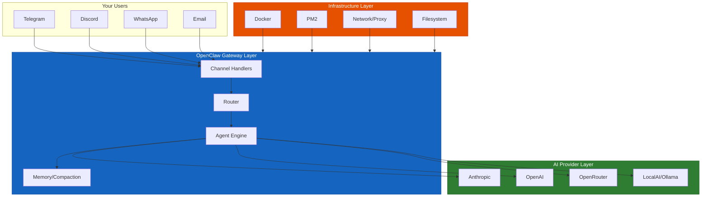
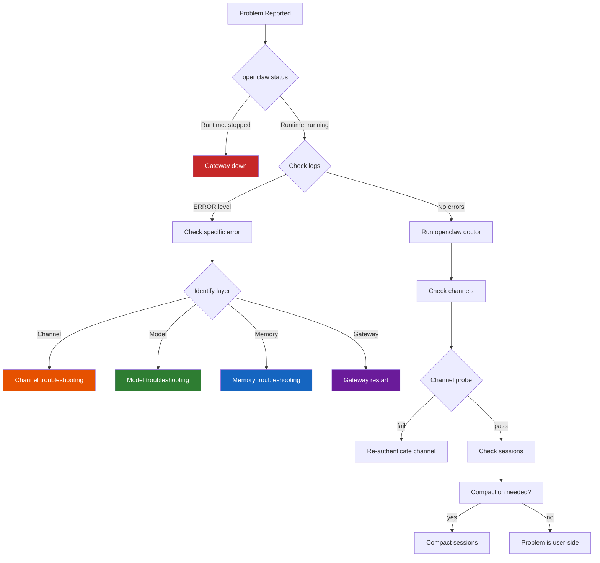

# OpenClaw Troubleshooting Guide
## Fix Every Common Problem: Gateway Crashes, Channel Failures, Model Errors, and Memory Issues

> **Reading Time:** 25 minutes
> **Difficulty:** Intermediate to Advanced
> **Prerequisites:** OpenClaw Gateway installed and running
> **Version:** OpenClaw v2026+

---

## Introduction: Why Troubleshooting Matters

You wake up. Your AI assistant is not responding. Your clients are messaging on Telegram but getting no replies. Your automated cron jobs stopped running three hours ago. The dashboard shows red.

This guide solves that.

OpenClaw is reliable when it works, but things break. Channels disconnect after updates. Models hit rate limits. Context windows overflow. Docker containers crash. Sessions accumulate until the disk fills up. This guide covers the problems that actually happen in production, based on real GitHub issues, Reddit posts, and Discord support threads.

We will go through every layer of the stack:



Each layer has its own failure modes. We will cover all of them.

---

## Part 1: The First 5 Minutes

Before diving into specific problems, run this sequence every time something breaks.

```bash
# Step 1: Check overall gateway status
openclaw status

# Step 2: Check gateway process specifically
openclaw gateway status

# Step 3: Watch live logs for errors
openclaw logs --follow

# Step 4: Run the diagnostic suite
openclaw doctor

# Step 5: Check channel connectivity
openclaw channels status --probe
```

What healthy looks like:

```
Runtime: running
RPC probe: ok
Channel probes: all return "works" or "audit ok"
```

If `Runtime` is not `running`, the gateway process is dead. If RPC probe is not `ok`, the gateway is alive but not responding. If channel probes fail, the specific channel handler is broken.

---

## Part 2: Gateway Will Not Start

### Problem: Gateway Process Keeps Restarting

The official Docker container restarts continuously. Logs show the gateway timing out during startup.

**Why it happens:** The sessions.json file grows too large. When it hits a certain size, loading it into memory takes too long and the startup watchdog kills the process before it finishes loading.

**How to fix:**

```bash
# Check sessions file size
ls -lh ~/.openclaw/sessions/sessions.json

# If it is over 50MB, archive it
cp ~/.openclaw/sessions/sessions.json ~/.openclaw/sessions/sessions.json.backup

# Create a fresh sessions file
echo '{}' > ~/.openclaw/sessions/sessions.json

# Now restart the gateway
openclaw gateway restart
```

This is a known issue tracked in GitHub issue #51097. The fix is to archive old sessions and start fresh.

### Problem: Docker Container Crashes After Enabling Discord

You enable the Discord plugin through the web UI and the container immediately crashes.

**Why it happens:** The Docker build process does not properly copy the plugin runtime files. When Discord tries to initialize, it cannot find the required dist/plugins/runtime/index.js file.

**How to fix:**

```bash
# Pull the latest image
docker pull openclaw/openclaw:latest

# Rebuild the container without cache
docker build --no-cache -t openclaw/openclaw:latest .

# If that still fails, use the pre-built official image
# and mount your config externally
docker run -d \
  -v /path/to/config:/root/.openclaw \
  -p 18789:18789 \
  openclaw/openclaw:latest
```

### Problem: Gateway Starts But RPC Probe Fails

The gateway process is running but it does not respond to RPC calls. This usually happens after a config change or an incomplete update.

**How to fix:**

```bash
# Generate a fresh gateway token
openclaw doctor --generate-gateway-token

# Restart the gateway
openclaw gateway restart

# Verify RPC is working
openclaw status
```

If that does not work, check the config file directly:

```bash
# View the current config
openclaw config get

# Check for syntax errors
openclaw config validate
```

### Problem: Out of Memory on Basic Commands

After upgrading to v2026.3.12, every CLI command fails with a JavaScript heap out of memory error.

**Why it happens:** A memory leak in that specific version causes the Node.js heap to exhaust on any operation that loads the workspace.

**How to fix:**

```bash
# Option 1: Increase Node.js heap size for this session
NODE_OPTIONS="--max-old-space-size=4096" openclaw status

# Option 2: Upgrade to the latest version (memory leak fixed)
npm install -g openclaw@latest

# Option 3: If you cannot upgrade immediately, clear session cache
rm -rf ~/.openclaw/agents/*/sessions/*.json
openclaw gateway restart
```

---

## Part 3: Channel Problems

Channels are where users interact with your agents. When channels break, users notice immediately.

### WhatsApp: Connected But No DM Replies

You see WhatsApp as connected in status, but users cannot get replies to direct messages.

**The fastest check:**

```bash
openclaw pairing list whatsapp
```

If the sender is not in the pairing list, the message gets silently dropped.

**How to fix:**

```bash
# Approve a specific sender
openclaw pairing approve whatsapp --sender "6281234567890"

# Or switch to allow-all DMs (less secure)
# Edit your openclaw.json:
{
  "channels": {
    "whatsapp": {
      "accounts": {
        "default": {
          "dmPolicy": "allow"
        }
      }
    }
  }
}
```

### WhatsApp: Random Disconnect and Relogin Loops

The WhatsApp connection drops every few minutes and keeps re-authenticating.

**Why it happens:** Usually caused by an unstable internet connection, an expired WhatsApp session token, or the credentials directory becoming corrupted.

**How to fix:**

```bash
# Re-login to WhatsApp
openclaw channels logout --channel whatsapp --account default
openclaw channels login --channel whatsapp --account default

# Check the credentials directory health
ls -la ~/.openclaw/channels/whatsapp/

# If the directory looks corrupted (weird permissions, missing files)
# remove it and re-authenticate
rm -rf ~/.openclaw/channels/whatsapp/default
openclaw channels login --channel whatsapp --account default

# Restart the gateway
openclaw gateway restart
```

### Telegram: Bot Online But Group Stays Silent

The Telegram bot shows as connected. You can DM it and get replies. But messages in groups never get responses.

**Why it happens:** Two possible causes. First, the bot has privacy mode enabled, which means it cannot read group messages. Second, the group is not in the allowlist.

**How to fix:**

```bash
# Check your group allowlist
openclaw config get channels.telegram.accounts.default.groups

# If the group is not listed, add it
openclaw channels allow --channel telegram --group "-1001234567890"

# Also check if mentions are required
# Some groups need the bot to be @mentioned to respond
openclaw config get channels.telegram.accounts.default.requireMention

# If requireMention is true and your group does not mention bots,
# disable it for that group
openclaw channels config --channel telegram --group "-1001234567890" \
  --set requireMention=false
```

To fix the privacy mode issue, go to [@BotFather](https://t.me/botfather) in Telegram:
1. Send `/mybot`
2. Select your bot
3. Privacy mode -> Disable

### Telegram: Send Failures With Network Errors

The bot can receive messages but cannot send replies. Logs show Telegram API call failures.

**Why it happens:** DNS issues, IPv6 routing problems, or a proxy that is blocking api.telegram.org.

**How to fix:**

```bash
# Test connectivity to Telegram API
curl -v https://api.telegram.org

# If DNS is the issue, use Google DNS
echo "8.8.8.8 api.telegram.org" >> /etc/hosts

# If you are behind a proxy, configure it
export HTTPS_PROXY="http://your-proxy:8080"
openclaw gateway restart

# Or add proxy settings to your config
{
  "channels": {
    "telegram": {
      "proxy": {
        "url": "http://your-proxy:8080"
      }
    }
  }
}
```

### Telegram: 429 Rate Limit Errors

You keep getting "429 error: token allotment exceeded" even though the bot worked fine before.

**Why it happens:** Telegram has per-bot message rate limits. If you send too many messages per second across all chats, Telegram temporarily blocks the bot.

**How to fix:**

```bash
# Check if it is a rate limit by looking at the error frequency
openclaw logs --lines 100 | grep 429

# Implement a rate limit delay between messages
# Edit your channel config:
{
  "channels": {
    "telegram": {
      "accounts": {
        "default": {
          "rateLimit": {
            "maxPerSecond": 1,
            "maxPerMinute": 30
          }
        }
      }
    }
  }
}

# Restart the gateway
openclaw gateway restart
```

### Discord: Bot Online But No Guild Replies

The Discord bot shows as connected to your server but ignores all messages.

**Why it happens:** The Message Content Intent is not enabled, or the bot does not have access to the specific channel.

**How to fix:**

1. Go to the [Discord Developer Portal](https://discord.com/developers/applications)
2. Select your application
3. Go to Bot -> Privileged Gateway Intents
4. Enable **Message Content Intent**
5. Save and restart the bot

Then verify in OpenClaw:

```bash
# Check Discord channel status
openclaw channels status --probe discord

# Check which channels are allowed
openclaw config get channels.discord.accounts.default.channels

# Allow the specific channel
openclaw channels allow --channel discord --channel "channel-id-here"
```

### Discord: Reasoning Content Leaking Into Responses

Users see internal thinking tags and reasoning content in Discord responses. This is a known bug in some versions.

**How to fix:**

```bash
# Check your OpenClaw version
openclaw --version

# Upgrade if you are on an affected version
npm install -g openclaw@latest

# If you cannot upgrade, disable thinking output for Discord
# Edit config:
{
  "channels": {
    "discord": {
      "accounts": {
        "default": {
          "thinkingMode": "hidden"
        }
      }
    }
  }
}

# Restart gateway
openclaw gateway restart
```

### Discord: Sessions Bypass Compaction

All Discord channel sessions accumulate until they hit context overflow. The compaction system does not run properly for Discord sessions.

**Why it happens:** A bug in session tracking causes Discord sessions to be excluded from the automatic compaction schedule.

**How to fix:**

```bash
# Manually trigger compaction for Discord sessions
openclaw sessions compact --channel discord --all

# If sessions are already overflowed, reset them
openclaw sessions list --channel discord
# Find the session ID that is broken
openclaw sessions reset <session-id>

# Set up a cron job to prevent this in the future
openclaw cron add \
  --name "discord-session-cleanup" \
  --every 6h \
  --command "sessions compact --channel discord"
```

### All Channels: Channel Fails to Initialize After Gateway Restart

You restart the gateway and a channel (usually WhatsApp or Telegram) fails to initialize. The logs say something about a missing token or a failed authentication.

**Why it happens:** The gateway restart process sometimes re-writes the config file during initialization. If the channel credentials are stored as SecretRefs, they might not resolve correctly during the restart sequence.

**How to fix:**

```bash
# Re-authenticate the channel
openclaw channels logout --channel telegram --account default
openclaw channels login --channel telegram --account default

# Restart the gateway
openclaw gateway restart

# If the issue persists, check if the channel config was modified
openclaw config get channels.telegram.accounts.default
```

This is a known issue. The workaround is to re-run the channel login after every gateway restart that was triggered by running `openclaw configure`.

---

## Part 4: AI and Model Errors

### Context Overflow Errors on Fresh Sessions

You get a "context overflow" error even on a brand new session with an empty workspace. The model window should not be full.

**Why it happens:** OpenClaw thinks the model has a 200k token context window, but the actual provider returns an overflow error because the model being used has a smaller window. This mismatch causes premature overflow errors.

**How to fix:**

```bash
# Check which model is actually being used
openclaw models list

# Check the actual context window for that model
openclaw models list --verbose | grep -A5 "claude-sonnet"

# If the config has the wrong window size, override it
{
  "models": {
    "providers": {
      "anthropic": {
        "models": [
          {
            "id": "claude-sonnet-4-7-20250514",
            "contextWindow": 200000,
            "contextTokens": 180000
          }
        ]
      }
    }
  }
}
```

### Model Failover Does Not Trigger on Rate Limit

Your primary model hits a 429 rate limit but OpenClaw does not switch to the fallback model. Everything just fails.

**Why it happens:** This is a known bug. The failover system checks for specific error signatures but does not properly detect 429 errors from all providers. It shows "All models failed" even though only the primary hit the rate limit.

**How to fix:**

```bash
# Manually trigger failover
openclaw models failover --agent main

# If you are using OpenRouter, configure explicit fallback
{
  "agents": {
    "list": [
      {
        "id": "main",
        "model": "anthropic/claude-sonnet-4-7-20250514",
        "fallback": "openai/gpt-4o"
      }
    ]
  }
}

# Restart gateway
openclaw gateway restart

# Monitor which model is active
openclaw status | grep "Active model"
```

### False Rate Limit Errors When API Is Fine

OpenClaw shows "API rate limit reached" but the upstream API is actually responding normally. Users get error messages even though nothing is wrong with the provider.

**Why it happens:** A bug in the error classification logic causes OpenClaw to misidentify normal responses as rate limit errors.

**How to fix:**

```bash
# Check upstream API directly
curl -H "Authorization: Bearer YOUR_API_KEY" \
  https://api.anthropic.com/v1/messages \
  --data '{"model":"claude-sonnet-4","max_tokens":10,"messages":[{"role":"user","content":"hi"}]}'

# If the API responds fine, the issue is with OpenClaw
# Upgrade to latest version
npm install -g openclaw@latest

# If you cannot upgrade, disable rate limit detection temporarily
{
  "agents": {
    "defaults": {
      "rateLimitDetection": false
    }
  }
}
```

### Model Not Allowed Error After OpenRouter Rate Limit

You hit the $5 spending cap on OpenRouter. After that, switching models fails with "model not allowed" for ALL models, even models that should not be affected.

**Why it happens:** When the OpenRouter account hits its spending cap, the entire API key becomes temporarily invalid. All model requests fail until the cap resets or you add more credit.

**How to fix:**

```bash
# Check OpenRouter usage
openclaw logs --lines 50 | grep "openrouter"

# Add more credit to your OpenRouter account
# or wait for the billing cycle reset

# In the meantime, use a different API provider
{
  "agents": {
    "list": [
      {
        "id": "main",
        "model": "anthropic/claude-sonnet-4",
        "provider": "anthropic"
      }
    ]
  }
}
```

### Agent Reply Silently Dropped on Rate Limit

When a 429 rate limit error occurs on the last model call of an agent run, OpenClaw ends the run with `aborted=false` and the user never gets a reply. The message just disappears.

**Why it happens:** A bug in the error handling for the final turn of a conversation causes the reply to be generated but never delivered.

**How to fix:**

```bash
# Enable delivery confirmation
{
  "agents": {
    "defaults": {
      "confirmDelivery": true
    }
  }
}

# Set a retry policy for rate limit errors
{
  "agents": {
    "defaults": {
      "retryOnRateLimit": {
        "maxAttempts": 3,
        "backoffSeconds": 5
      }
    }
  }
}

# Restart the gateway
openclaw gateway restart
```

---

## Part 5: Memory and Session Problems

### Session Memory Files Growing Out of Control

The sessions directory contains hundreds of session files and is eating up disk space. The gateway is getting slower to start.

**How to fix:**

```bash
# Find large session files
find ~/.openclaw -name "*.json" -size +10M -ls

# Archive old sessions
openclaw sessions archive --older-than 30d

# Set up automatic pruning
openclaw sessions prune --keep 50 --by-size

# If sessions.json itself is huge, split it
python3 -c "
import json
with open('~/.openclaw/sessions/sessions.json') as f:
    data = json.load(f)
# Split into monthly files
months = {}
for k, v in data.items():
    month = k[:7]  # YYYY-MM
    months.setdefault(month, {})[k] = v
for month, records in months.items():
    with open(f'~/.openclaw/sessions/sessions-{month}.json', 'w') as f:
        json.dump(records, f)
print('Split into', len(months), 'files')
"
```

### Compaction Not Running Automatically

Sessions are getting huge and OpenClaw is not automatically compacting them. Users see context overflow errors more frequently.

**How to fix:**

```bash
# Check if compaction is enabled
openclaw config get agents.defaults.compaction.enabled

# If it is disabled, enable it
openclaw config set agents.defaults.compaction.enabled true

# Check the compaction schedule
openclaw config get agents.defaults.compaction.threshold

# Set a reasonable threshold (default is 160000 tokens)
openclaw config set agents.defaults.compaction.threshold 140000

# Manually trigger compaction for all sessions
openclaw sessions compact --all

# Check compaction history
openclaw logs --lines 100 | grep compaction
```

### Active Memory Ignoring Workspace Files

You update MEMORY.md with important team data, but the agent does not see it. The agent acts like the file is empty or contains old information.

**Why it happens:** The active memory system caches its state. Updates to workspace files do not automatically trigger a memory refresh.

**How to fix:**

```bash
# Force a memory refresh
openclaw memory refresh --workspace

# Or restart the memory server
openclaw memory restart

# Verify the memory was loaded
openclaw memory list --workspace

# If you are in a multi-agent setup, check that the workspace
# is correctly linked to the right agent
openclaw agents list --bindings
```

### Memory Search Returns No Results

You use the memory search feature but it returns nothing, even for queries that should match.

**How to fix:**

```bash
# Check the memory database status
openclaw memory status

# Rebuild the search index
openclaw memory rebuild

# Test with a known query
openclaw memory search "test query"

# If you are using a custom embedding provider, check its status
openclaw config get memory.embeddingProvider
```

---

## Part 6: Docker and Container Issues

### Container Uses Too Much Memory

The OpenClaw Docker container is consuming 8GB of RAM and your server is swapping.

**How to fix:**

```bash
# Set a hard memory limit for the container
docker run -d \
  --memory="2g" \
  --memory-swap="2g" \
  -v /path/to/config:/root/.openclaw \
  -p 18789:18789 \
  openclaw/openclaw:latest

# If running via docker-compose, add:
# services:
#   openclaw:
#     mem_limit: 2g
#     memswap_limit: 2g

# Clear the internal cache inside the container
docker exec openclaw openclaw cache clear

# Restart the container
docker restart openclaw
```

### Cannot Restart Gateway Inside Container

Running `openclaw gateway restart` or `openclaw gateway stop` fails inside a container that does not have systemd.

**Why it happens:** The restart/stop commands use systemd signals. Containers without systemd cannot process these commands.

**How to fix:**

```bash
# Instead of the built-in restart, restart the container directly
docker restart openclaw

# Or use the Docker API directly
docker kill -s HUP openclaw

# To stop the gateway inside the container without restarting it
docker exec openclaw gateway stop
```

### Port Conflicts in Docker Setup

Another container is already using port 18789 or 8080, and OpenClaw fails to start.

**How to fix:**

```bash
# Check what is using the port
lsof -i :18789
netstat -tlnp | grep 18789

# Map OpenClaw to a different port
docker run -d \
  -p 18790:18789 \
  -e OPENCLAW_PORT=18789 \
  -v /path/to/config:/root/.openclaw \
  openclaw/openclaw:latest
```

---

## Part 7: Security Problems

### API Keys Leaking to the LLM

API keys are being exposed to the language model. This is a serious security issue. GitHub issue #11829 documents multiple vectors where this can happen.

**How to fix:**

```bash
# Run a security audit
openclaw security audit

# Check for exposed keys in your config
# Redact sensitive values from logs
openclaw config set logging.redactSensitive true

# Ensure exec commands do not include API keys in their output
# Edit your exec profile:
{
  "security": {
    "exec": {
      "redactEnv": ["API_KEY", "SECRET", "TOKEN", "PASSWORD"]
    }
  }
}

# Restart after making changes
openclaw gateway restart
```

### Allowlist Blocking Your Own Account After Upgrade

After upgrading OpenClaw, you cannot reach your own bot anymore. The security allowlist is blocking you.

**Why it happens:** The security audit and allowlist system changed behavior in a recent update. Usernames that were previously accepted now require numeric sender IDs.

**How to fix:**

```bash
# Run the auto-fix for allowlists
openclaw doctor --fix

# If that does not work, manually add your ID
openclaw security allow --sender "YOUR_NUMERIC_TELEGRAM_ID"

# Or switch to allow-all temporarily to confirm this is the issue
openclaw config set channels.telegram.accounts.default.allowFrom "*"
openclaw gateway restart
```

---

## Part 8: Network and Connectivity

### Gateway Unreachable From Outside

The gateway is running locally but you cannot access it from other machines or from the internet.

**How to fix:**

```bash
# Check what the gateway is bound to
openclaw config get gateway.bind

# If it is bound to localhost, change it to 0.0.0.0
openclaw config set gateway.bind "0.0.0.0"
openclaw gateway restart

# Check firewall rules
ufw status
ufw allow 18789/tcp

# If behind NAT, set up port forwarding
# Or use a tunnel
ssh -L 18789:localhost:18789 your-server
```

### DNS Resolution Failing Inside Gateway

The gateway cannot resolve domain names when making API calls to AI providers.

**How to fix:**

```bash
# Test DNS from the gateway host
nslookup api.anthropic.com
nslookup api.openai.com

# If DNS fails, check resolv.conf
cat /etc/resolv.conf

# Add Google DNS as fallback
echo "nameserver 8.8.8.8" >> /etc/resolv.conf

# Inside Docker, you may need to pass DNS config
docker run -d \
  --dns 8.8.8.8 \
  --dns 8.8.4.4 \
  -v /path/to/config:/root/.openclaw \
  -p 18789:18789 \
  openclaw/openclaw:latest
```

---

## Part 9: Daily Maintenance Checklist

Run these commands regularly to keep your gateway healthy.

```bash
# Every morning: Check status
openclaw status && openclaw channels status --probe

# Every few hours: Check for errors in logs
openclaw logs --lines 20 | grep -E "ERROR|WARN|CRIT"

# Every day: Run the doctor tool
openclaw doctor

# Every week: Check disk usage
df -h ~/.openclaw
find ~/.openclaw -name "*.json" -size +50M -ls

# Every week: Archive old sessions
openclaw sessions archive --older-than 7d

# Every week: Check for security issues
openclaw security audit

# After any config change: Verify the gateway is healthy
openclaw gateway status
openclaw channels status --probe
```

---

## Part 10: Diagnostic Reference

### Command Ladder for Any Problem



### Error Code Quick Reference

| Error Code | Meaning | Quick Fix |
|------------|---------|-----------|
| 401 | Unauthorized | Regenerate API key |
| 403 | Forbidden | Check allowlist, check permissions |
| 429 | Rate limited | Wait, implement backoff |
| 500 | Server error | Restart gateway, check provider status |
| 502 | Bad gateway | Check reverse proxy, check upstream |
| 503 | Service unavailable | Provider down, use fallback model |
| ECONNREFUSED | Connection refused | Check service is running, check port |
| ETIMEDOUT | Connection timed out | Check firewall, check DNS |
| ENOENT | File not found | Check paths, check workspace |

---

## For More Information

- [Official Channel Troubleshooting Docs](https://docs.openclaw.ai/channels/troubleshooting.md)
- [Gateway Troubleshooting Docs](https://docs.openclaw.ai/gateway/troubleshooting.md)
- [Doctor Command Reference](https://docs.openclaw.ai/cli/doctor.md)
- [Security Audit Command](https://docs.openclaw.ai/cli/security.md)
- [Session Management Docs](https://docs.openclaw.ai/concepts/session.md)
- [Compaction and Context Docs](https://docs.openclaw.ai/concepts/compaction.md)

Want to run OpenClaw on a VPS that just works, without dealing with Docker and server config?

**[Get SumoPod VPS](https://blog.fanani.co/sumopod)** - Pre-configured VPS hosting with OpenClaw already set up, plus affiliate support for multi-agent and proxy configurations.

For the easy-to-follow version of this guide in mixed Indonesian and English:

**[Baca versi Bahasa Indonesia](https://blog.fanani.co/tech/openclaw-troubleshooting-guide/)** - Same content, casual style, easier to digest.

---

## Related Tutorials

- [OpenClaw Gateway Setup From Scratch](/tutorials/openclaw-gateway-setup-from-scratch.md) - Start here if you are setting up for the first time
- [OpenClaw Session Maintenance Guide](/tutorials/openclaw-session-maintenance.md) - Keep sessions healthy before problems occur
- [OpenClaw Security Hardening Guide](/tutorials/openclaw-security-hardening.md) - Prevent security issues before they happen
- [OpenClaw Multi-Account Routing](/tutorials/openclaw-multi-account-routing.md) - Manage multiple agents and billing separately
- [OpenClaw MCP Server Setup](/tutorials/openclaw-mcp-server-setup.md) - Connect data sources properly

---

*This guide is verified against official OpenClaw documentation and real GitHub issues from the openclaw/openclaw repository.*

**Last Updated:** April 2026
**Version:** 1.0
**Author:** Radian IT Team
