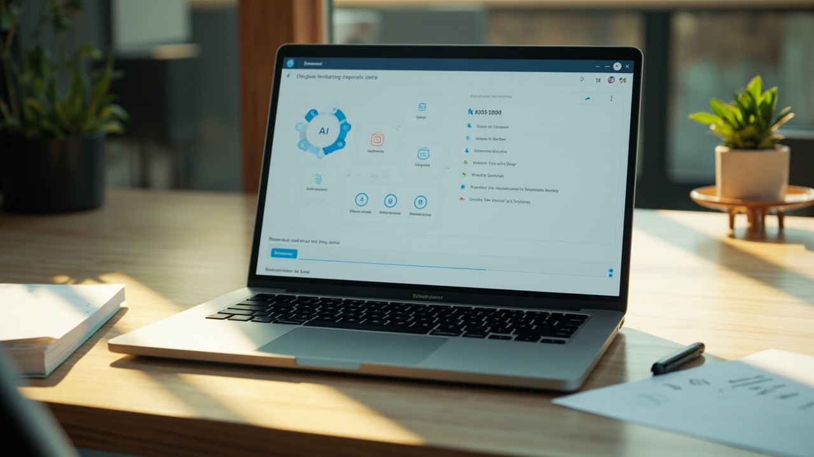
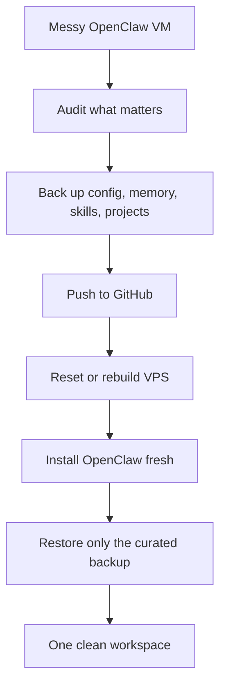
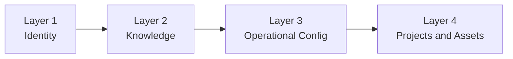
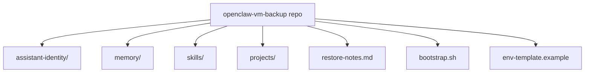
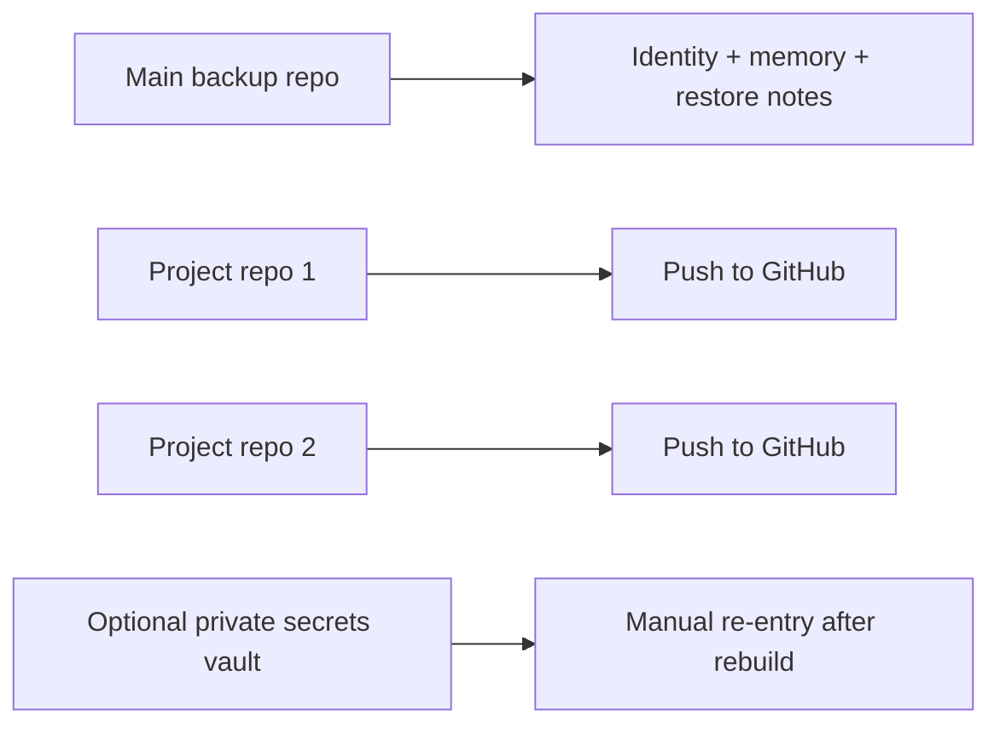

# How to Back Up an OpenClaw VM to GitHub, Reset the Server, and Restore Everything into One Clean Workspace
## A practical recovery guide for messy OpenClaw installs, scattered workspaces, and people who want a clean restart without losing history

> **Estimated reading time:** 22 to 28 minutes  
> **Difficulty:** Beginner to Intermediate  
> **Best for:** OpenClaw users running on a VPS who want to rebuild cleanly without throwing away their prior work

---



## Before You Touch Anything

If your OpenClaw VM feels messy, you are not alone.

This usually happens after a few weeks of real use. You start with one workspace. Then another test repo appears. Then a backup folder. Then a second agent setup. Then scripts land in one place, skills in another, notes somewhere else, and suddenly the machine still works but the layout feels like a junk drawer.

That is the moment many people ask the same question:

**If I want to reset this VM and start clean, what do I actually need to back up?**

This guide answers that directly.

It shows you how to:

1. Identify the files that matter
2. Back them up to GitHub safely
3. Reset or rebuild the VPS
4. Restore OpenClaw into one tidy workspace
5. Keep previous history, memories, prompts, and project context where it still makes sense

If you want the easier mixed Indonesian + English version for casual reading, use the companion blog post here:

**https://blog.fanani.co/tech/openclaw-backup-reset-restore/**

If you want a VPS first, and want to support our affiliate link, use Sumopod here:

**https://blog.fanani.co/sumopod**

---

## The Real Goal

The goal is not “copy the whole server forever.”

That sounds safe, but it usually preserves the same mess you are trying to escape.

The better goal is this:

- keep the **brain**
- keep the **important work**
- keep the **useful config**
- drop the **garbage, cache, and accidental sprawl**

That means you want a **selective backup**, not blind hoarding.

Here is the clean mental model.



If you follow that flow, you do not just survive the reset. You come back with a better system.

---

## What You Usually Need to Preserve

Let us separate your OpenClaw VM into four layers.



### Layer 1: Identity

This is the part that makes your assistant feel like *your* assistant.

Usually includes files like:

- `SOUL.md`
- `USER.md`
- `AGENTS.md`
- `IDENTITY.md`
- `TOOLS.md`
- any custom prompt scaffolding

If you lose this layer, the assistant still runs, but it no longer behaves like the same assistant.

### Layer 2: Knowledge

This is the continuity layer.

Usually includes:

- `MEMORY.md`
- `memory/*.md`
- daily notes
- diary files you actually care about
- project docs
- decisions and lessons learned

If your goal is “start fresh but keep history,” this layer matters a lot.

### Layer 3: Operational Config

This is what makes the stack work.

Usually includes:

- `~/.openclaw/openclaw.json`
- agent model configs
- gateway-related settings
- cron scripts you wrote
- custom commands
- routing rules
- channel config templates

Be careful here: some config files may include secrets. Do not push raw secrets to GitHub unless the repo is private and you intentionally accept that risk. Safer pattern: back up the structure, then re-add secrets via environment variables on restore.

### Layer 4: Projects and Assets

This is the practical work you created around OpenClaw.

Examples:

- blog repos
- automation scripts
- skill folders
- dashboards
- tutorial repos
- exported diagrams
- image assets

This is often where the real value lives.

---

## What You Usually Do *Not* Need to Preserve

A lot of VPS clutter is rebuildable.

You can normally skip:

- `node_modules/`
- package manager caches
- old logs
- temporary screenshots
- compiled output folders
- `.next/`, `.nuxt/`, `dist/`, `.output/`
- Docker cache layers
- duplicated tar backups sitting in random folders
- stale session junk you do not actually want

This is where many people go wrong. They back up everything, then restore everything, then wonder why the new machine feels old on day one.

---

## The Minimum Safe Backup Checklist

If someone asked me for the shortest practical answer, I would say back up these first:

```text
~/.openclaw/openclaw.json
~/.openclaw/agents/
<your main workspace>/SOUL.md
<your main workspace>/USER.md
<your main workspace>/AGENTS.md
<your main workspace>/TOOLS.md
<your main workspace>/MEMORY.md
<your main workspace>/memory/
<your main workspace>/skills/
<your project repos>
```

That is the short version.

But if you want to rebuild cleanly, do one extra step before backup: **decide the new target structure first**.

---

## The Best Restore Pattern: One Main Workspace

The easiest way to avoid future chaos is to restore into one intentional root.

Example:

```text
/root/workspace/
├── assistant-core/
├── projects/
│   ├── blog-fanani/
│   ├── openclaw-sumopod/
│   └── other-projects/
├── memory/
├── skills/
├── scripts/
└── backups/
```

Or if you want OpenClaw-native structure but cleaner:

```text
/root/.openclaw/
├── workspace-main/
├── workspace-projects/
│   ├── blog-fanani/
│   └── openclaw-sumopod/
├── shared-skills/
└── archived-backups/
```

The exact naming is less important than consistency.

What matters is:

- one obvious main workspace
- one obvious projects area
- one obvious memory area
- no mystery folders with overlapping purpose

---

## Step 1: Audit Before Backup

Do not start by zipping random directories.

Start with an audit.

```bash
pwd
find ~ -maxdepth 3 -type d \( -name '*openclaw*' -o -name '*workspace*' -o -name '*blog*' -o -name '*skills*' \) | sort
```

Then inspect the important candidates:

```bash
du -sh ~/.openclaw/* 2>/dev/null | sort -h
ls -la ~/workspace 2>/dev/null
ls -la ~/.openclaw/agents 2>/dev/null
```

Your job here is not to memorize every folder.

Your job is to answer three questions:

1. Which folder is the real home base?
2. Which folders are active projects?
3. Which folders are just leftovers?

Make that call before you back up.

---

## Step 2: Create a Curated Backup Repo

The cleanest pattern is a GitHub repo dedicated to your OpenClaw backup and restore scaffolding.

Example repo contents:



Good structure:

```text
openclaw-vm-backup/
├── assistant-identity/
│   ├── SOUL.md
│   ├── USER.md
│   ├── AGENTS.md
│   ├── TOOLS.md
│   └── MEMORY.md
├── memory/
├── skills/
├── projects/
│   ├── openclaw-sumopod/
│   └── blog-fanani/
├── restore-notes.md
└── env-template.example
```

This makes restore dramatically easier.

---

## Step 3: Back Up the Right Files

Once you know what matters, copy only the curated set.

Example:

```bash
mkdir -p ~/openclaw-vm-backup/assistant-identity
mkdir -p ~/openclaw-vm-backup/projects
mkdir -p ~/openclaw-vm-backup/memory
mkdir -p ~/openclaw-vm-backup/skills

cp ~/workspace/SOUL.md ~/openclaw-vm-backup/assistant-identity/ 2>/dev/null
cp ~/workspace/USER.md ~/openclaw-vm-backup/assistant-identity/ 2>/dev/null
cp ~/workspace/AGENTS.md ~/openclaw-vm-backup/assistant-identity/ 2>/dev/null
cp ~/workspace/TOOLS.md ~/openclaw-vm-backup/assistant-identity/ 2>/dev/null
cp ~/workspace/MEMORY.md ~/openclaw-vm-backup/assistant-identity/ 2>/dev/null
cp -r ~/workspace/memory ~/openclaw-vm-backup/ 2>/dev/null
cp ~/.openclaw/openclaw.json ~/openclaw-vm-backup/ 2>/dev/null
```

For Git-based project repos, do not just copy the working tree. Preserve the Git repo itself if that history matters.

```bash
cp -r ~/openclaw-sumopod ~/openclaw-vm-backup/projects/
cp -r ~/blog-fanani ~/openclaw-vm-backup/projects/
```

Or better, push each active repo upstream before reset.

---

## Step 4: Push to GitHub Before Resetting the VPS

This is the key move.

If the repo is not pushed, it is not a real backup yet.

```bash
git init
git add .
git commit -m "Backup OpenClaw VM before rebuild"
git remote add origin <your-private-repo-url>
git push -u origin main
```

If you use multiple project repos, push them individually too.



That split is healthy.

One repo for recovery context. Separate repos for actual projects.

---

## Step 5: Reset the VPS with a Clear Restore Plan

Only reset after you can answer this confidently:

- where the backup lives
- which repo contains what
- which secrets are intentionally excluded
- what the new folder layout should be

If you cannot answer those yet, do not wipe the server.

Resetting is easy. Restoring clarity is the hard part.

---

## Step 6: Restore OpenClaw into a Cleaner Layout

After the VPS is rebuilt, install OpenClaw fresh first.

Then clone your repos into the structure you planned.

Example:

```bash
mkdir -p /root/workspace/projects
cd /root/workspace

git clone <backup-repo-url> openclaw-vm-backup
git clone <openclaw-sumopod-repo-url> projects/openclaw-sumopod
git clone <blog-repo-url> projects/blog-fanani
```

Then restore the identity files into the workspace you actually want OpenClaw to use.

```bash
cp /root/workspace/openclaw-vm-backup/assistant-identity/* /root/workspace/
cp -r /root/workspace/openclaw-vm-backup/memory /root/workspace/
```

Then re-apply config carefully.

Do not blindly overwrite a fresh `openclaw.json` if versions changed a lot. Compare and merge.

---

## Step 7: Reconnect Secrets, Channels, and External Services

This is where many restores fail.

The files come back. The personality comes back. But Telegram breaks, model routing breaks, or API keys are missing.

Make a short restore checklist:

- re-add environment variables
- verify provider API keys
- verify Telegram or WhatsApp tokens
- verify Google credentials if used
- verify cron jobs
- verify custom skills path
- verify workspace path assumptions inside scripts

A restore is not complete when files exist.

A restore is complete when the assistant behaves correctly again.

---

## Common Mistakes That Make the New VM Messy Again

A clean rebuild can still go sideways if you restore without discipline.

Here are the most common mistakes:

### Restoring three overlapping workspaces

If you had `workspace`, `workspace-radit`, and `openclaw-workspace-final-final`, do not restore all three “just in case.” Pick the winner. Archive the rest outside the active path.

### Copying old config blindly into a newer OpenClaw version

Config schemas evolve. A fresh install may support better defaults than the version you backed up from. Compare, merge, and validate. Do not overwrite on autopilot.

### Keeping secrets only in one old file

If your only copy of a token lives inside a single old config file, that is a fragile setup. Move toward environment variables and documented restore notes.

### Preserving junk because it feels safer

Caches and stale build output do not make restores safer. They just make them heavier.

### Not testing after restore

You should verify the stack immediately:

```bash
openclaw status
openclaw models list
openclaw sessions cleanup --dry-run
```

Then test at least one real interaction in your primary channel.

---

## A Simple Restore Notes Template

Include a plain text file like this in your backup repo:

```text
Server purpose: Main OpenClaw personal assistant
Primary workspace: /root/workspace/core
Project repos:
- openclaw-sumopod
- blog-fanani
Secrets restored manually:
- Telegram bot token
- provider API keys
- Google credentials
Post-restore checks:
- OpenClaw gateway live
- model routing correct
- memory files loaded
- cron jobs restored
```

This is boring documentation. That is why it is valuable. During a rebuild, boring beats clever every single time.

---

## What I Would Tell Someone Asking in a Group Chat

If someone said:

> “My OpenClaw VM is messy. I want to start from zero, but keep the previous history.”

I would say:

1. Back up your important OpenClaw files to GitHub first
2. Preserve identity, memory, config, and actual project repos
3. Do **not** preserve junk caches and random clutter
4. Reset the VPS only after the backup is verified
5. Restore into one clean workspace, not five half-duplicated ones

That is the sane path.

Not glamorous. Just correct.

---

## Recommended Final Structure After Restore

Here is a practical end state:

```text
/root/workspace/
├── core/
│   ├── SOUL.md
│   ├── USER.md
│   ├── AGENTS.md
│   ├── TOOLS.md
│   ├── MEMORY.md
│   └── memory/
├── projects/
│   ├── openclaw-sumopod/
│   ├── blog-fanani/
│   └── other-active-repos/
├── shared/
│   ├── skills/
│   └── scripts/
└── restore-notes.md
```

Simple beats clever.

---

## Final Advice

If your VM feels messy, that does **not** mean you failed.

It usually means the system became useful faster than the structure matured.

That is normal.

What matters now is not preserving every file forever. What matters is preserving the parts that carry identity, knowledge, and active value.

Back those up properly. Push them to GitHub. Rebuild with intention. Restore into one clear workspace.

That is how you turn “my VM is chaotic” into “my assistant system is finally maintainable.”

If you want a VPS to host your OpenClaw stack or related projects, use Sumopod here:

**https://blog.fanani.co/sumopod**

If you prefer the friendlier companion article, read it here:

**https://blog.fanani.co/tech/openclaw-backup-reset-restore/**

---

## Related Links

- Companion blog tutorial: **https://blog.fanani.co/tech/openclaw-backup-reset-restore/**
- OpenClaw Sumopod repo: **https://github.com/fanani-radian/openclaw-sumopod**
- OpenClaw official repo: **https://github.com/openclaw/openclaw**
