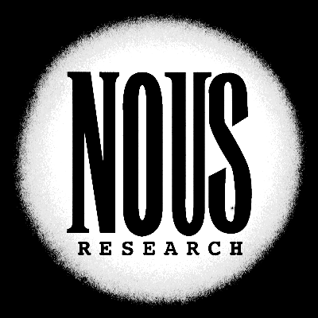
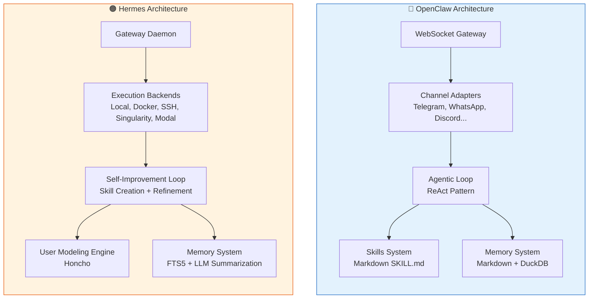
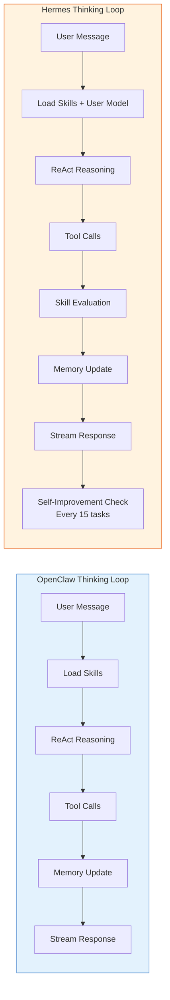
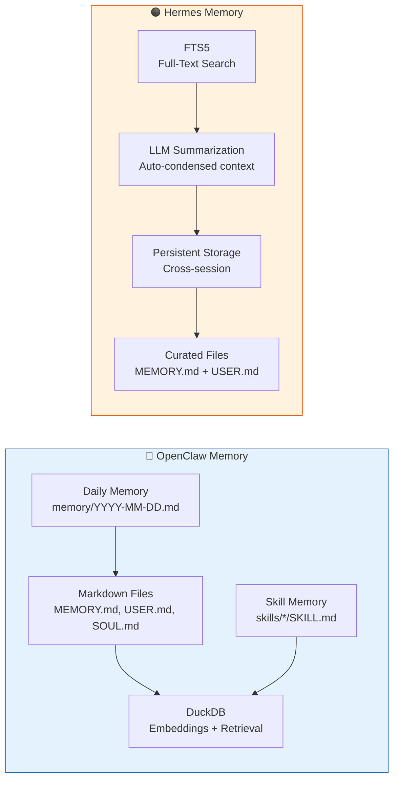
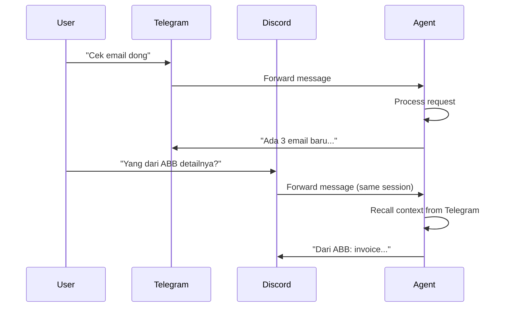
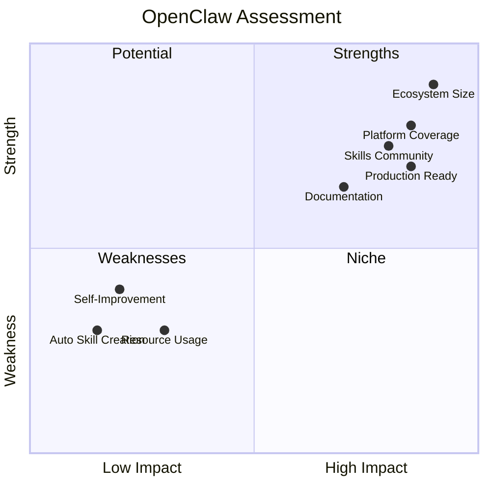
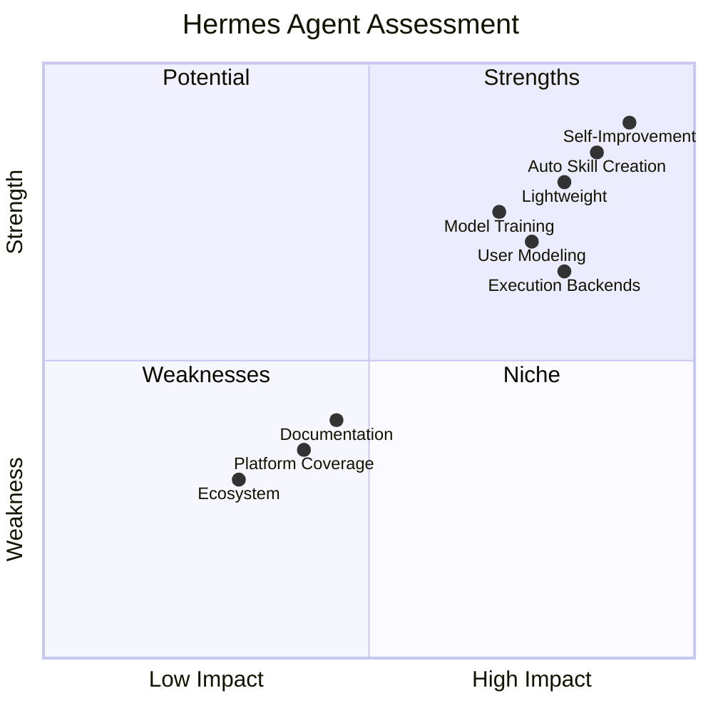
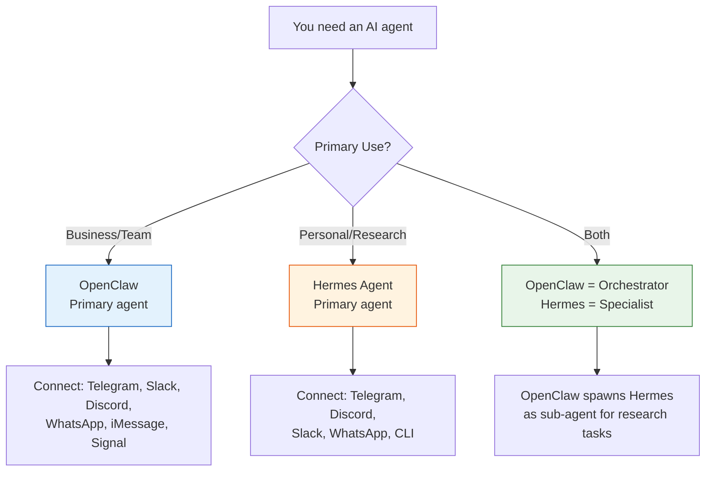
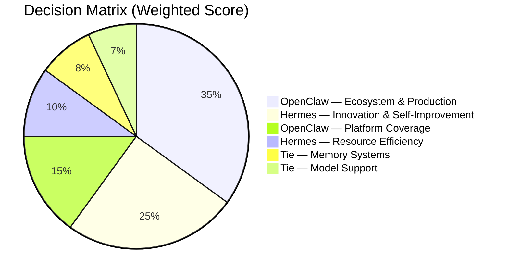

# OpenClaw vs Hermes Agent — Comprehensive Comparison Guide (2026)



> Two of the most powerful open-source AI agents in 2026. Which one should you pick?

---

## Table of Contents

1. [What is OpenClaw?](#what-is-openclaw)
2. [What is Hermes Agent?](#what-is-hermes-agent)
3. [Architecture Comparison](#architecture-comparison)
4. [Feature-by-Feature Comparison](#feature-by-feature-comparison)
5. [Memory System](#memory-system)
6. [Skills & Extensibility](#skills--extensibility)
7. [Multi-Platform Support](#multi-platform-support)
8. [Cost & Performance](#cost--performance)
9. [Pros & Cons](#pros--cons)
10. [Use Case Recommendations](#use-case-recommendations)
11. [Summary](#summary)

---

## What is OpenClaw?


[OpenClaw](https://github.com/openclaw/openclaw) is the **most popular open-source AI agent** with **307k+ GitHub stars** (as of March 2026). Built by the OpenClaw community, it transforms any LLM into an autonomous digital assistant that runs on your server, connects to your messaging apps, and remembers everything.

### Core Philosophy

> "Give an LLM hands, eyes, and ears — then let it live on your machine."

OpenClaw is **local-first**. Your data, memory, skills, and conversations stay on your hardware. The gateway connects to Telegram, WhatsApp, Discord, Slack, iMessage, Signal, and more — acting as a single unified interface for all interactions.

### Key Characteristics

- **Node.js runtime** — single process, five subsystems
- **Markdown-based skills** — extend capabilities without writing code
- **Local-first data** — all memory stored as `.md` and `.yaml` files
- **24/7 daemon** — runs as a systemd service, proactively reaches out
- **Model agnostic** — Claude, GPT-4o, Gemini, Ollama, anything
- **Multi-agent orchestration** — spawn sub-agents for parallel tasks
- **Cost-aware design** — tiered model routing, caching, zero-waste architecture

### Quick Start

```bash
curl -fsSL https://openclaw.ai/install.sh | bash
openclaw setup    # Interactive wizard
openclaw gateway  # Connect messaging platforms
```

---

## What is Hermes Agent?


[Hermes Agent](https://github.com/NousResearch/hermes-agent) is an open-source AI agent by **Nous Research** with **~6k GitHub stars**. It focuses on **self-improvement and autonomous skill creation** — the agent literally programs itself by turning learned approaches into reusable skills.

### Core Philosophy

> "An agent that grows with you. It learns, remembers, and gets more capable the longer it runs."

Hermes differentiates itself through its **self-improving loop**. After every 15 tasks, it evaluates performance, refines existing skills, and creates new ones based on patterns it discovered. It's the only open-source agent that can contribute to improving its own AI model through batch trajectory generation via Atropos RL.

### Key Characteristics

- **Python runtime** — lightweight, fast to deploy
- **Self-improving loop** — autonomous skill creation from experience
- **Persistent cross-session memory** — FTS5 full-text search with LLM summarization
- **User Modeling Engine (Honcho)** — builds a model of your working style
- **Five execution backends** — local, Docker, SSH, Singularity, Modal
- **Container hardening** — namespace isolation for security
- **Atropos RL integration** — feeds agent experience back into model training

### Quick Start

```bash
curl -fsSL https://raw.githubusercontent.com/NousResearch/hermes-agent/main/scripts/install.sh | bash
hermes setup     # Interactive wizard
hermes gateway setup  # Connect messaging platforms
hermes           # Start chatting
```

---

## Architecture Comparison



### Runtime Differences

| Aspect | OpenClaw | Hermes Agent |
|--------|----------|--------------|
| **Language** | Node.js | Python |
| **Process Model** | Single process, 5 subsystems | Single process, modular |
| **Installation** | npm-based, `openclaw` CLI | pip-based, `hermes` CLI |
| **Package Manager** | npm (Node.js ecosystem) | uv (Python ecosystem) |
| **Configuration** | YAML + Markdown | YAML + Python |
| **OS Support** | Linux, macOS, WSL2 | Linux, macOS, WSL2 |
| **System Service** | systemd via `openclaw gateway install` | systemd via `hermes gateway install` |

### How They Think



The key architectural difference: **Hermes has a self-improvement loop** that evaluates its own performance and creates new skills. OpenClaw relies on human-authored skills and manual updates.

---

## Feature-by-Feature Comparison

### Core Capabilities

| Feature | OpenClaw | Hermes Agent |
|---------|----------|--------------|
| **Web Browsing** | ✅ Built-in (Playwright) | ✅ Built-in (Playwright) |
| **Web Search** | ✅ Multiple providers | ✅ Multiple providers |
| **File System** | ✅ Read, write, edit | ✅ Read, write, edit |
| **Shell Commands** | ✅ Full terminal access | ✅ Full terminal access |
| **Code Execution** | ✅ Via shell tools | ✅ Python RPC scripts |
| **Browser Automation** | ✅ Playwright + CDP | ✅ Playwright |
| **Vision/Image Analysis** | ✅ Multi-model | ✅ Multi-model |
| **Image Generation** | ✅ Multi-provider | ✅ Multi-provider |
| **Text-to-Speech** | ✅ Multi-provider | ✅ Multi-provider |
| **Voice Input** | ✅ Whisper integration | ✅ Voice transcription |
| **Sub-agents** | ✅ Spawning + orchestration | ✅ Isolated with own context |
| **Cron Scheduling** | ✅ Natural language | ✅ Natural language |
| **Git Integration** | ✅ Built-in | ✅ Built-in |

### Messaging Platforms

| Platform | OpenClaw | Hermes Agent |
|----------|----------|--------------|
| **Telegram** | ✅ Native | ✅ Native |
| **Discord** | ✅ Native | ✅ Native |
| **Slack** | ✅ Native | ✅ Native |
| **WhatsApp** | ✅ Native | ✅ Native |
| **Signal** | ✅ Native | ❌ Not listed |
| **iMessage** | ✅ Native | ❌ Not listed |
| **WeChat Work** | ✅ Native | ❌ Not listed |
| **QQ** | ✅ Native | ❌ Not listed |
| **DingTalk** | ✅ Native | ❌ Not listed |
| **CLI** | ✅ Native | ✅ Native |

> **OpenClaw wins on platform coverage** — especially for Asian messaging apps (WeChat, QQ, DingTalk) and privacy-focused platforms (Signal, iMessage).

### Model Support

| Provider | OpenClaw | Hermes Agent |
|----------|----------|--------------|
| **OpenAI** (GPT-4o, o1) | ✅ | ✅ |
| **Anthropic** (Claude) | ✅ | ✅ |
| **Google** (Gemini) | ✅ | ✅ |
| **OpenRouter** (200+ models) | ✅ | ✅ |
| **Ollama** (Local) | ✅ | ✅ |
| **vLLM** | ✅ | ✅ |
| **SGLang** | ❌ | ✅ |
| **Nous Models** (Hermes LLM) | ✅ | ✅ Native |
| **Provider Routing** | ✅ Tiered fallback | ✅ Automatic failover |
| **Cost Optimization** | ✅ Tiered model selection | ✅ Per-task routing |

---

## Memory System

This is where both agents shine, but with fundamentally different approaches.



### OpenClaw Memory

- **Human-readable**: Everything stored as `.md` files — you can open them in any text editor
- **MEMORY.md**: Curated long-term memory, manually maintained by the agent
- **Daily files**: `memory/YYYY-MM-DD.md` for raw daily logs
- **SOUL.md**: Agent personality and behavior rules
- **USER.md**: User preferences and context
- **DuckDB**: Vector embeddings for semantic search
- **Manual curation**: Agent decides what's worth keeping long-term

### Hermes Memory

- **FTS5 search**: SQLite full-text search across all past interactions
- **LLM summarization**: Automatically condenses old conversations to save context
- **Persistent**: Survives restarts and even migration between servers
- **Curated files**: Similar MEMORY.md and USER.md approach
- **Searchable history**: Every past conversation is queryable

### Memory Comparison

| Aspect | OpenClaw | Hermes Agent |
|--------|----------|--------------|
| **Storage Format** | Markdown files + DuckDB | SQLite FTS5 + Markdown |
| **Human Readable** | ✅ Fully | ✅ Curated files yes |
| **Semantic Search** | ✅ DuckDB embeddings | ✅ FTS5 + LLM |
| **Auto-summarization** | Manual (agent decides) | ✅ Automatic |
| **Cross-session** | ✅ | ✅ |
| **Cross-server** | Via git sync | ✅ Native migration |
| **Searchable History** | Limited | ✅ All conversations |

---

## Skills & Extensibility

### OpenClaw Skills

Skills are **Markdown files** (`SKILL.md`) that contain natural language instructions. No code required — just write what the agent should do, and it follows.

```
skills/
├── morning-briefing/
│   └── SKILL.md          ← Just instructions
├── smart-search/
│   ├── SKILL.md
│   └── scripts/
│       └── search.sh     ← Optional helper scripts
└── humanizer/
    └── SKILL.md
```

**Pros:** Anyone can create skills. No programming needed. Community shares skills via [ClawHub](https://clawhub.ai).

**Cons:** Less structured. Quality depends on prompt writing skill. Hard to enforce deterministic behavior.

### Hermes Skills

Hermes takes a different approach — skills are **auto-generated** from the agent's experience. After completing tasks, it extracts patterns and creates reusable skill definitions.

```
skills/
├── auto-generated/
│   ├── git-deploy-fix.md      ← Created from experience
│   ├── email-triage.md        ← Learned from repetition
│   └── debug-nextjs.md        ← Extracted from debugging sessions
└── manual/
    └── custom-skill.md        ← Human can also write these
```

**Pros:** Skills improve over time. Based on real experience. Self-maintaining.

**Cons:** Can create redundant or low-quality skills. Less transparent about what it's learning. Humans might not understand auto-generated skills.

### Skill Comparison

| Aspect | OpenClaw | Hermes Agent |
|--------|----------|--------------|
| **Creation** | Human-authored Markdown | Auto-generated from experience |
| **Format** | SKILL.md with natural language | Markdown + Python helpers |
| **Community Sharing** | ✅ ClawHub.ai | ✅ agentskills.io |
| **Version Control** | Git-based | Git-based |
| **Quality Control** | Manual review | Self-evaluation every 15 tasks |
| **Code Needed** | ❌ No (optional scripts) | ❌ No (optional Python RPC) |
| **Skill Evolution** | Manual updates | Automatic refinement |
| **Transparency** | ✅ Fully human-readable | ⚠️ Auto-generated, may need review |

---

## Multi-Platform Support

### Cross-Platform Conversation Continuity

Both agents support picking up a conversation on one platform and continuing on another.



### OpenClaw Platform Strengths

- **Broadest coverage**: 9+ messaging platforms
- **Asian market**: WeChat Work, QQ, DingTalk
- **Apple ecosystem**: iMessage support
- **Privacy**: Signal support
- **Enterprise**: Slack, Microsoft Teams (via webhook)

### Hermes Platform Strengths

- **Core platforms**: Telegram, Discord, Slack, WhatsApp, CLI
- **Simpler setup**: Fewer platforms = faster configuration
- **Cross-platform memory**: Conversations persist across platforms seamlessly
- **Multi-agent profiles**: Each bot can have its own memory, skills, gateway connections

---

## Cost & Performance

### Token Efficiency

| Metric | OpenClaw | Hermes Agent |
|--------|----------|--------------|
| **Model Tiering** | ✅ 3-tier system (T1/T2/T3) | ✅ Per-task routing |
| **Caching** | ✅ Embedding + retrieval cache | ✅ Context caching |
| **Deterministic Reuse** | ✅ Step reuse for repeated tasks | ✅ Skill caching |
| **Compaction** | ✅ Auto-context compaction | ✅ LLM summarization |
| **Sub-agent Cost** | ✅ Can use cheaper models | ✅ Isolated, own model choice |
| **Local Model Support** | ✅ Ollama | ✅ Ollama, vLLM, SGLang |

### Resource Usage

| Resource | OpenClaw | Hermes Agent |
|----------|----------|--------------|
| **Minimum RAM** | ~1GB | ~512MB |
| **Disk Space** | ~500MB base | ~300MB base |
| **CPU** | Low (Node.js event loop) | Low (Python async) |
| **Cold Start** | ~3 seconds | ~2 seconds |
| **Idle Memory** | ~200MB | ~150MB |

### Infrastructure Cost Comparison

Running both on a $5/month VPS (1 CPU, 1GB RAM):

| Component | OpenClaw | Hermes Agent |
|-----------|----------|--------------|
| **Base Agent** | ✅ Comfortable | ✅ Very comfortable |
| **+ Ollama (phi-3)** | ⚠️ Tight | ✅ Comfortable |
| **+ Playwright** | ⚠️ Tight | ✅ Comfortable |
| **+ Multiple Platforms** | ❌ Need 2GB+ | ⚠️ Tight |
| **+ Sub-agents** | ❌ Need 2GB+ | ⚠️ Tight |

> **Hermes is more lightweight** on resource-constrained environments. OpenClaw benefits from 2GB+ RAM for full functionality.

---

## Pros & Cons

### OpenClaw



**Pros:**
- 🏆 **Massive ecosystem** — 307k+ GitHub stars, thousands of community skills
- 🌐 **Platform coverage** — 9+ messaging platforms including Asian markets
- 📚 **Best documentation** — Extensive guides, tutorials, and community content
- 🔒 **NVIDIA NemoClaw** — Enterprise-grade security with kernel-level sandboxing
- 🎯 **Production ready** — Battle-tested by thousands of users
- 💬 **ClawHub marketplace** — Browse and install skills like an app store
- 📱 **Multi-agent orchestration** — Spawn coordinated sub-agents easily

**Cons:**
- 💾 **Heavier** — Needs 2GB+ RAM for full functionality
- 📝 **Manual skills** — Skills are human-authored, not auto-generated
- 🔄 **No self-improvement** — Agent doesn't learn from its own experience
- 🧩 **More complex** — Five subsystems architecture has steeper learning curve
- ⚡ **Node.js dependency** — Some prefer Python for AI/ML workflows

### Hermes Agent



**Pros:**
- 🧠 **Self-improving** — Creates and refines skills automatically from experience
- 🪶 **Lightweight** — Runs well on minimal hardware (512MB RAM)
- 🎯 **User modeling** — Honcho engine builds a deep model of your preferences
- 🐳 **5 execution backends** — Local, Docker, SSH, Singularity, Modal
- 🔬 **Research-backed** — Developed by Nous Research (AI research lab)
- 🔄 **Atropos RL** — Can improve its own LLM through trajectory generation
- 🐍 **Python-native** — Better fit for ML/AI workflows

**Cons:**
- 📦 **Smaller ecosystem** — ~6k stars, fewer community skills
- 📱 **Fewer platforms** — Missing Signal, iMessage, WeChat, QQ
- 📚 **Less documentation** — Fewer tutorials and guides available
- 🎓 **Steeper learning curve** — Self-improvement system adds complexity
- ⚠️ **Less battle-tested** — Newer, smaller user base
- 🔮 **Auto-skills quality** — Can generate redundant or low-quality skills

---

## Use Case Recommendations

### Choose OpenClaw When...

| Scenario | Why OpenClaw |
|----------|-------------|
| **Business automation** | Broad platform support, production-ready |
| **Multi-country team** | Asian messaging apps (WeChat, QQ, DingTalk) |
| **Enterprise deployment** | NemoClaw security, extensive docs |
| **Large skill library needed** | ClawHub marketplace, 194+ built-in skills |
| **Multi-agent orchestration** | Mature sub-agent spawning and coordination |
| **Content creation at scale** | Strong social media and marketing skills |
| **Privacy-first needs** | Signal + iMessage support |
| **Community support** | Large user base, Discord community |

### Choose Hermes Agent When...

| Scenario | Why Hermes |
|----------|-----------|
| **Resource-constrained VPS** | Lightweight, 512MB RAM minimum |
| **Self-improving assistant** | Auto-generates and refines skills |
| **ML/AI research workflows** | Python-native, Atropos RL integration |
| **Docker/container deployments** | 5 execution backends including container isolation |
| **Personal knowledge assistant** | User modeling engine (Honcho) |
| **Cost optimization** | Better token efficiency on small hardware |
| **Self-hosting purist** | Simpler architecture, fewer dependencies |
| ** contributing to model training** | Atropos RL feeds experience back to LLM |

### Choose Both When...



> **Pro tip:** You can run both! Use OpenClaw as your main orchestrator (broader platform support) and spawn Hermes as a specialized sub-agent for research and self-improvement tasks.

---

## Summary

### At a Glance

| Category | OpenClaw | Hermes Agent |
|----------|----------|--------------|
| **GitHub Stars** | ⭐ 307k+ | ⭐ ~6k |
| **Runtime** | Node.js | Python |
| **Min RAM** | 1-2GB | 512MB |
| **Platforms** | 9+ | 5 |
| **Skills** | 194+ built-in | Auto-generated + manual |
| **Self-Improvement** | ❌ | ✅ |
| **Community** | 🏆 Massive | 📈 Growing |
| **Documentation** | 🏆 Extensive | 📚 Adequate |
| **Security** | NemoClaw (NVIDIA) | Container isolation |
| **Best For** | Business, teams, scale | Personal, research, learning |

### The Bottom Line

**OpenClaw is the mature, battle-tested choice.** If you need reliability, broad platform support, a huge skill library, and enterprise-grade security — it's the safe bet. Think of it as the **Android of AI agents** — open, flexible, and massive ecosystem.

**Hermes Agent is the innovative, self-improving choice.** If you want an agent that literally gets smarter over time, runs on minimal hardware, and has deep Python/ML integration — it's the exciting bet. Think of it as the **research lab breakthrough** — less polished but pushing boundaries.



**Can't go wrong with either.** The best agent is the one you actually set up and use daily. Both are open-source, MIT-licensed, and actively maintained. Start with one, try the other later — your data and workflows port between them easily.

---

## Links

- [OpenClaw GitHub](https://github.com/openclaw/openclaw) — 307k+ stars
- [OpenClaw Documentation](https://docs.openclaw.ai)
- [OpenClaw Community](https://discord.com/invite/clawd)
- [ClawHub — Skill Marketplace](https://clawhub.ai)
- [Hermes Agent GitHub](https://github.com/NousResearch/hermes-agent) — ~6k stars
- [Hermes Agent Docs](https://hermes-agent.nousresearch.com/docs)
- [Nous Research](https://nousresearch.com)
- [agentskills.io — Skill Standard](https://agentskills.io)

---

*Last updated: April 2026*
