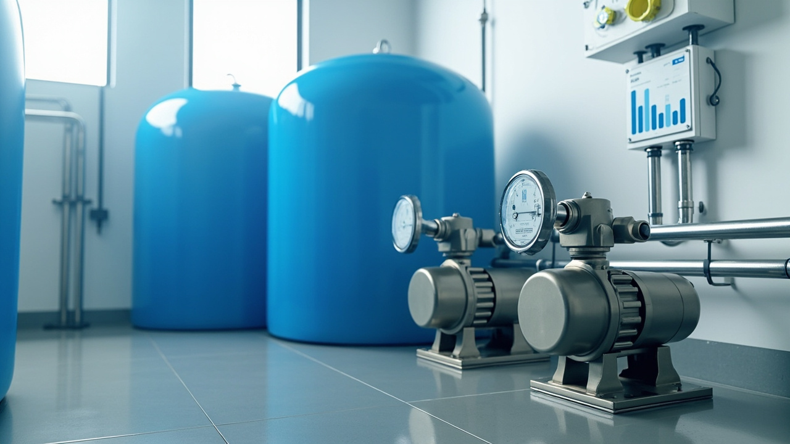
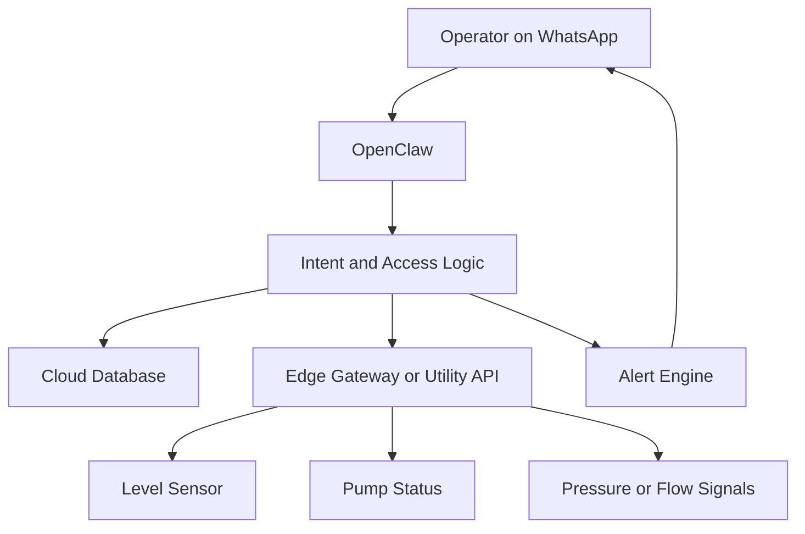
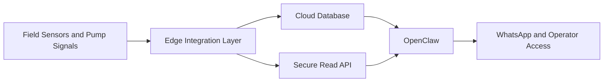
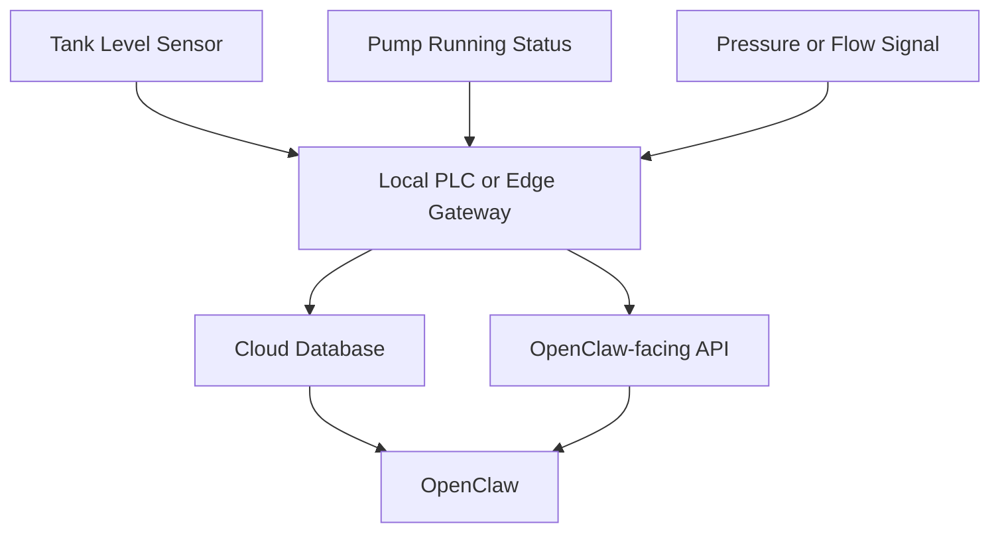
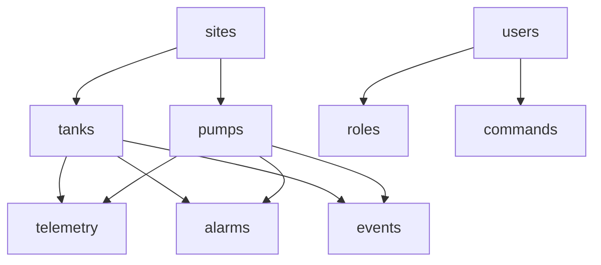
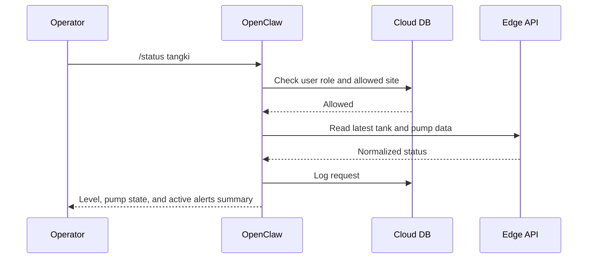
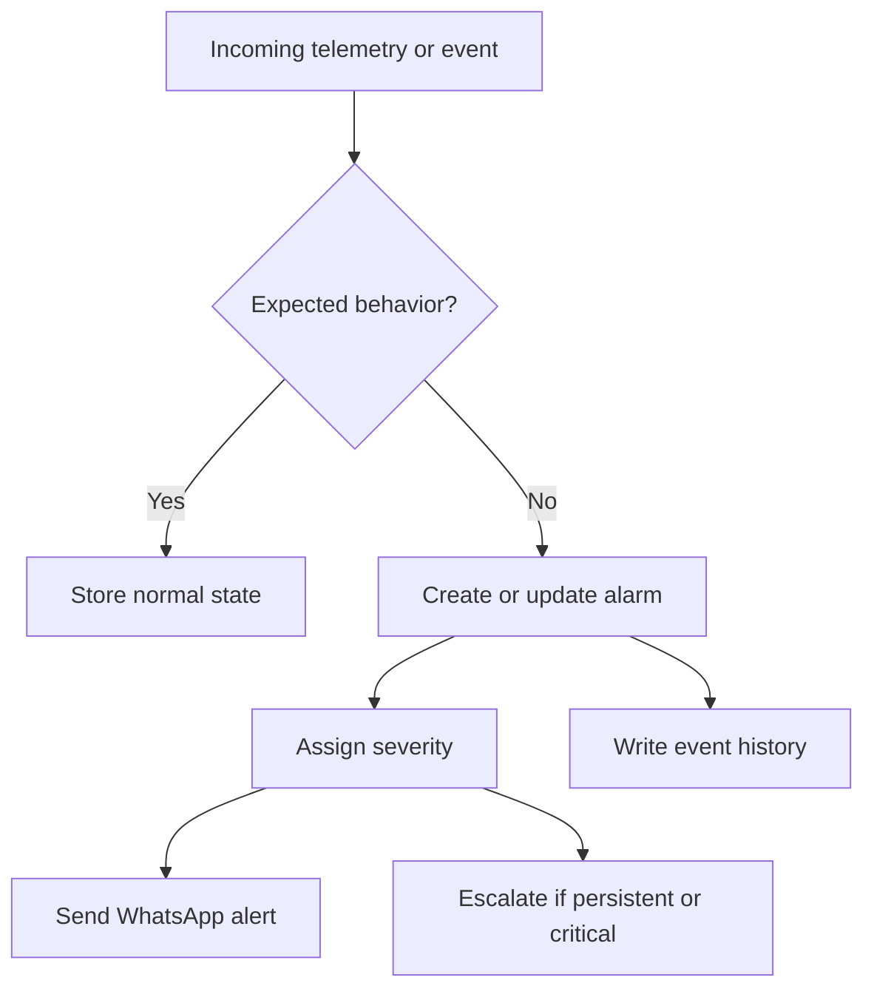
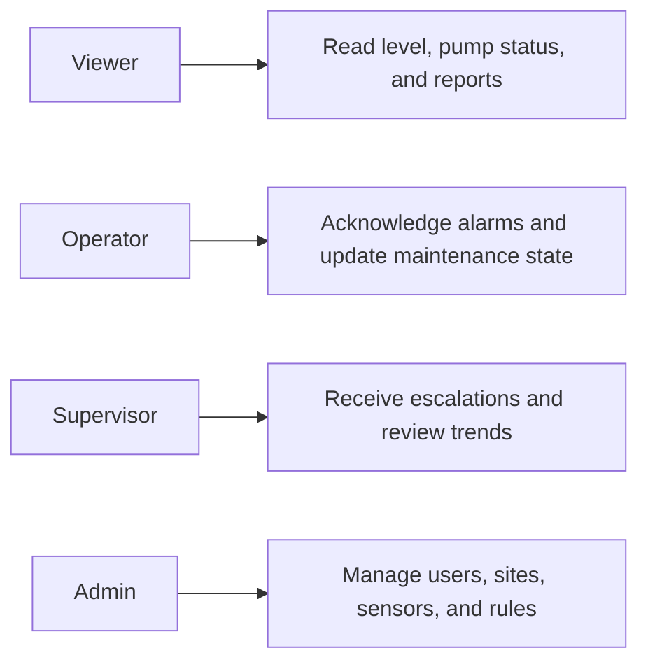
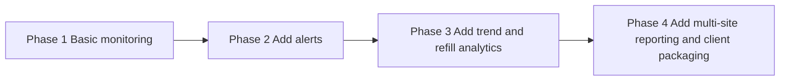

# Using OpenClaw for Water Tank Monitoring and Pump Alerts
## A practical pattern for level monitoring, WhatsApp alerts, pump visibility, and multi-site utility workflows without jumping straight into a full BMS or SCADA project

> **Estimated reading time:** 30 to 36 minutes  
> **Difficulty:** Intermediate  
> **Best for:** Building operators, apartment managers, facility teams, industrial utility staff, property groups, and contractors who need a real monitoring workflow for tanks and pumps

---



## Before We Start

This is the technical English version.

If you want the easier mixed Indonesian + English walkthrough, read the companion blog post here:

**https://blog.fanani.co/tech/openclaw-water-tank-monitoring/**

If you need a VPS for OpenClaw, WhatsApp automation, scheduling, alert delivery, and reporting, use our affiliate link here:

**https://blog.fanani.co/sumopod**

If you want a custom monitoring system like this for a building, plant, workshop, or property portfolio, you can contact:

- **fanani@cvrfm.com**
- **+628115443456**

Consultation is available.

---

## 1. Pain Point Real

Water systems look simple until they fail at the wrong time.

A tank is full, until it is not.

A pump is healthy, until it starts short-cycling at 3 AM.

A building manager assumes everything is fine, until tenants complain that upper floors have no water pressure.

This is the real operational problem.

Not just “how do we read a level sensor.”

The real problem is that many water systems are still managed with a weak visibility layer.

Typical pain points include:

- nobody knows the actual tank level without asking someone to check
- the transfer pump is running too often but nobody notices
- the rooftop tank is low and the alarm does not reach the right person fast enough
- the level sensor exists, but the data is trapped inside a panel, HMI, or local PLC
- multiple buildings or multiple tanks create fragmented monitoring
- alerts are either absent or too noisy to be trusted

This affects:

- apartments
- hotels
- boarding houses
- factories
- warehouses
- campuses
- workshops
- service buildings with daily utility demand

That makes water tank monitoring a strong use case for OpenClaw.

Not because OpenClaw is a replacement for pump logic.

Because OpenClaw can become the **operational layer** that turns utility data into understandable messages, alerts, summaries, and role-based workflows.

---

## 2. Why WhatsApp and OpenClaw Fit This Well

For many teams, a giant dashboard is not the first missing piece.

The first missing piece is timely awareness.

They need a simple way to know:

- is the tank healthy right now?
- is the pump running too often?
- is the level trending down too fast?
- did the refill cycle happen normally?
- is a specific building at risk of low water supply?

WhatsApp works because it is already in people’s hands.

OpenClaw works because it can sit between:

- sensors and tank telemetry
- cloud database storage
- alert logic
- operator queries
- owner escalation
- scheduled summaries

So instead of checking a panel manually, an operator can ask:

```text
/status tangki
/level rooftop
/pump status
/alarm air
/report air hari ini
```

And the answer can be human-readable, not raw numbers with zero context.



That is the right role for OpenClaw.

---

## 3. High-Level Architecture

OpenClaw should not become the low-level replacement for pump control hardware.

That would be a bad design decision.

The proper architecture is:

- field hardware handles direct sensing and control
- local logic handles immediate utility behavior
- OpenClaw handles monitoring, messaging, summaries, alerting, and escalation

A clean high-level model looks like this.



That separation gives you a system that is easier to trust and easier to expand.

---

## 4. Hardware and Backend Options

This use case is flexible on hardware.

That matters a lot.

You do not want a tutorial that only works with one exact controller family.

### Option A: PLC + analog level input

Very common in more structured buildings or plants.

- ultrasonic, pressure, or float-based level feedback
- PLC exposes current tank level and pump state
- local service reads and normalizes the values

### Option B: Smart relay or gateway with discrete status points

Useful in smaller properties.

- pump ON/OFF status
- low-level and high-level float switches
- basic runtime counters
- edge service publishes status via HTTP or MQTT

### Option C: IoT edge controller with cloud sync

For lighter deployments.

- microcontroller or gateway reads level and status
- local logic handles immediate switching if required
- OpenClaw reads from cloud and serves human workflows

### Option D: Hybrid building system integration

If there is already a BMS or utility panel:

- OpenClaw can read via existing API or middleware
- no need to rebuild the control layer from zero

A realistic field stack can look like this.



Again, the important rule stays the same.

OpenClaw should orchestrate the information layer, not impersonate the utility control layer.

---

## 5. Database Model

The schema should support status, trends, alerts, and operator history without becoming messy.

A practical model:



Meaning:

- `sites` = building or location
- `tanks` = rooftop tank, underground tank, process tank, reserve tank
- `pumps` = transfer pump, booster pump, duty/standby pump
- `telemetry` = level, runtime, pressure, state, timestamp
- `alarms` = low level, no refill, frequent starts, pressure drop, telemetry loss
- `events` = pump start, stop, refill cycle, abnormal trend
- `users` = operators, supervisors, owners, staff
- `roles` = permission boundaries
- `commands` = operator actions like acknowledgment or maintenance status updates

This supports both simple and multi-site deployments.

---

## 6. Command and Interaction Flow

The conversation layer must be clear and predictable.

Useful commands can include:

```text
/status tangki
/level tanki-atap
/pump status
/alarm air
/report air hari ini
/riwayat refill
```

A read interaction might work like this.



That is the kind of interaction people actually keep using.

If the building has multiple tanks, OpenClaw can answer in a structured way:

- Rooftop tank A: 78 percent
- Ground tank: 54 percent
- Booster pump: standby
- Active alarm: none

That is clear and useful.

---

## 7. Alert Logic

This is where the system earns its keep.

A few alerts are especially valuable.

### Alert type 1: Tank level below threshold

Simple, obvious, important.

### Alert type 2: Pump running but tank level not rising as expected

This can indicate:

- suction issue
- empty source tank
- valve problem
- sensor mismatch
- pump failure under load

### Alert type 3: Pump starts too frequently

This often signals:

- pressure instability
- control issue
- leakage
- poor deadband configuration
- undersized or failing vessel in pressure systems

### Alert type 4: Telemetry offline

No data is also an alarm condition.

### Alert type 5: Refill cycle takes unusually long

This can be a very useful operational warning.

A clean alert flow can look like this.



The point is not just to trigger alarms.

The point is to trigger alarms that people will respect.

That means good thresholds, reasonable timing, and not spamming every little fluctuation.

---

## 8. Role Access

Even for monitoring systems, role boundaries matter.

A useful role model:



OpenClaw should always know:

- who is asking
- which site or tank they are allowed to see
- whether the interaction is read-only or operational
- whether an escalation should include them automatically

That is how the system stays usable as it grows.

---

## 9. MVP Rollout

Do not try to build the perfect utility intelligence platform on day one.

A strong MVP can be:

1. read tank level
2. read pump ON/OFF status
3. store telemetry in cloud database
4. send low-level alerts
5. send telemetry-offline alerts
6. allow role-based status checks from WhatsApp
7. provide daily summary message

That already solves a real problem.

A staged rollout can look like this.



That rollout is realistic and commercially sensible.

---

## 10. How to Productize This for Clients

This use case is highly productizable.

Because many clients do not want to think in terms of sensors, APIs, and telemetry normalization.

They want outcomes like:

- no more surprise low-water incidents
- faster awareness when utility systems behave oddly
- WhatsApp alerts to the right people
- visibility across multiple buildings
- cleaner reporting for owners or management

A packaged offer can include:

- hardware signal mapping
- OpenClaw workflow setup
- database and alert model setup
- WhatsApp integration
- threshold tuning
- support for one site or many sites

Good target clients include:

- apartment operators
- hotel groups
- boarding house owners with multiple properties
- commercial buildings
- industrial sites with utility systems

That makes this a very strong article topic because it maps well to real service offerings.

---

## Real-World Design Principle

Let the field layer keep direct utility control.

Let OpenClaw own:

- visibility
- summaries
- alerts
- human workflows
- escalation
- reporting

That is the healthy boundary.

If you keep that split, the system stays maintainable and trustworthy.

---

## Final Take

OpenClaw is a very good fit for water tank monitoring when you use it as the operational intelligence layer rather than a fake PLC replacement.

It can make tank systems easier to supervise through:

- WhatsApp status access
- low-level alerts
- pump behavior visibility
- refill trend awareness
- role-based access
- cloud-backed history
- multi-site reporting potential

That is what makes the use case real.

Not the sensor itself.

The workflow around it.

If you want the easier mixed Indonesian + English version, read it here:

**https://blog.fanani.co/tech/openclaw-water-tank-monitoring/**

If you need VPS infrastructure to host the automation stack, use our affiliate link here:

**https://blog.fanani.co/sumopod**

And if you want a custom monitoring system like this for your own facility, you can contact:

- **fanani@cvrfm.com**
- **+628115443456**

Consultation is available.

---

## Related Links

- Companion blog version: **https://blog.fanani.co/tech/openclaw-water-tank-monitoring/**
- OpenClaw Sumopod repo: **https://github.com/fanani-radian/openclaw-sumopod**
- OpenClaw official repo: **https://github.com/openclaw/openclaw**

>>> Syncing to /var/www/blog-fanani/...