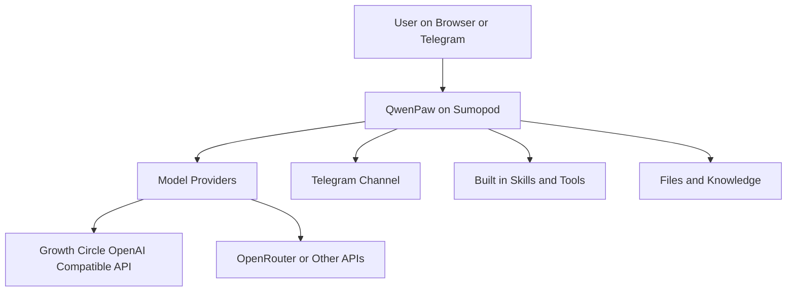
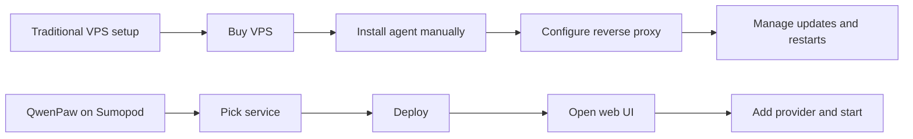
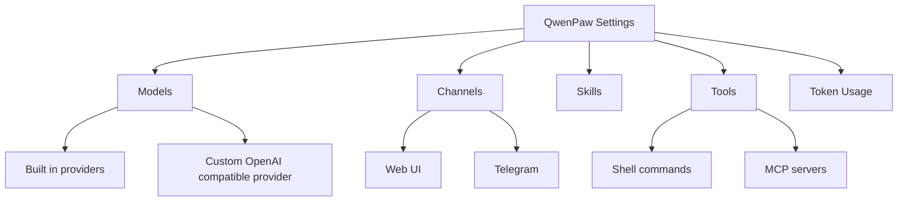
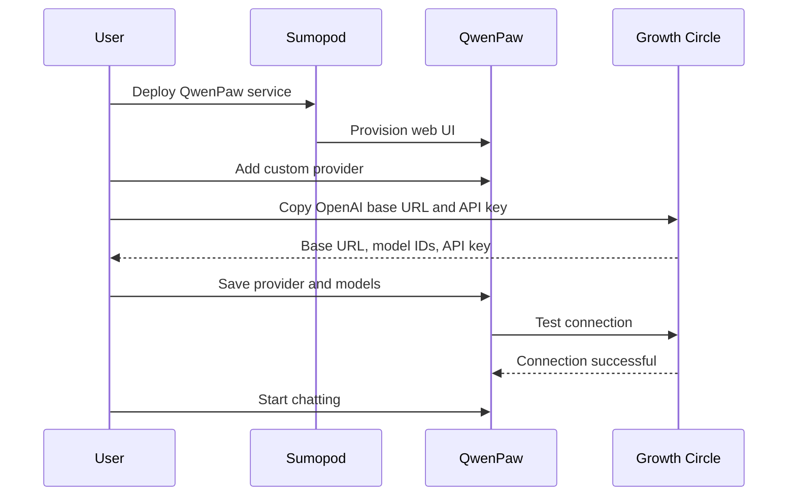
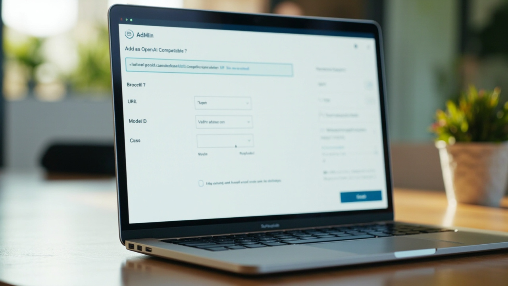
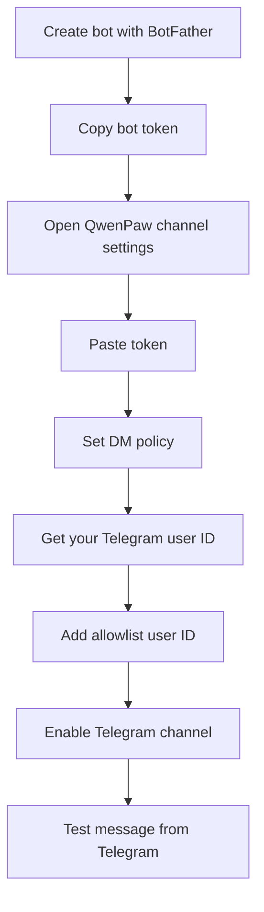
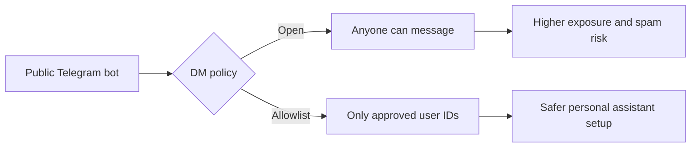

# How to Run QwenPaw on Sumopod and Add Free Growth Circle Models
## A practical guide to getting a web UI, custom providers, Telegram access, and premium-feeling models without building everything from scratch

> **Estimated reading time:** 32 to 38 minutes  
> **Difficulty:** Beginner to Intermediate  
> **Last updated:** April 2026  
> **Best for:** Founders, indie hackers, operators, and curious builders who want an OpenClaw-style assistant fast

---


## Before We Start

This tutorial is the technical version.

If you want the friendlier mixed Indonesian and English walkthrough, read the companion blog post here:
**https://blog.fanani.co/tech/qwenpaw-sumopod-growth-circle/**

If you want to sign up for Sumopod and support this content, use the affiliate link here:
**https://blog.fanani.co/sumopod**

---

## Why This Stack Is Suddenly Interesting

A lot of people love the idea of AI agents. Fewer people love the reality of installing them.

That is the whole reason this setup matters.

You want something that feels like OpenClaw. You want a clean web interface, tool calling, channels, model settings, skill creation, usage stats, and the sense that your assistant is a real working system, not just another chat tab. But you do not always want to spend half a day provisioning a VPS, wiring reverse proxies, fighting auth, and checking logs when the one thing you actually wanted was to test ideas.

That is where **QwenPaw on Sumopod** gets surprisingly compelling.

Instead of starting from raw infrastructure, you can deploy QwenPaw as a managed service inside Sumopod, open the web UI, add your provider, paste your model IDs, and start chatting. That shortcut is the whole product story.

And right now the timing is good.

According to the latest community momentum shared around this ecosystem:

- **Sumopod has grown to 50,000 users**
- **Growth Circle hit 300 paid members in less than 2 weeks**

That kind of growth does not prove a tool is perfect. It does prove that interest is real, the onboarding friction is low enough for people to move, and there is enough energy around the stack that tutorials, community support, and model-sharing workflows are evolving fast.

This guide shows you the exact flow that matters most:

1. Deploy QwenPaw on Sumopod
2. Add a custom OpenAI-compatible provider
3. Use free Growth Circle models like GPT-5.4 and MiniMax M2.7 style options
4. Connect Telegram so your assistant is not trapped in a browser
5. Understand what is safe to touch and what is better left alone

If you have been curious but did not want to burn time figuring out which buttons matter, this is the tutorial.

---

## What We Are Building

By the end of this guide, you will have:

- A live **QwenPaw instance** running on Sumopod
- A working **web UI** for day-to-day chatting
- A **custom provider** using an OpenAI-compatible base URL
- Multiple **Growth Circle models** added manually by model ID
- Optional **Telegram access** with allowlist protection
- A clean mental model for how QwenPaw, Sumopod, and external providers fit together

Here is the architecture in one glance.



The key point is simple: **Sumopod hosts the app experience, but your model quality still depends on the provider you attach.**

That is why custom providers matter so much.

---

## Why Not Just Rent a Regular VPS

You absolutely can. In many cases, that is still the best move.

If you want full root access, custom daemons, reverse proxy control, your own deploy pipeline, and tight operational ownership, a normal VPS is still king. That is the adult version.

But for many users, especially early-stage builders, content creators, solo operators, or anyone testing agent workflows, a normal VPS introduces too much setup drag.

Here is the difference in plain English.



The traditional path gives you more control. The Sumopod path gives you speed.

That is the tradeoff.

And for this specific tutorial, speed wins.

If your goal is to test whether you even like the workflow, the fastest way is often the smartest way.

---

## What QwenPaw Actually Is

QwenPaw is best understood as an **agent-style AI workspace with a strong web UI and settings-first experience**.

It feels familiar if you come from OpenClaw, Claude Code, or modern agent dashboards. You get a place to chat, swap models, create providers, manage channels, inspect token usage, and turn an LLM into something more like an assistant system.

That is the appeal.

You are not opening a raw API playground. You are opening a living interface for an assistant.

The repo is here if you want to inspect the project directly:
**https://github.com/agentscope-ai/QwenPaw**

And the walkthrough that inspired this tutorial is here:
**https://youtu.be/QfFaEBELjEM**

The video is in Indonesian, but even if you do not speak it fluently, the UI flow is easy to follow. The important bits are the Sumopod service deployment, the custom provider setup, the Growth Circle base URL, the manual model ID entry, and the Telegram configuration.

---

## Prerequisites

Keep this small. You do not need much.

### You need:

- A **Sumopod account**
- Access to **QwenPaw by Sumopod** under the Services area
- A **Growth Circle** account if you want the provider flow from this tutorial
- A browser
- Optional: a Telegram account and BotFather if you want channel access

### Useful links

- Sumopod affiliate link: **https://blog.fanani.co/sumopod**
- QwenPaw video reference: **https://youtu.be/QfFaEBELjEM**
- QwenPaw GitHub repo: **https://github.com/agentscope-ai/QwenPaw**

### What you do not need

- You do not need to provision a fresh VPS manually for this flow
- You do not need to install QwenPaw from source
- You do not need Docker knowledge just to get started

That is the whole point. The managed route removes the heavy lifting up front.

---

## Step 1: Find QwenPaw in Sumopod

This is the first detail that trips people up.

If you open Sumopod and immediately go to the VPS section, you may not see what you expected. In the walkthrough, QwenPaw is **not selected from the regular VPS creation page**. It lives under **Services**.

That sounds minor, but it matters. A lot of users waste time looking in the wrong place and assume the product is unavailable.

The correct flow is:

1. Log in to Sumopod
2. Open **Services**
3. Click **Add Service**
4. Look for **QwenPaw by Sumopod**
5. Pick the plan you want
6. Name the service
7. Deploy

That is it.

The video shows an entry-level option that is positioned as a low-cost way to get started quickly. The exact pricing or inventory may change, so do not hard-code your expectations around one plan name forever. The important part is the product pattern, not the exact badge on the pricing card.

What makes this useful is that the service is managed. You are not spinning up a blank Linux box and doing all the boring parts yourself.

You deploy, wait for provisioning, then you get a login link.

That is the first moment where the whole thing clicks. Instead of terminal setup pain, you land in a web UI that already looks like something usable.


And honestly, that convenience is the entire reason this tutorial exists.

---

## Step 2: Log In and Learn the Surface Area

Once QwenPaw is deployed, Sumopod gives you a login link.

Open it.

What you should see is a clean interface with a layout that feels familiar if you have used agent platforms before. The specific naming may change slightly over time, but the important areas are usually the same:

- **Chat**
- **Models**
- **Channels**
- **Skills**
- **Tools**
- **Usage or token stats**

This is the first good sign.

A lot of AI products die because the first-run experience feels like a configuration tax. QwenPaw, at least in this managed form, starts from a more generous assumption. It assumes you want to do something useful today.

Here is a simple map of the settings areas you will care about most.



At this point, do not click everything like a raccoon in a kitchen.

Focus on the order that actually matters:

1. Models
2. Provider
3. Model IDs
4. API key
5. Test connection
6. Chat
7. Telegram, if needed

That sequence prevents confusion.

---

## Step 3: Understand the Built-in Models vs Custom Providers

When you open the Models section, you will likely see some built-in providers or bundled options already available.

That is nice, but it is not the whole story.

In practice, most people care about three things:

- Can I use a provider I already trust?
- Can I reduce costs?
- Can I access models that are better than the default free set?

That is where **custom providers** come in.

In the walkthrough, the built-in options include various sources, some paid, some free, some local. Those are fine for testing. But the more interesting move is adding **Growth Circle** as an **OpenAI-compatible provider**.

Why? Because it gives you a way to plug in models through a familiar OpenAI-style API format.

And if you already live in a multi-provider world, this is ideal. You are not trapped. You are simply giving QwenPaw another route out to the models you want.

This is the mental model:

- **QwenPaw** is the assistant interface and control surface
- **Sumopod** is the managed hosting and delivery layer
- **Growth Circle** is one possible model backend

Once you see those as separate layers, the setup stops feeling magical and starts feeling controllable.

---

## Step 4: Create a Growth Circle Provider

Now we get to the good part.

The custom provider flow in the video is straightforward.

1. Open the **Models** section
2. Choose **Add Provider**
3. Give it a name, for example `Growth Circle`
4. Set the provider type to **OpenAI-compatible** or equivalent
5. Copy the **OpenAI base URL** from Growth Circle
6. Paste it into the base URL field in QwenPaw
7. Create the provider

It will usually appear as a provider entry that is not fully ready yet, because at this stage it still has no models and may not have an API key saved.

That is normal.

Do not panic if you see something like “not ready” or “no model”. The provider shell exists. You still need to attach model definitions and credentials.

The flow looks like this:



That is the backbone of the tutorial.

Once you know this pattern, you can reuse it for other OpenAI-compatible providers later.



---

## Step 5: Add Models Manually by Model ID

This is the part many new users miss.

Creating the provider is not enough.

You also need to add the **model IDs manually**.

In the Growth Circle flow shown in the video, the presenter copies a model ID from Growth Circle, pastes it into the model form inside QwenPaw, and uses the same value for both the model name and the model ID to keep things simple.

That is a perfectly sane move.

When people overcomplicate AI dashboards, they often start by giving fancy labels to everything. Then two weeks later they forget what maps to what. Naming the model the same as the ID is boring, but boring wins.

A clean pattern is:

- **Model ID:** exact provider model ID
- **Display name:** same as model ID, or the same plus a short note if you need it

In the walkthrough, the example models include:

- **GPT-5.4 free**
- **MiniMax M2.7 free** style options

Your exact model catalog may change over time, especially for free tiers. That is normal. What matters is the method:

1. Open the provider’s model list in Growth Circle
2. Find a model you want
3. Copy the model ID
4. Go back to QwenPaw
5. Add a new model under the provider
6. Paste the model ID
7. Save
8. Repeat for the next model

Do that two or three times and suddenly the provider becomes useful.

My recommendation is to start with:

- One general-purpose model
- One faster model
- One backup model

That gives you optionality without clutter.

A good starter set usually looks like this:

| Role | What to pick | Why it matters |
|------|--------------|----------------|
| Main chat model | A strong general model | Default daily work |
| Fast model | Lower-latency model | Quick checks and short prompts |
| Backup | Another stable option | Reduces lock-in and downtime pain |

Do not add twelve models on day one. That is not power. That is menu fatigue.

Pick three, test them, and only expand when you know why.

---

## Step 6: Add the API Key and Test the Connection

Once the provider and models exist, you still need the credential.

In the video, this is done by going back to the Growth Circle key page, copying the key, pasting it into the provider configuration inside QwenPaw, and saving.

After that, the presenter tests the connection per model.

That is the exact move you want.

Do not assume a provider works because the form accepted your paste. Test it.

A real setup checklist looks like this:

- Base URL saved
- Model IDs saved
- API key saved
- Connection test run
- Successful response confirmed
- Chat test sent from the chat window

If the connection test passes, you are basically alive.

If it fails, the usual causes are boring and fixable:

1. Wrong base URL
2. Invalid or rotated API key
3. Wrong model ID
4. Model temporarily rate-limited
5. Provider expects OpenAI-compatible formatting but one field is mismatched

That is why testing each layer matters. You want to know whether the failure lives in the provider config, the key, or the model definition.

Do not debug all three at once if you can avoid it.

---

## Step 7: Use the Chat Window Properly

After the provider tests successfully, go into the chat view and explicitly select the model you want to use.

That matters more than people realize.

A lot of users think they configured a model, then start chatting in a session that is still pointing at a different provider. Five minutes later they think the provider setup failed, when really the UI is just still using the previous model.

So do this deliberately:

1. Open chat
2. Find the model selector
3. Choose the Growth Circle model you just added
4. Send a tiny test prompt

Start with something boring, like:

```text
Say hello and tell me which provider you are using.
```

You are not testing intelligence yet. You are testing the pipe.

Once the pipe works, then try one short real-world task and one medium task.

For example:

- Summarize a paragraph
- Draft a friendly reply
- Extract action items from a messy note

If those three work, you are in business.

This is also the moment where many users realize the real value of the setup: **the premium feeling comes less from the web UI and more from the provider quality underneath it.**

QwenPaw gives you the shell. Your provider choice gives you the bite.

---

## Step 8: Connect Telegram So the Assistant Escapes the Browser


A browser-only assistant is fine for testing.

A Telegram-connected assistant is an actual companion.

The video shows a clean Telegram setup path from inside QwenPaw:

1. Open **Channels**
2. Select **Telegram**
3. Paste your bot token
4. Choose your DM policy
5. Add your allowlist user ID if you want private access
6. Enable the channel
7. Save
8. Send a test message from Telegram

That is enough to get live.

Here is the flow visually.



If you are building a personal assistant, I strongly recommend **allowlist**, not open access.

Because yes, you can make a public bot.

But unless you deliberately want a public-facing assistant, that is usually unnecessary exposure. Personal bots should act like personal infrastructure, not like open parking lots.

Here is the security tradeoff.



The workflow in the video uses **BotFather** to create the bot, then a user ID lookup bot to find the Telegram user ID for the allowlist.

That is exactly what you should do.

Once enabled, send a test message from Telegram and watch for typing or a reply.

If it answers, congratulations. Your assistant is no longer trapped in a tab.


---

## Step 9: Skills, Tools, and the Stuff You Should Not Randomly Toggle

By this stage, the platform gets tempting.

You see menus for skills, tools, command execution, MCP servers, token usage, maybe even advanced controls. It is easy to feel like a hacker god for five minutes and then accidentally make your setup worse.

So here is the rule.

**Do not touch advanced settings just because they exist.**

The video itself hints at this. Some areas are worth exploring later, but not during your first successful setup. Right now, the goal is a stable assistant, not a full-time hobby in self-inflicted debugging.

The main areas worth paying attention to are:

### Skills
Useful when you want repeatable behaviors, templates, or systemized instructions.

### Tools
Useful when you need the assistant to do more than chat, for example shell commands, integrations, or external connectivity.

### MCP
Potentially powerful, especially if you want browser integrations or extra system capabilities, but also a place where people love creating complexity before creating value.

### Token usage
Actually important. This tells you whether your shiny free-feeling setup is still behaving like a cost-efficient tool or turning into a token furnace.

The smartest first-week strategy is boring:

- Get chat working
- Get one good model working
- Get Telegram working
- Watch usage
- Only then start extending

That order will save you hours.

---

## Step 10: What Makes Growth Circle Attractive in This Setup

Let us be honest about the real appeal here.

It is not just that Growth Circle exposes an OpenAI-compatible endpoint. A lot of services do that.

The attraction is the combination of:

- familiar provider shape
- access to free or shared options
- model variety
- community energy
- low-friction testing inside a clean UI

That combination is powerful for experimentation.

If you are a builder, the whole thing feels like a sandbox with just enough structure to be productive.

The community story matters too. When a tool ecosystem is growing quickly, it usually means three things happen at once:

1. More shared setups appear
2. More weird edge cases get discovered
3. The average time from confusion to working answer drops

That is why the “50K users” and “300 paid members in less than 2 weeks” signals matter. Not because big numbers are inherently impressive, but because ecosystem velocity changes the practical user experience.

A dead tool can be great and still waste your time. A fast-moving tool can be imperfect and still be the smarter place to build for a season.

---

## Troubleshooting

Let us keep this grounded.

Here are the most likely issues.

### Problem: Provider says not ready
Usually means one of these:

- no API key saved yet
- no model added yet
- model ID does not match a valid model

### Problem: Test connection fails
Check in this order:

1. Base URL
2. API key
3. model ID
4. provider type is OpenAI-compatible

Do not randomize five settings at once.

### Problem: Chat works in web UI but not in Telegram
Usually one of these:

- wrong bot token
- Telegram channel not enabled
- DM policy blocks you
- your user ID is not on the allowlist
- you messaged the wrong bot username

### Problem: Output feels weak
That is often not QwenPaw. That is your model choice.

Swap models first before blaming the platform.

### Problem: Too many token costs
Common causes:

- using the biggest model for trivial prompts
- pasting huge context constantly
- letting long sessions grow without resetting
- calling tools or big context models for work that a small model could do

Remember, the interface is one thing. Operating discipline is another.

---

## Is This Better Than OpenClaw?

That is the wrong question.

The honest question is this:

**Which one is better for the kind of work you want today?**

OpenClaw is stronger when you want deep control, local workspace behavior, richer orchestration patterns, more explicit tool discipline, and a system that can feel like a programmable operator.

QwenPaw on Sumopod is stronger when you want a fast start, a clean managed UI, and an easier route to “I have an assistant running right now.”

That is not a war. That is product positioning.

A lot of users should use both.

Use QwenPaw when you want speed, convenience, and fast model testing.
Use OpenClaw when you want heavier automation, more opinionated operational control, and deeper agent work.

The reason I like this tutorial topic is that it does not force a fake rivalry. It shows a shortcut that is genuinely useful.

---

## My Recommended Starter Setup

If you want the shortest path to something solid, do this:

1. Deploy QwenPaw via Sumopod Services
2. Add Growth Circle as a custom OpenAI-compatible provider
3. Add two or three models only
4. Test one model in chat
5. Connect Telegram with allowlist mode
6. Watch token usage for a few days
7. Add skills or extra tools only after you actually need them

That gets you from curiosity to daily use without turning setup into a side quest.

And if you are still deciding whether to try Sumopod, use the affiliate link here:
**https://blog.fanani.co/sumopod**

---

## Final Thoughts

There is a weird pattern in AI tooling right now.

The market keeps producing two extremes:

- raw infrastructure that is powerful but exhausting
- polished chat apps that are easy but boxed in

QwenPaw on Sumopod sits in an interesting middle.

You get the convenience of a managed service, but you still retain a meaningful degree of provider choice and assistant shaping. That is why the custom provider flow matters so much. It turns the product from a static hosted app into a configurable agent surface.

That is also why the Growth Circle connection is not just a side trick. It is the difference between “I deployed the UI” and “I actually like using this thing.”

So if you want a low-friction way to spin up an assistant that feels more serious than a toy but easier than a full self-hosted stack, this is one of the better workflows available right now.

Deploy it. Add the provider. Keep the model list small. Use allowlist for Telegram. Test deliberately. Do not over-customize on day one.

That last point matters more than people think.

Most broken AI setups are not broken because the tool was bad. They are broken because the user got excited and edited twelve things before understanding the first three.

Do the simple version first. Then grow from there.

---

## References

- QwenPaw video walkthrough: **https://youtu.be/QfFaEBELjEM**
- QwenPaw GitHub repo: **https://github.com/agentscope-ai/QwenPaw**
- Sumopod affiliate link: **https://blog.fanani.co/sumopod**
- Companion blog version: **https://blog.fanani.co/tech/qwenpaw-sumopod-growth-circle/**

---

## Related Reading

If you want the more conversational, blog-style version with the same core setup explained in mixed Indonesian and English, go here:
**https://blog.fanani.co/tech/qwenpaw-sumopod-growth-circle/**
