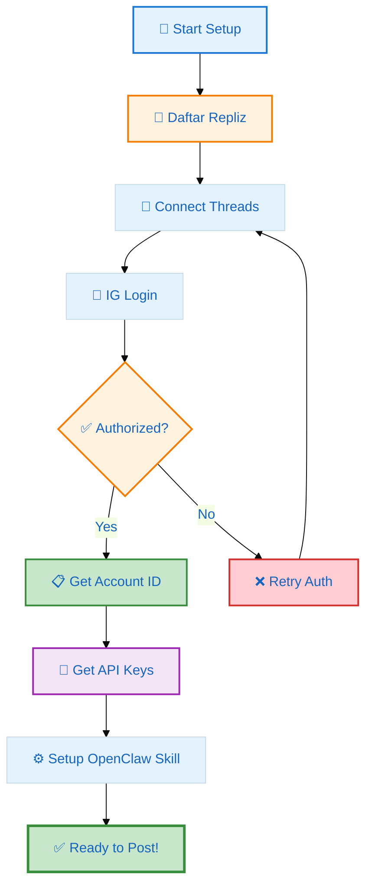
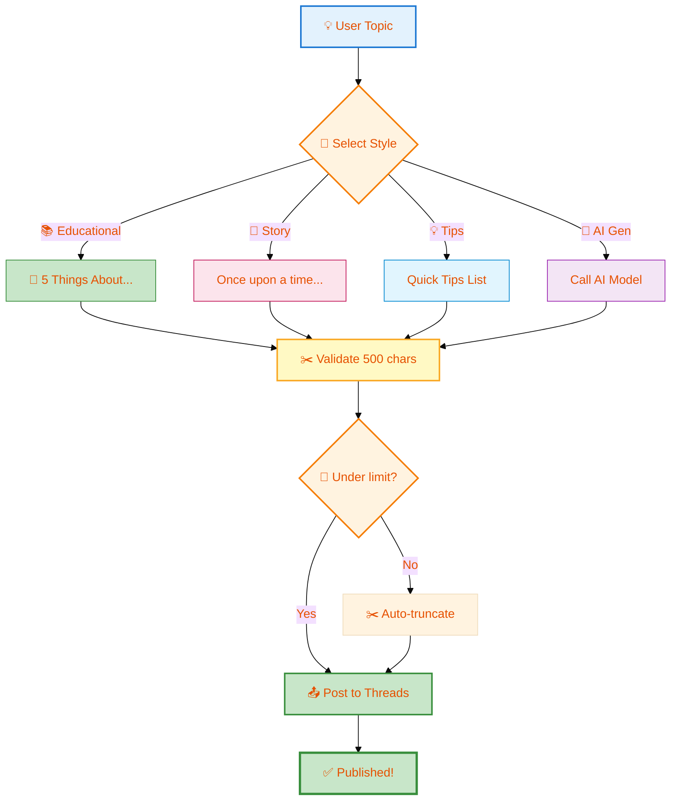

# 🧵 Auto-Post ke Threads dengan OpenClaw + Repliz

> **Level:** Intermediate  
> **Time:** 15-20 menit  > **Cost:** Free (Repliz free tier)

---

## 📋 Apa yang Akan Kamu Bangun

Di tutorial ini, kita akan setup **automation posting ke Threads** menggunakan OpenClaw dan Repliz API. Bayangkan: cukup kirim pesan ke Telegram, dan konten otomatis diposting ke Threads dengan AI-generated caption! 🤖

**Hasil akhir:**
```
Kamu di Telegram: "/postthread Tips project management"

↓ [OpenClaw + AI]

Threads @radianhub:
🧵 5 Lessons from Tips project management

1/ Prep saves time 📋
Planning detail = 30% lebih efisien
...
```

---

## 🎯 Prerequisites

Sebelum mulai, pastikan kamu punya:

| Requirement | Status | Link |
|-------------|--------|------|
| OpenClaw terinstall | ✅ Wajib | [Install Guide](https://docs.openclaw.ai) |
| Akun Threads | ✅ Wajib | [threads.com](https://threads.com) |
| Akun Repliz | ✅ Wajib | [repliz.com](https://repliz.com) |
| Python 3.8+ | ✅ Wajib | `python3 --version` |
| Basic Git knowledge | ⭐ Recommended | - |

---

## 🚀 Step 1: Setup Repliz Account

### 1.1 Daftar/Login ke Repliz

1. Buka [https://repliz.com](https://repliz.com)
2. Login dengan akun Google atau email
3. Complete onboarding (skip kalau tidak diperlukan)

### 1.2 Connect Threads Account

```
Dashboard Repliz
    ↓
「+ Connect Account」
    ↓
Pilih 「Threads」
    ↓
Login dengan akun Instagram (Threads pakai IG auth)
    ↓
Authorize Repliz
    ↓
✅ Status: Connected
```

### 🔌 Setup Flow Diagram



**Simpan informasi ini:**
- Buka https://repliz.com/user/integration
- Klik Threads account → **Copy Account ID** (nanti dipakai di script)

---

## 🔧 Step 2: Dapatkan API Credentials

### 2.1 Access Key & Secret Key

Di dashboard Repliz:
```
Profile → Settings → API Keys
    ↓
Generate New Key
    ↓
Copy:
  - Access Key: 1234567890
  - Secret Key: abcdefghijklmnop
```

⚠️ **PENTING:** Secret key hanya ditampilkan sekali! Simpan dengan aman.

### 2.2 Test API dengan cURL

```bash
# Encode credentials
credentials="ACCESS_KEY:SECRET_KEY"
encoded=$(echo -n $credentials | base64)

# Test API
curl -X GET "https://api.repliz.com/public/account?page=1&limit=10" \
  -H "Authorization: Basic $encoded" \
  -H "Content-Type: application/json"
```

**Expected response:**
```json
{
  "docs": [{
    "type": "threads",
    "username": "yourusername",
    "isConnected": true
  }]
}
```

✅ Kalau dapat response seperti di atas → API key valid!

---

## 💻 Step 3: Setup OpenClaw Skill

### 3.1 Buat Folder Structure

```bash
cd ~/.openclaw/workspace  # atau workspace kamu

mkdir -p skills/repliz-threads/scripts
cd skills/repliz-threads
```

### 3.2 Buat Main Script

Buat file `scripts/repliz-threads.py`:

```python
#!/usr/bin/env python3
"""
Repliz Threads Automation Skill
Auto-post ke Threads via Telegram commands
"""

import requests
import base64
import sys
from datetime import datetime, timedelta

# 🔑 CONFIG - Ganti dengan credentials kamu
REPLIZ_ACCESS_KEY = "YOUR_ACCESS_KEY_HERE"
REPLIZ_SECRET_KEY = "YOUR_SECRET_KEY_HERE"
THREADS_ACCOUNT_ID = "YOUR_THREADS_ACCOUNT_ID_HERE"  # Dari step 1.2

REPLIZ_API_BASE = "https://api.repliz.com"


def generate_content(topic):
    """Generate AI content untuk Threads"""
    # Simple template (bisa diganti dengan AI call)
    return f"""🧵 Quick thoughts on {topic}

1/ Start with why 🎯
Purpose drives everything

2/ Process matters 📋
Good process = consistent results

3/ People first 🤝
Team adalah asset utama

4/ Iterate fast ⚡
Ship, learn, improve

5/ Celebrate wins 🎉
Small wins lead to big success

What's your take? 👇

#Thoughts #Learning"""


def post_to_threads(content):
    """Post ke Threads via Repliz API"""
    # ⚠️ Threads max 500 chars!
    if len(content) > 500:
        content = content[:497] + "..."
    
    # Basic Auth (Bearer tidak work untuk schedule API)
    credentials = f"{REPLIZ_ACCESS_KEY}:{REPLIZ_SECRET_KEY}"
    encoded = base64.b64encode(credentials.encode()).decode()
    
    headers = {
        "Authorization": f"Basic {encoded}",
        "Content-Type": "application/json"
    }
    
    # Schedule 1 menit dari sekarang (instant-ish)
    schedule_time = datetime.utcnow() + timedelta(minutes=1)
    
    payload = {
        "description": content,  # ✅ Field yang work untuk Threads
        "accountId": THREADS_ACCOUNT_ID,
        "scheduleAt": schedule_time.strftime("%Y-%m-%dT%H:%M:00.000Z"),
        "type": "text"
    }
    
    try:
        response = requests.post(
            f"{REPLIZ_API_BASE}/public/schedule",
            headers=headers,
            json=payload,
            timeout=60
        )
        
        if response.status_code in [200, 201]:
            data = response.json()
            return {
                "success": True,
                "post_id": data.get("_id"),
                "message": f"✅ Posted! Check Threads in ~1 minute"
            }
        else:
            return {
                "success": False,
                "error": response.json().get("message", f"HTTP {response.status_code}")
            }
            
    except Exception as e:
        return {"success": False, "error": str(e)}


if __name__ == "__main__":
    if len(sys.argv) > 1:
        topic = " ".join(sys.argv[1:])
        print(f"📝 Generating content for: {topic}")
        
        content = generate_content(topic)
        print(f"📤 Posting to Threads...")
        
        result = post_to_threads(content)
        
        if result["success"]:
            print(result["message"])
        else:
            print(f"❌ Error: {result['error']}")
    else:
        print("Usage: python3 repliz-threads.py [topic]")
```

### 3.3 Buat Command Wrapper

Buat file `scripts/repliz-threads.sh`:

```bash
#!/bin/bash
# Wrapper untuk Telegram commands

SCRIPT_DIR="$(cd "$(dirname "${BASH_SOURCE[0]}")" && pwd)"

if [ -z "$1" ]; then
    echo "❌ Usage: /postthread [topic]"
    echo "Example: /postthread Tips project management"
    exit 1
fi

python3 "$SCRIPT_DIR/repliz-threads.py" "$@"
```

Jadikan executable:
```bash
chmod +x scripts/repliz-threads.sh
```

---

## 🔗 Step 4: Integrasi dengan OpenClaw

### 📤 Complete Posting Workflow

```mermaid
%%{init: {'theme': 'base', 'themeVariables': { 'primaryColor': '#e8f5e9', 'primaryTextColor': '#2e7d32'}}}%%
flowchart LR
    subgraph Telegram["💬 Telegram"]
        CMD["/postthread Tips productivity"]
    end
    
    subgraph OpenClaw["🤖 OpenClaw"]
        PARSE["🔍 Parse Command"]
        EXEC["⚡ Execute Script"]
    end
    
    subgraph Script["💻 Python Script"]
        GEN["📝 Generate Content"]
        POST["📤 API Call"]
    end
    
    subgraph ReplizAPI["🌐 Repliz API"]
        AUTH["🔑 Auth Check"]
        SCHED["⏰ Schedule Post"]
    end
    
    subgraph Threads["🧵 Threads"]
        PUBLISH["📱 Publish"]
    end
    
    CMD --> PARSE
    PARSE --> EXEC
    EXEC --> GEN
    GEN -->|AI Content| POST
    POST -->|HTTPS| AUTH
    AUTH --> SCHED
    SCHED -->|1 min| PUBLISH
    PUBLISH -->|✅ Posted!| EXEC
    EXEC -->|Success Message| CMD
    
    style Telegram fill:#e3f2fd,stroke:#1976d2
    style OpenClaw fill:#fff3e0,stroke:#f57c00
    style Script fill:#c8e6c9,stroke:#388e3c
    style ReplizAPI fill:#f3e5f5,stroke:#9c27b0
    style Threads fill:#fce4ec,stroke:#c2185b
```



### 4.1 Update HEARTBEAT.md atau Commands

Tambahkan command di `HEARTBEAT.md`:

```markdown
### 📱 Threads Commands
- **/postthread [topic]** → Post ke Threads. 
  Execute: `bash ~/.openclaw/workspace/skills/repliz-threads/scripts/repliz-threads.sh "[topic]"`
  Example: `/postthread Tips productivity`
```

### 4.2 Test Manual

```bash
# Test script
cd ~/.openclaw/workspace/skills/repliz-threads
python3 scripts/repliz-threads.py "Test automation"

# Expected output:
# 📝 Generating content for: Test automation
# 📤 Posting to Threads...
# ✅ Posted! Check Threads in ~1 minute
```

---

## 🎨 Step 5: Customize Content (Optional)

### 🔄 Content Generation Flow



### 5.1 Ganti Template

Edit fungsi `generate_content()` di script:

```python
def generate_content(topic, style="educational"):
    """Generate content dengan berbagai style"""
    
    templates = {
        "educational": f"""🧵 5 things about {topic}

1/ ...
2/ ...
""",
        "story": f"""📖 A story about {topic}

Once upon a time...
""",
        "tips": f"""💡 Quick tips: {topic}

→ Tip 1...
→ Tip 2...
"""
    }
    
    return templates.get(style, templates["educational"])
```

### 5.2 Integrasi AI (Advanced)

Untuk content yang lebih sophisticated, panggil AI model:

```python
def generate_with_ai(topic):
    """Generate content using OpenClaw AI"""
    import subprocess
    
    prompt = f"""Buat thread untuk Threads tentang {topic}.
    Max 500 karakter. Style: educational, casual."""
    
    result = subprocess.run(
        ["openclaw", "run", "--", "echo", prompt],
        capture_output=True,
        text=True
    )
    
    return result.stdout.strip()
```

---

## ✅ Step 6: Verifikasi & Testing

### 6.1 Check Scheduled Posts

```bash
# Cek status di Repliz dashboard
open https://repliz.com/user/schedule
```

Atau via API:
```bash
curl -X GET "https://api.repliz.com/public/schedule?page=1&limit=10" \
  -H "Authorization: Basic $encoded"
```

### 6.2 Verifikasi di Threads

1. Buka https://www.threads.com/@yourusername
2. Tunggu 1-2 menit setelah posting
3. Refresh page
4. ✅ Post should appear!

### 6.3 Troubleshooting

| Issue | Cause | Solution |
|-------|-------|----------|
| "invalid postId" | Token expired | Reconnect di Repliz dashboard |
| "text required" | Wrong field | Use `description` not `text` |
| "500 char limit" | Content too long | Auto-truncate in script |
| "401 Unauthorized" | Wrong API key | Check Access/Secret key |

---

## 🚀 Advanced: Auto-Schedule & Queue

### Setup Daily Auto-Post

Tambahkan di `HEARTBEAT.md`:

```bash
# Daily Threads post at 9 AM
0 9 * * * cd ~/.openclaw/workspace && python3 skills/repliz-threads/scripts/repliz-threads.py "Daily insights"
```

### Content Queue System

Buat file `content-queue.txt`:
```
Tips project management
How to handle tight deadlines
Safety culture in workplace
...
```

Script untuk ambil dari queue:
```python
def get_next_topic():
    with open("content-queue.txt", "r") as f:
        topics = f.readlines()
    
    topic = topics[0].strip()
    
    # Remove used topic
    with open("content-queue.txt", "w") as f:
        f.writelines(topics[1:])
    
    return topic
```

---

## 📚 Referensi

| Resource | Link |
|----------|------|
| Repliz API Docs | https://azickri.gitbook.io/repliz |
| OpenClaw Docs | https://docs.openclaw.ai |
| Threads API Limit | Max 500 chars per post |
| This Tutorial Code | https://github.com/fanani-radian/radit/tree/master/skills/repliz-radianhub |

---

## 🎉 Kesimpulan

**Apa yang sudah kita bangun:**

✅ Integration OpenClaw ↔ Repliz ↔ Threads  
✅ AI-generated content dengan template  
✅ Telegram command untuk instant post  
✅ Auto-truncate untuk 500 char limit  
✅ Error handling & troubleshooting  

**Next steps:**
- 🔄 Tambahkan Instagram support (setelah reconnect)
- 🤖 Integrasi dengan AI model untuk content generation
- 📊 Analytics: track engagement via Repliz dashboard
- 🎨 Visual content: tambah image support

---

> **Share your setup!**  
> Punya variasi atau improvement? Share di komunitas OpenClaw Discord! 🌏

---

**Last Updated:** March 12, 2026  
**Author:** OpenClaw Sumopod Community  
**Tags:** #openclaw #repliz #threads #automation #social-media
