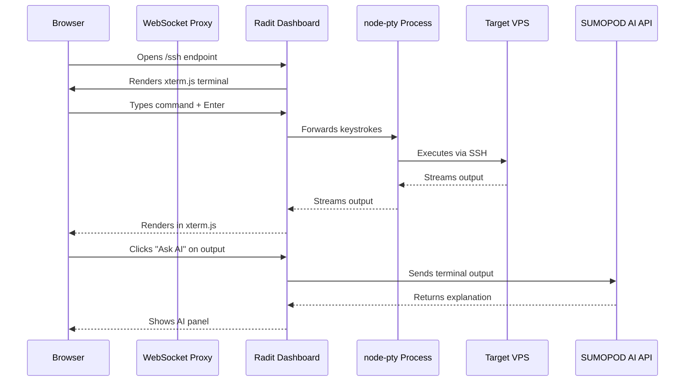

# SSH Terminal in Radit Dashboard: Browser-Based Server Access with AI Assistance

**Published:** April 2026  
**Category:** DevOps / Infrastructure  
**Tags:** ssh, terminal, vps, browser, ai, radit-dashboard, devops  
**Author:** Radit (Radian IT)

---

## Overview

Managing servers should not require a separate terminal application. The SSH Terminal feature embedded directly into [Radit Dashboard](https://radit.fanani.co/ssh) lets you connect to any VPS through your browser, execute commands in real time, and even ask an AI to explain the output for you.

Think of it as your terminal that never lies to you about what a command actually did.

## What Problem Does This Solve

Most developers manage servers through one of two ways.

First, desktop SSH clients like PuTTY, Terminal.app, or iTerm2. These work well but require configuration, SSH keys, and a leap of faith every time the output scrolls faster than you can read. You also need the client installed on whatever machine you are using.

Second, third-party web consoles. These work in a pinch but feel clunky, offer zero context about what you are looking at, and require you to context-switch between tools to ask "what does this error even mean?"

Radit Dashboard solves both problems by sitting right next to your other project management tools. No new app to install. No key configuration to maintain. Open the tab, connect to your VPS, and go.

There is a third scenario worth mentioning. You are on someone else's computer during a screen-sharing session, or you need to show a junior engineer what is happening on a server, and installing anything is not an option. Radit Dashboard SSH Terminal works in any modern browser with no plugins required.

## Architecture

Here is how the pieces connect.



The stack behind this:

- **xterm.js** — renders the terminal in the browser with full ANSI color support
- **node-pty** — spawns a real PTY (pseudo-terminal) on the server side
- **WebSocket proxy via Nginx** — routes WebSocket connections to port 7682
- **SUMOPOD AI API** (ai.sumopod.com) — powers the "Ask AI" feature

Every component in this chain is open source or standard infrastructure. Nothing proprietary runs in the critical path.

## Getting Started

### Prerequisites

- A VPS with SSH access (password or key-based)
- Radit Dashboard running at radit.fanani.co
- SSH port open on your VPS (default: 22)
- No additional software required on your machine

### Connecting to Your Server

1. Open [radit.fanani.co/ssh](https://radit.fanani.co/ssh) in your browser
2. Enter your server details:
   - **Host** — IP address or hostname of your VPS
   - **Port** — SSH port (default: 22)
   - **Username** — e.g. root, ubuntu, admin
   - **Password** or **Private Key** — authentication method
3. Click **Connect**

You are now inside a real terminal session running on your VPS. Every command you type executes on that machine, not inside a sandbox.

### Session Persistence

The terminal session stays alive even if your browser tab loses focus or your laptop goes to sleep. The PTY on the server keeps running. WebSocket will reconnect automatically when you return to the tab.

This is different from some web consoles that kill your session the moment you switch tabs. Here the server-side process owns the session, and the browser is just a window into it.

### Recommended VPS for SSH Work

If you do not have a VPS yet, consider deploying one through [SUMOPOD](https://blog.fanani.co/sumopod). SUMOPOD offers cloud VPS instances optimized for development and deployment workflows, with SSH access preconfigured and ready to use. You can have a working server in under five minutes.

## The AI Ask Feature

This is where things get interesting.

### How It Works

When you run a command and the output is long, cryptic, or just plain confusing, you can highlight the text and click the **"Ask AI"** button that appears. Radit sends that output to the SUMOPOD AI API and returns a plain-language explanation.

**Example workflow:**

```
$ df -h
Filesystem      Size  Used Avail Use% Mounted on
/dev/sda1       100G   45G   55G  45% /
tmpfs           7.8G     0  7.8G   0% /dev/shm
/dev/sdb1       500G  320G  180G  63% /data
```

You highlight the entire output, click **Ask AI**, and get back:

> Your root filesystem has 55GB free (45% used), which is healthy. The /data mount on /dev/sdb1 is at 63% capacity with 180GB remaining. The tmpfs partition is an in-memory filesystem with 7.8GB available but currently unused.

That response tells you what the numbers mean and which ones matter. Not just "this column is disk usage" but actual operational guidance.

### Why This Is Useful

AI explains what went wrong, not just what the numbers mean. When you run `htop` and see red processes, the AI can tell you whether you should be worried. When `dmesg` fills the screen with kernel messages, the AI can flag the ones that actually matter.

It reduces the time you spend reading man pages for commands you only use once a quarter.

Consider the scenario where you are debugging a slow API response. You run `curl -I` against your endpoint and get a timeout. You run it again and get a 502 Bad Gateway. You run `journalctl -u nginx` and get 40 lines of error messages. You highlight those 40 lines, click Ask AI, and in seconds you know that Nginx is timing out waiting for your Node.js backend to respond within the proxy timeout window. You did not need to know the Nginx config directive proxy_read_timeout. You just needed to know the root cause.

### Limitations

The AI Ask feature analyzes the output you highlight. If you do not select anything, it asks the AI to explain the most recent command context. Results depend on the clarity of the terminal output. Very noisy or truncated output may produce less useful explanations.

Also, AI Ask is not a replacement for understanding your systems. It is a productivity layer. You still own the servers.

## Feature Walkthrough

### Terminal Controls

The embedded xterm.js supports the full range of terminal features. You get ANSI color codes, Unicode rendering, ligatures if your system supports them, and a scrollback buffer that goes back as far as you need.

You can resize the terminal by dragging the window. The PTY receives the resize event and adjusts its dimensions accordingly. This matters when you run programs like `vim` or `nano` that depend on knowing the terminal size.

Common keyboard shortcuts work normally: Ctrl+C to interrupt, Ctrl+D to exit, Ctrl+L to clear, Tab for autocomplete.

### Multi-Session Support

You can open multiple SSH connections in separate browser tabs. Each tab maintains its own PTY process on the server. This is useful when you need to compare state across servers or run parallel operations.

### Connection Settings Memory

Radit remembers your connection settings locally so you do not have to type the host and username every time. Passwords and private keys are never stored. Only the host, port, username, and connection type are remembered.

## Troubleshooting

### Connection Refused

**Problem:** "Connection refused" when attempting to connect.

**Check:**

- SSH daemon is running on the target VPS: `sudo systemctl status sshd`
- Port 22 (or your configured port) is open in the firewall: `sudo ufw status` or cloud provider security group rules
- The IP you are connecting from is not blocked

If you are on a cloud provider like AWS, DigitalOcean, or GCP, the security group or firewall rules are a common culprit. Open the web console for your VPS and run the checks there first.

### Authentication Fails

**Problem:** Password or key authentication keeps failing.

**Check:**

- Password is correct (no caps lock, no special character encoding issues)
- For key-based auth, ensure the private key is in OpenSSH format (not PPK if coming from PuTTY)
- The public key is added to `~/.ssh/authorized_keys` on the target server
- Key file permissions: `chmod 600 ~/.ssh/private_key` on the Radit server

If your private key was exported from PuTTY, it is in PPK format. You need to convert it to OpenSSH format using `puttygen` or regenerate the key pair entirely.

### Terminal Renders Incorrectly

**Problem:** Output looks scrambled, missing characters, or wrong colors.

**Check:**

- Your terminal font supports Unicode and emoji (required for some command outputs)
- The remote server locale settings are configured: run `locale` on the VPS
- Try resizing the browser window (terminal dimensions are renegotiated on resize events)

If you see blocks where characters should be, the VPS locale is probably set to ASCII-only. Run `export LC_ALL=en_US.UTF-8` in the session and try again.

### AI Ask Not Responding

**Problem:** Clicking "Ask AI" produces no response or an error.

**Check:**

- You have an active internet connection
- The SUMOPOD AI API is reachable (ai.sumopod.com)
- The terminal output is not empty when you click Ask AI
- Check browser console (F12) for any JavaScript errors

If the API is down, the Ask AI button will show a timeout after about 10 seconds. The terminal itself continues working normally.

### WebSocket Disconnects Frequently

**Problem:** Session disconnects after a few minutes of inactivity.

**Check:**

- Nginx WebSocket timeout settings (default is often 60 seconds)
- Any idle timeout configured on your VPS firewall or cloud provider load balancer
- Radit Dashboard server is healthy (check system status in the dashboard sidebar)

Cloud providers like AWS have an idle timeout on their load balancers that can drop long-lived WebSocket connections. You may need to configure a keepalive ping from the client side.

## Deployment Options

### Using Radit Dashboard SaaS

The easiest option. Radit Dashboard runs at radit.fanani.co and you connect to your VPS from there. No server to maintain on your end. This is what most users should start with.

### Self-Hosting Radit Dashboard

If you want to run Radit Dashboard on your own infrastructure, the setup is documented on the GitHub repository. You will need Node.js 18 or higher, a server with WebSocket support, and SSH credentials for the VPS instances you want to connect to.

The self-hosted version uses the same architecture. node-pty runs on your Radit server, not on the target VPS. Your Radit server needs outbound SSH access to the target VPS.

## Security Considerations

All SSH connections through Radit Dashboard go over an encrypted WebSocket connection (WSS). Credentials are never stored on the Radit server. The private key exists in memory only for the duration of the session.

For key-based auth, the private key is transmitted once at connection time and discarded immediately after. The server does not persist it.

If you are concerned about exposing SSH access through a web interface, consider using a non-standard port, setting up fail2ban on your VPS, and using IP allowlisting in your firewall rules.

## Conclusion

The SSH Terminal in Radit Dashboard is not trying to replace your terminal emulator. It is there for the moments when you are on a different machine, testing something on a shared screen, or just want to check on a server without opening a new window. And when the output does not make sense, the AI Ask feature closes the loop without requiring you to switch contexts.

Pair it with a reliable VPS from [SUMOPOD](https://blog.fanani.co/sumopod) and you have a complete workflow that stays entirely inside your browser.

For a walkthrough with screenshots and a video demo, see the blog tutorial: [SSH Terminal dalam Dashboard Radit](https://blog.fanani.co/posts/ssh-terminal-dalam-dashboard)

---

**Related Tutorials:**

- [Getting Started with Radit Dashboard](/posts/radit-dashboard-getting-started)
- [Deploy Your First VPS on SUMOPOD](/posts/sumopod-vps-deployment)