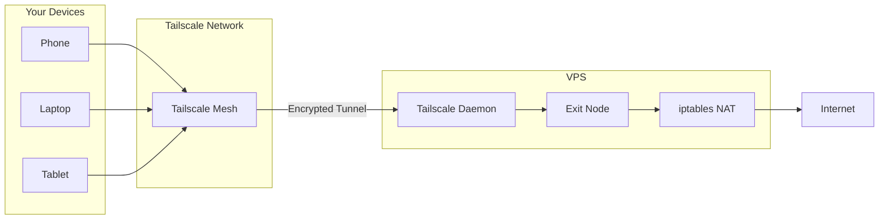
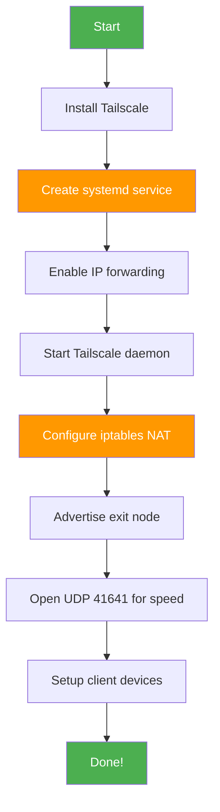
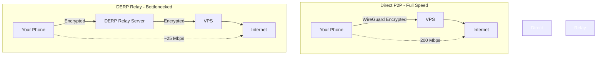

# Tailscale VPN Exit Node on VPS

Turn your VPS into a private VPN exit node with Tailscale. Bypass blocked sites, secure your traffic, and access geo-restricted content — all without messing with traditional VPN configs.

## Overview

Traditional VPNs are a pain. Configs, protocols, certificates, monthly subscriptions. Tailscale skips all that. It's a mesh VPN built on WireGuard — zero config, peer-to-peer, and stupidly fast.

This tutorial walks you through turning a SumoPod VPS into an exit node. Once done, your phone and laptop route all traffic through your VPS. Blocked sites? Gone. ISP snooping? Not anymore. Public WiFi paranoia? Handled.

**What you get:**
- Access blocked sites (Reddit, news, etc.)
- Encrypted tunnel for all your traffic
- Full VPS bandwidth on direct connections
- Works on phone, laptop, tablet — any device

**Tested on:** OpenCloudOS 9.4 (RHEL-based) at SumoPod.

## Architecture

Here's how it all connects:




Think of it like a private tunnel from your phone to your VPS. Your ISP sees encrypted gibberish. The websites see your VPS IP. You see everything, uncensored.

## Prerequisites

- A VPS (we use [SumoPod](https://sumopod.com) — cheap, fast, reliable)
- Root access to your VPS
- A Tailscale account (free tier works)
- Basic terminal familiarity

**Grab a SumoPod VPS:** [Sign up here](https://sumopod.com/register?ref=856057af-2bb3-40b8-998a-3e70170804ae) — the $5/mo plan is plenty for a personal exit node.

## Installation Flow




The orange steps are the ones most tutorials skip — but they're the difference between "it works" and "it actually works."


## Step 1: Install Tailscale

SSH into your VPS and run:

```bash
curl -fsSL https://tailscale.com/install.sh | sh
```

This installs:
- `/usr/local/bin/tailscale` - the CLI
- `/usr/local/bin/tailscaled` - the daemon

Verify:

```bash
tailscale version
```

## Step 2: Create systemd Service

On RHEL-based distros, the install script does not create a systemd service. You must create it manually.

```bash
cat > /etc/systemd/system/tailscaled.service << EOF
[Unit]
Description=Tailscale node daemon
After=network.target

[Service]
ExecStart=/usr/local/bin/tailscaled --tun=tailscaled --state=/var/lib/tailscale/tailscaled.state
Restart=on-failure
LimitNOFILE=65536

[Install]
WantedBy=multi-user.target
EOF
```

**Important:** The `--tun=tailscaled` flag enables TUN mode. Without it, exit node will not work.

```bash
mkdir -p /var/lib/tailscale
systemctl daemon-reload
```

## Step 3: Enable IP Forwarding

```bash
cat > /etc/sysctl.d/99-tailscale.conf << EOF
net.ipv4.ip_forward = 1
net.ipv6.conf.all.forwarding = 1
EOF
sysctl -p /etc/sysctl.d/99-tailscale.conf
```

## Step 4: Start and Authenticate

```bash
systemctl enable --now tailscaled
tailscale up --advertise-exit-node --accept-routes
```

This prints a URL. Open it in your browser, sign in, and authorize.

```bash
tailscale status
```

## Step 5: Configure iptables NAT

Find your main interface:

```bash
ip route | grep default
```

Set up NAT masquerading (replace eth0 if different):

```bash
iptables -t nat -A POSTROUTING -o eth0 -j MASQUERADE
iptables -A FORWARD -i tailscale0 -j ACCEPT
iptables -A FORWARD -o tailscale0 -j ACCEPT
```

### Persist iptables Rules

RHEL-based distros lose iptables rules on reboot:

```bash
iptables-save > /etc/iptables.rules
```

Create a restore service:

```bash
cat > /etc/systemd/system/iptables-restore.service << EOF
[Unit]
Description=Restore iptables rules
Before=network-pre.target
Wants=network-pre.target

[Service]
Type=oneshot
ExecStart=/usr/sbin/iptables-restore /etc/iptables.rules
RemainAfterExit=yes

[Install]
WantedBy=multi-user.target
EOF

systemctl enable iptables-restore
```

## Step 6: Open Port for Direct Connections

```bash
iptables -I INPUT -p udp --dport 41641 -j ACCEPT
iptables -I INPUT -p tcp --dport 41641 -j ACCEPT
iptables-save > /etc/iptables.rules
```

Also open UDP 41641 in your VPS provider firewall panel.

## Step 7: Approve Exit Node

Go to the [Tailscale Admin Console](https://login.tailscale.com/admin/machines):

1. Find your VPS in the machine list
2. Click `...` menu -> **Edit route settings**
3. Enable **Use as exit node**
4. Save

## Step 8: Client Setup

### Phone (iOS / Android)

1. Download Tailscale app
2. Sign in with the same account
3. Tap your VPS name
4. Toggle **Use as exit node**

### Laptop (macOS / Windows / Linux)

1. Install from [tailscale.com/download](https://tailscale.com/download)
2. Sign in
3. Click VPS -> **Use exit node**

```bash
curl -fsSL https://tailscale.com/install.sh | sh
```

This installs:
- `/usr/local/bin/tailscale` - the CLI
- `/usr/local/bin/tailscaled` - the daemon

Verify:

```bash
curl ifconfig.me
```

Should return your VPS IP.

## Connection Speed: Direct vs Relay

This matters. A lot.




**Direct (P2P):** Your device connects straight to the VPS. You get the full VPS bandwidth. On a 200 Mbps VPS, you will see close to 200 Mbps.

**Relay (DERP):** Traffic bounces through a Tailscale relay server. Speed drops to around 25 Mbps. Still works, but not great for streaming or large downloads.

### Check Your Connection Type

On the VPS:

```bash
tailscale status
```

Look at the connection column for each client. If it says `relay`, you are not getting direct P2P.

### How to Get Direct P2P

1. **Open UDP 41641** on your VPS firewall (provider panel + iptables)
2. **Restart Tailscale on the client** - toggle it off and on
3. **Check again:** `tailscale status`

If you are on mobile data, you might be stuck on relay due to carrier NAT. Switch to WiFi and try again.

## Security Considerations

### What Exit Nodes Do

When a device uses your exit node, ALL its traffic goes through your VPS. That means:
- Websites see your VPS IP (not your real IP)
- Your ISP cannot see which sites you visit
- Your VPS CAN see the traffic (if HTTPS, it sees the domain but not the content)

### Hardening Your VPS


You have two layers of encryption:
1. **WireGuard** (Tailscale) - encrypts everything between you and the VPS
2. **TLS/HTTPS** - encrypts everything between the VPS and the website

### Best Practices

- **Keep Tailscale updated** - re-run the install script periodically
- **Use key expiry** - Tailscale rotates keys automatically
- **Limit exit node access** - restrict which users can use your exit node in the admin console
- **Dedicated VPS** - do not run your exit node on a production server
- **No logging** - your VPS does not log by default. Keep it that way.

## Troubleshooting

### Cannot use exit node on client

The exit node is not approved in the admin console. Go to [Machines page](https://login.tailscale.com/admin/machines) and approve it.

### Connection works but no internet

Check iptables NAT rules:

```bash
iptables -t nat -L -v
```

You should see the MASQUERADE rule. Also check IP forwarding:

```bash
sysctl net.ipv4.ip_forward
```

Should return `1`.

### Everything worked before reboot, now broken

You did not persist iptables rules. Go back to Step 5 and set up the iptables-restore service.

### tailscaled will not start

Check the logs:

```bash
journalctl -u tailscaled -n 50
```

Common issues:
- Missing `--tun=tailscaled` in the ExecStart command
- Missing state directory (`mkdir -p /var/lib/tailscale`)
- SELinux blocking it (try `setenforce 0` temporarily)

### Slow speeds on WiFi but fine on LTE

Your home router might block UDP 41641. Try port forwarding on your router.

### VPS IP is blacklisted on some sites

Some sites block datacenter IPs. Options:
- Use a residential IP VPS (expensive)
- Accept that some sites will not work through the exit node

### Tailscale login/api blocked (403 Forbidden)

This is a less common but critical issue. Some VPS providers have IP ranges blocked by Tailscale itself — usually providers with large blocks that get flagged for abuse/spam.

**Check if your VPS is affected:**
```bash
curl -sI https://login.tailscale.com | head -1
curl -sI https://api.tailscale.com | head -1
```
If either returns `403 Forbidden`, your VPS IP is blocked.

**Solutions:**
1. **Try a different region** — same provider, different datacenter (e.g., Singapore → Tokyo)
2. **Switch provider** — if all regions are blocked
3. **Use Tailscale auth keys** — if only login is blocked but API works, generate an auth key from another device at [Settings > Keys](https://login.tailscale.com/admin/settings/keys), then on the VPS: `tailscale up --authkey=tskey-auth-xxxxx`
4. **Use WireGuard directly** — if Tailscale is completely blocked, skip it and install WireGuard manually. More setup work but no dependency on Tailscale servers

Note: This varies by provider and even by region. Our SumoPod VPS (used in this tutorial) had no issues, but DigitalOcean Singapore has been reported as blocked.

## Getting a VPS

Need a VPS? We use [SumoPod](https://sumopod.com) - affordable, fast, and reliable.

[**Sign up for SumoPod**](https://sumopod.com/register?ref=856057af-2bb3-40b8-998a-3e70170804ae)

The cheapest plan (/mo) handles a personal exit node just fine. Look for:
- At least 1 vCPU
- 1GB+ RAM
- A location close to you (lower latency = faster)

## Summary

Here is what you set up:

1. Installed Tailscale on your VPS
2. Created a systemd service (RHEL-specific)
3. Enabled IP forwarding
4. Configured NAT masquerading with iptables
5. Advertised your VPS as an exit node
6. Connected your devices
7. Optimized for direct P2P connections

Total time: ~15 minutes. Recurring cost: /mo for the VPS. Tailscale itself is free for personal use.

Not bad for a VPN that is faster and more private than most paid services.

---

**Questions? Issues?** Open a [GitHub issue](https://github.com/fanani-radian/openclaw-sumopod/issues) - happy to help.


## Why Not Just Use a Commercial VPN?

Fair question. Here is the comparison:

| Feature | Tailscale Exit Node | Commercial VPN |
|---------|--------------------|----|
| Cost | /mo VPS only | 0-15/mo subscription |
| Bandwidth | Unlimited (VPS limit) | Often capped or throttled |
| Privacy | You control the server | You trust the provider |
| Speed | Full VPS speed | Shared, often slower |
| Config | One-time setup | Per-app configs |
| Devices | Up to 100 (free tier) | Usually 5-10 |
| Logging | None (you control it) | Varies by provider |

With a Tailscale exit node, you are not just a customer. You are the administrator. You decide what gets logged, what gets blocked, and how traffic flows. That level of control is worth the 15-minute setup time.

## What About DNS?

By default, your VPS uses its own DNS resolver. Traffic for blocked domains might still resolve (which is fine for most cases). If you want extra privacy, consider using a privacy-focused DNS resolver like Cloudflare (1.1.1.1) or Quad9 (9.9.9.9) on your VPS.

You can also set up Tailscale MagicDNS, which provides DNS resolution within your Tailscale network. This is optional but nice to have.

## Monitoring Your Exit Node

Want to keep an eye on traffic? A few options:

- **vnstat** - track bandwidth usage per interface
- **iftop** - real-time traffic monitoring
- **Tailscale admin console** - see connected devices and their status

Install vnstat on your VPS:

```bash
dnf install -y vnstat
systemctl enable --now vnstat
vnstat -i tailscale0
```

## Advanced: Multiple Exit Nodes

Have VPS in different countries? You can set up multiple exit nodes and switch between them from your client. This is useful for accessing geo-restricted content from different regions.

Just repeat the setup on each VPS. In the Tailscale client, you can choose which exit node to use at any time.
