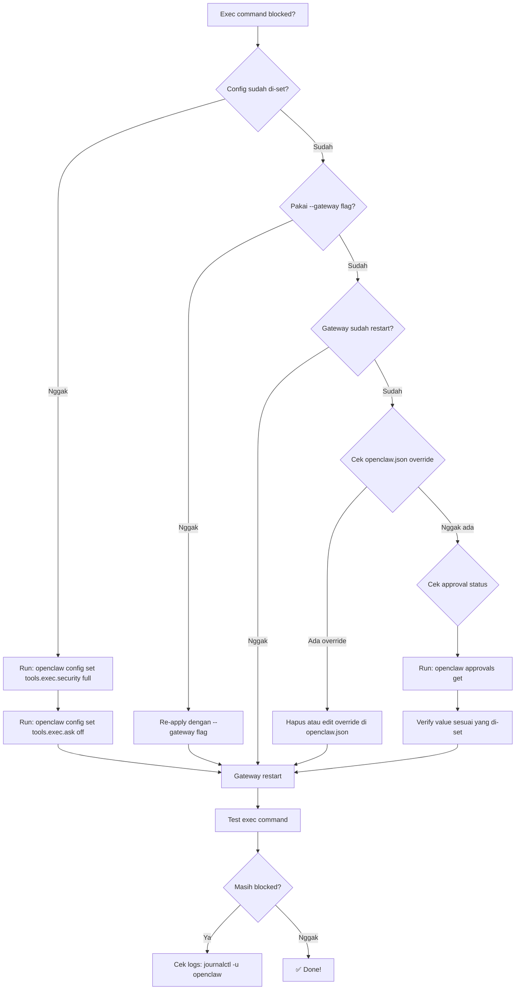

# Upgrade OpenClaw ke 2026.3.31 + Fix Exec Approvals

OpenClaw versi **2026.3.31** sudah rilis dengan beberapa perbaikan dan perubahan security. Yang paling noticeable buat banyak user: **exec approval default sekarang lebih ketat**. Kalau kamu baru upgrade, besar kemungkinan kamu bakal kena error `exec denied: allowlist miss`.

Tutorial ini nge-cover cara upgrade dan cara fix exec approvals biar workflow kamu nggak terganggu.

---

## Cara Upgrade

```bash
# Upgrade ke versi terbaru
npm install -g openclaw@latest

# Restart gateway (WAJIB)
openclaw gateway restart
```

Verify upgrade:

```bash
openclaw --version
```

Harusnya nunjukkin `2026.3.31` atau lebih baru.

---

## Breaking Change: Exec Approvals

Di versi baru ini, default policy exec approval berubah jadi lebih ketat. Artinya, beberapa command yang sebelumnya jalan otomatis, sekarang bisa ke-block dan muncul error kayak gini:

```
exec denied: allowlist miss
```

**Kenapa berubah?** Security improvement. OpenClaw sekarang lebih konservative secara default untuk mencegah command yang nggak di-autorize jalan tanpa approval.

---

## Fix Exec Approvals

Ada 2 cara — pilih salah satu:

### Cara 1: Config CLI (Rekomendasi) ⭐

Cara paling simpel, cukup 3 command:

```bash
# Set security mode ke full (izinin semua exec)
openclaw config set tools.exec.security full

# Matikan ask mode (nggak perlu approval manual)
openclaw config set tools.exec.ask off

# Restart gateway — JANGAN LUPA!
openclaw gateway restart
```

### Cara 2: Edit File Approvals

Kalau kamu mau kontrol lebih granular lewat file:

```bash
# Edit file approvals
nano ~/.openclaw/exec-approvals.json
```

Tambahkan:

```json
{
  "defaults": {
    "security": "full"
  }
}
```

Lalu apply ke gateway:

```bash
# ⚠️ WAJIB pakai --gateway flag!
openclaw approvals set --gateway --file ~/.openclaw/exec-approvals.json

# Restart gateway
openclaw gateway restart
```

> **⚠️ Penting:** Flag `--gateway` itu krusial. Kalau kamu cuma `openclaw approvals set` tanpa `--gateway`, config-nya cuma apply lokal — gateway tetap pake policy lama. Ini error paling sering bikin user bingung.

---

## Policy Reference

Biar nggak guess-work, ini penjelasan singkat tiap mode:

### Security Modes (`tools.exec.security`)

| Mode | Behavior |
|------|----------|
| `deny` | Block semua exec command. Paling ketat. |
| `allowlist` | Hanya command yang ada di allowlist yang boleh jalan. Default di versi baru. |
| `full` | Semua exec command diizinin. Paling longgar. |

### Ask Modes (`tools.exec.ask`)

| Mode | Behavior |
|------|----------|
| `off` | Nggak pernah minta approval. Langsung jalan (sesuai security mode). |
| `on-miss` | Minta approval cuma kalau command nggak match allowlist. |
| `always` | Selalu minta approval untuk semua exec command. |

### Ask Fallback (`tools.exec.askFallback`)

Mode yang dipake kalau ask diminta tapi nggak bisa di-resolve (misal interactive session nggak tersedia):

- `deny` — Tolak command (aman)
- `allowlist` — Pakai allowlist rules
- `full` — Izinin semua

**Setup paling umum:** `security: full` + `ask: off` → no blocking, no prompts.

---

## Troubleshooting

Kalau setelah config kamu masih ke-block, cek decision tree ini:



### Quick Checklist

1. ✅ `openclaw config set tools.exec.security full` — sudah?
2. ✅ `openclaw config set tools.exec.ask off` — sudah?
3. ✅ `--gateway` flag — pakai waktu apply approvals?
4. ✅ `openclaw gateway restart` — udah restart?
5. ✅ `~/.openclaw/openclaw.json` — cek ada nggak override security config di sana
6. ✅ `openclaw approvals get` — verify value-nya bener

### Common Pitfalls

- **Lupa restart gateway** — Config baru nggak akan ke-load sampai gateway restart
- **Lupa `--gateway` flag** — Config cuma apply lokal, gateway tetap pake policy lama
- **openclaw.json override** — Ada kemungkinan `openclaw.json` punya exec security config yang override CLI setting

---

## Links

- [Exec Approvals Docs](https://docs.openclaw.ai/tools/exec-approvals)
- [Approvals CLI Docs](https://docs.openclaw.ai/cli/approvals.md)

---

Semoga membantu. Kalau masih ada masalah, cek logs dengan `journalctl -u openclaw --since "1 hour ago"` atau tanya di community.
