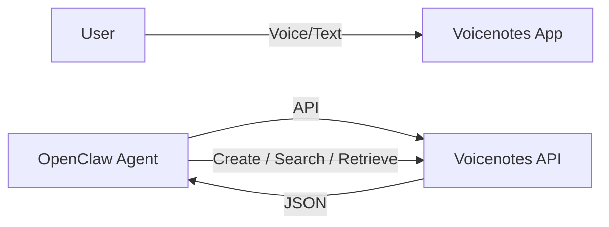

# Voicenotes Integration with OpenClaw


[Voicenotes](https://voicenotes.com) is a voice-first note-taking app. With the official OpenClaw skill, your agent can **create, search, and retrieve notes** — making it a personal knowledge base your agent can read and write to.

## Quick Setup

**1.** Create integration at [Voicenotes Settings](https://voicenotes.com/app?open-claw=true#settings) → copy API key

**2.** Add to `~/.openclaw/config.yaml`:
```yaml
skills:
  voicenotes:
    env:
      VOICENOTES_API_KEY: "your_key_here"
```

**3.** Verify:
```bash
curl -s "https://api.voicenotes.com/api/integrations/open-claw/search/semantic?query=test" \
  -H "Authorization: $VOICENOTES_API_KEY" | jq '.[0].title'
```

## Architecture



## API Cheat Sheet

All endpoints need: `-H "Authorization: $VOICENOTES_API_KEY"`

**Search notes semantically:**
```bash
curl -G "https://api.voicenotes.com/api/integrations/open-claw/search/semantic" \
  --data-urlencode "query=tekanan darah" \
  -H "Authorization: $VOICENOTES_API_KEY"
```

**Create a text note:**
```bash
curl -X POST "https://api.voicenotes.com/api/integrations/open-claw/recordings/new" \
  -H "Authorization: $VOICENOTES_API_KEY" \
  -H "Content-Type: application/json" \
  -d '{"recording_type": 3, "transcript": "Note content here", "device_info": "open-claw"}'
```

**Get full transcript by UUID:**
```bash
curl "https://api.voicenotes.com/api/integrations/open-claw/recordings/{uuid}" \
  -H "Authorization: $VOICENOTES_API_KEY"
```

**Filter by tags and date:**
```bash
curl -X POST "https://api.voicenotes.com/api/integrations/open-claw/recordings" \
  -H "Authorization: $VOICENOTES_API_KEY" \
  -H "Content-Type: application/json" \
  -d '{"tags": ["health"], "date_range": ["2026-03-01T00:00:00Z", "2026-04-01T00:00:00Z"]}'
```

`recording_type`: `1` = voice note, `2` = voice meeting, `3` = text note

## Use Cases

**Health Tracking** — Log blood pressure, blood sugar, etc. Then search for trends later.

**Meeting Notes** — Search past meeting transcripts to find decisions or action items.

**Quick Capture** — Tell your agent "save this to voicenotes" → instant text note, no app needed.

## Routing Rules

| User Says | Action |
|-----------|--------|
| "voicenotes [query]" | Semantic search |
| "catat di voicenotes" | Create text note |
| "cari di voicenotes" | Search notes |
| "catat/simpan" (no voicenotes) | Route to workspace files |

## Notes

- Rate limit: ~3 req/sec
- Search returns `note`, `note_split`, or `import_split` types
- `import_split` cannot be fetched by UUID (imported files only)
- Line breaks in transcripts use `<br>` tags

## Links

- [Voicenotes](https://voicenotes.com)
- [OpenClaw Voicenotes Skill](https://github.com/openclaw/skills/tree/main/voicenotes-official)
