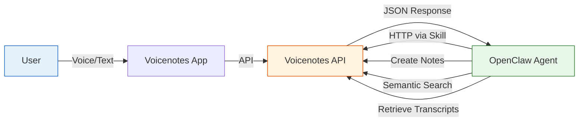

# Voicenotes Integration with OpenClaw

## Overview

[Voicenotes](https://voicenotes.com) is a voice-first note-taking app that also supports text notes. With the official OpenClaw integration, your AI agent can **create, search, and retrieve notes** directly through natural conversation — making it a powerful personal knowledge base that your agent can read and write to.

## Architecture



## Setup

### Step 1: Create Integration on Voicenotes

1. Go to [Voicenotes Settings](https://voicenotes.com/app?open-claw=true#settings)
2. Create a new OpenClaw integration
3. Copy the API key

### Step 2: Configure OpenClaw

Add the API key to your OpenClaw config (`~/.openclaw/config.yaml`):

```yaml
skills:
  voicenotes:
    env:
      VOICENOTES_API_KEY: "your_key_here"
```

### Step 3: Verify Connection

```bash
curl -s "https://api.voicenotes.com/api/integrations/open-claw/search/semantic?query=test" \
  -H "Authorization: $VOICENOTES_API_KEY" | jq '.[0].title'
```

If it returns a note title (or empty array), you're connected.

## API Reference

All endpoints require the `Authorization` header with your API key.

### Semantic Search

Search your notes by meaning, not just keywords:

```bash
curl -G "https://api.voicenotes.com/api/integrations/open-claw/search/semantic" \
  --data-urlencode "query=tekanan darah tinggi" \
  -H "Authorization: $VOICENOTES_API_KEY"
```

**Response types:**
- `note` — Complete note matching the search
- `note_split` — Chunk from a longer note (fetch full transcript with the UUID)
- `import_split` — Chunk from an imported file (title = filename)

### Create a Text Note

```bash
curl -X POST "https://api.voicenotes.com/api/integrations/open-claw/recordings/new" \
  -H "Authorization: $VOICENOTES_API_KEY" \
  -H "Content-Type: application/json" \
  -d '{
    "recording_type": 3,
    "transcript": "Your note content here with line breaks as <br> tags",
    "device_info": "open-claw"
  }'
```

`recording_type` values:
- `1` — Voice note
- `2` — Voice meeting
- `3` — Text note (what we use for programmatic entries)

### Get Full Transcript

```bash
curl "https://api.voicenotes.com/api/integrations/open-claw/recordings/{uuid}" \
  -H "Authorization: $VOICENOTES_API_KEY"
```

Use this when a search returns a `note_split` — fetch the full recording by UUID.

### Filter by Tags and Date Range

```bash
curl -X POST "https://api.voicenotes.com/api/integrations/open-claw/recordings" \
  -H "Authorization: $VOICENOTES_API_KEY" \
  -H "Content-Type: application/json" \
  -d '{
    "tags": ["health", "blood-pressure"],
    "date_range": ["2026-03-01T00:00:00.000000Z", "2026-04-01T00:00:00.000000Z"]
  }'
```

## Real-World Use Cases

### Health Tracking

When you send health data to your agent, it can log it to Voicenotes:

```bash
curl -X POST "https://api.voicenotes.com/api/integrations/open-claw/recordings/new" \
  -H "Authorization: $VOICENOTES_API_KEY" \
  -H "Content-Type: application/json" \
  -d '{
    "recording_type": 3,
    "transcript": "Tekanan Darah - Zainul Fanani<br>1 April 2026, 05:13 WITA<br><br>Pengukuran 1: SYS 136, DIA 103, Pulse 96<br>Pengukuran 2: SYS 129, DIA 103, Pulse 94<br><br>Catatan: Diastolik konsisten 103 mmHg (Hipertensi Tahap 2)",
    "device_info": "open-claw"
  }'
```

Later, search for trends:
```bash
curl -G "https://api.voicenotes.com/api/integrations/open-claw/search/semantic" \
  --data-urlencode "query=tekanan darah diastolik tinggi" \
  -H "Authorization: $VOICENOTES_API_KEY"
```

### Meeting Notes Retrieval

Your agent can search past meeting transcripts to answer questions:

```bash
curl -G "https://api.voicenotes.com/api/integrations/open-claw/search/semantic" \
  --data-urlencode "query=decision about project timeline" \
  -H "Authorization: $VOICENOTES_API_KEY"
```

### Quick Idea Capture

Tell your agent "save this to voicenotes" and it creates a text note instantly — no need to open the app.

## Routing Rules (OpenClaw Skill)

In your agent's routing logic, detect Voicenotes intents:

| User Says | Action |
|-----------|--------|
| "voicenotes [query]" | Semantic search via API |
| "catat di voicenotes" | Create text note |
| "cari di voicenotes" | Search notes |
| "save to voicenotes" | Create text note |

Non-voicenotes "catat"/"simpan" commands route to workspace files instead.

## Rate Limits & Notes

- **Rate limit:** ~3 requests/second average
- **Note IDs:** 8-character alphanumeric UUIDs
- **Pagination:** Recordings endpoint returns paginated results (`meta.per_page`, `links.next`)
- **HTML in transcripts:** Line breaks are `<br>`, bold is `<b>` — this is expected

## Troubleshooting

| Issue | Fix |
|-------|-----|
| `401 Unauthorized` | Check API key in config |
| Empty search results | Try broader query terms |
| `import_split` can't be fetched | These are from imported files — only search works |
| Rate limited | Add delay between requests |

## Links

- [Voicenotes](https://voicenotes.com)
- [OpenClaw Voicenotes Skill](https://github.com/openclaw/skills/tree/main/voicenotes-official)
