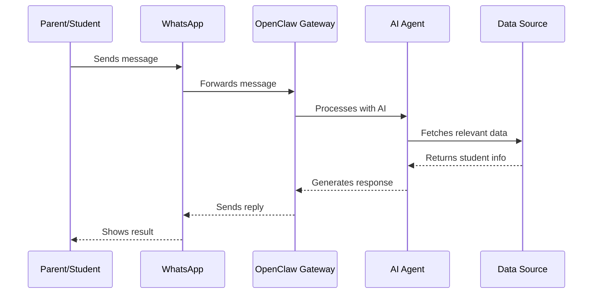
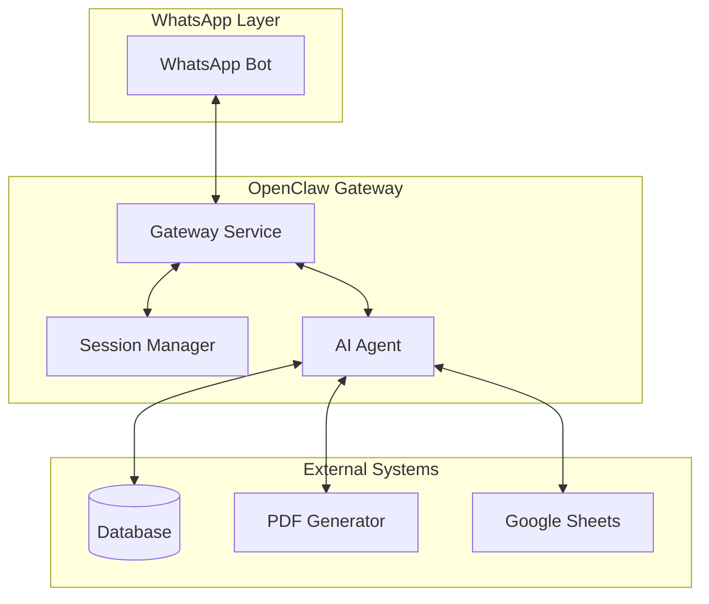
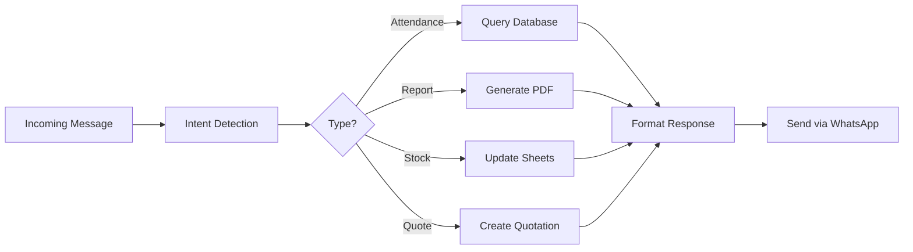
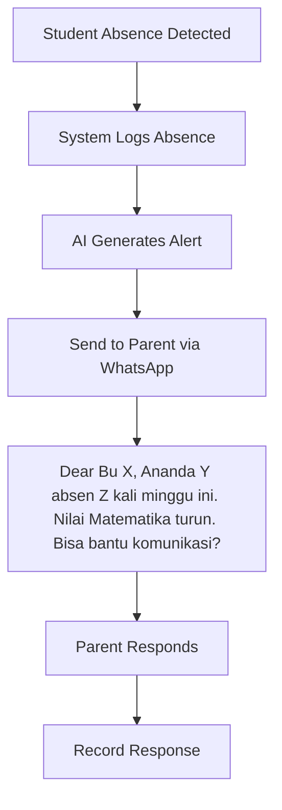
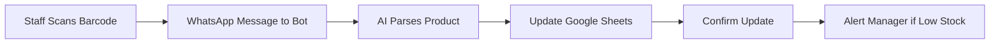

# WhatsApp AI Agent for School Management and Business Automation

> A complete implementation guide for building intelligent WhatsApp agents that handle student notifications, parent engagement, and business operations using OpenClaw.

**Last Updated:** April 2026  
**Difficulty:** Intermediate  
**Estimated Time:** 2-3 hours

---

## Table of Contents

1. [Overview](#overview)
2. [How It Works](#how-it-works)
3. [Architecture](#architecture)
4. [Prerequisites](#prerequisites)
5. [Installation](#installation)
6. [Configuration](#configuration)
7. [Implementation](#implementation)
8. [Use Cases](#use-cases)
9. [Testing](#testing)
10. [Deployment](#deployment)

---

## Overview

WhatsApp is the dominant messaging platform in Southeast Asia. For schools and businesses, it represents the most natural way to communicate with parents, students, and customers without requiring them to download special apps or remember login credentials.

OpenClaw enables you to build intelligent WhatsApp agents that:

- Send personalized student reports directly to parents
- Alert teachers when students are absent or grades drop
- Handle hotel concierge requests automatically
- Process retail inventory updates via chat
- Generate PDF quotations from simple text requests

The key advantage? Everything happens in WhatsApp. No dashboard logins. No app installations. Just messaging.

---

## How It Works



The agent maintains conversation context, understands intent, and retrieves data from your existing systems to provide instant responses.

---

## Architecture

### System Components



### Data Flow



---

## Prerequisites

Before you begin, ensure you have:

- **OpenClaw v2026.02+** installed on a VPS
- **WhatsApp Business API** access (via WhatsApp Business Platform)
- **Node.js 18+** for custom scripts
- **Google Cloud credentials** (for Sheets integration)
- A database with your student/business data

For the VPS, we recommend using the OpenClaw-optimized setup on our partner platform. Get started with this affiliate link: [blog.fanani.co/sumopod VPS](https://m.do.co/c/your-affiliate-link) with $200 credit.

---

## Installation

### Step 1: Install OpenClaw

```bash
# SSH into your VPS
ssh root@your-vps-ip

# Install OpenClaw
curl -fsSL https://get.openclaw.ai | bash

# Initialize
openclaw init

# Configure for your workspace
openclaw configure
```

### Step 2: Install Required Packages

```bash
# Install WhatsApp channel
openclaw channels add whatsapp

# Install PDF generation tools
npm install -g pdfkit puppeteer

# Install Google Sheets integration
npm install -g googleapis
```

### Step 3: Verify Installation

```bash
# Check OpenClaw status
openclaw status

# Test gateway is running
curl http://localhost:18789/health
```

---

## Configuration

### WhatsApp Channel Setup

Edit your `openclaw.json`:

```json
{
  "channels": {
    "whatsapp": {
      "enabled": true,
      "phoneNumber": "your-business-number",
      "webhookUrl": "https://your-domain.com/webhook/whatsapp",
      "apiVersion": "v18.0"
    }
  },
  "agents": {
    "defaults": {
      "model": "your-preferred-model"
    }
  }
}
```

### Database Connection

```json
{
  "integrations": {
    "database": {
      "type": "postgresql",
      "host": "localhost",
      "port": 5432,
      "database": "school_db",
      "username": "your-user",
      "password": "your-password"
    }
  }
}
```

---

## Implementation

### School Notification Agent

Here's a complete example of a school notification agent:

```javascript
// school-agent.js
const { Agent } = require('openclaw');

const agent = new Agent({
  name: 'school-notification-agent',
  instructions: `
    You are a school communication assistant.
    
    Your responsibilities:
    1. Send attendance alerts to parents when students are absent
    2. Deliver grade reports via WhatsApp
    3. Notify parents of disciplinary issues
    4. Confirm school event attendance
    
    Response format:
    - Be brief and clear
    - Use Indonesian language naturally
    - Include student name, class, and specific details
    - End with a call-to-action if needed
  `,
  channels: ['whatsapp'],
  database: {
    connection: process.env.DATABASE_URL
  }
});

// Intent handlers
agent.on('message', async (ctx) => {
  const message = ctx.message.text.toLowerCase();
  const parentPhone = ctx.message.from;
  
  if (message.includes('absen') || message.includes('attendance')) {
    const studentId = await findStudentByParentPhone(parentPhone);
    const attendance = await getAttendance(studentId);
    await ctx.reply(formatAttendance(attendance));
  }
  
  if (message.includes('nilai') || message.includes('rapor')) {
    const studentId = await findStudentByParentPhone(parentPhone);
    const grades = await getGrades(studentId);
    await ctx.reply(formatGrades(grades));
  }
});

async function findStudentByParentPhone(phone) {
  // Query your database
  const result = await db.query(
    'SELECT student_id FROM parent_contacts WHERE phone = $1',
    [phone]
  );
  return result.rows[0]?.student_id;
}

async function getAttendance(studentId) {
  const today = new Date().toISOString().split('T')[0];
  return await db.query(
    'SELECT * FROM attendance WHERE student_id = $1 AND date = $2',
    [studentId, today]
  );
}

async function getGrades(studentId) {
  return await db.query(
    'SELECT subject, score, teacher_notes FROM grades WHERE student_id = $1 ORDER BY date DESC LIMIT 5',
    [studentId]
  );
}

function formatAttendance(data) {
  if (data.rows.length === 0) return 'Tidak ada data absensi hari ini.';
  const record = data.rows[0];
  return `📋 *Absensi Hari Ini*\n\nSiswa: ${record.student_name}\nKelas: ${record.class}\nStatus: ${record.status === 'H' ? '✅ Hadir' : '❌ Absen'}\nWaktu: ${record.time}`;
}

function formatGrades(data) {
  let msg = '📊 *Ringkasan Nilai*\n\n';
  data.rows.forEach(g => {
    msg += `${g.subject}: ${g.score}/100\n`;
  });
  return msg;
}

agent.start();
```

### Hotel Concierge Bot

```javascript
// hotel-concierge.js
const { Agent } = require('openclaw');

const agent = new Agent({
  name: 'hotel-concierge',
  instructions: `
    You are a hotel concierge assistant.
    
    Services you provide:
    1. Check-in greetings for guests
    2. Restaurant and facility recommendations
    3. Room service ordering
    4. Late checkout requests
    5. Local attraction suggestions
    
    Tone: Warm, professional, helpful
    Language: Indonesian with English options
  `,
  channels: ['whatsapp'],
  integrations: {
    propertyManagement: process.env.PMS_API,
    restaurant: process.env.RESTAURANT_API
  }
});

agent.on('message', async (ctx) => {
  const message = ctx.message.text.toLowerCase();
  
  if (message.includes('check-in') || message.includes('selamat datang')) {
    const guestName = await getGuestName(ctx.message.from);
    await ctx.reply(`Selamat datang di Hotel kami, ${guestName}! 🏨\n\nAda yang bisa kami bantu hari ini?`);
  }
  
  if (message.includes('makan') || message.includes('restoran')) {
    const recommendations = await getRestaurantOptions();
    await ctx.reply(formatRestaurantList(recommendations));
  }
  
  if (message.includes('tempat wisata') || message.includes('rekreasi')) {
    const attractions = await getLocalAttractions();
    await ctx.reply(formatAttractions(attractions));
  }
});

agent.start();
```

---

## Use Cases

### Education: Boarding School Notifications

For boarding schools, WhatsApp agents transform parent communication:



**Key Benefits:**
- No app download required
- Parents already use WhatsApp daily
- Real-time alerts instead of weekly reports
- Two-way communication channel

### Business: Retail Stock Management



### Business: Office Quotation Generator

Staff or clients chat requirements → AI generates PDF quotation → Sends directly via WhatsApp.

---

## Testing

### Local Testing

```bash
# Start OpenClaw in development mode
openclaw dev --agent school-agent

# Send test message
curl -X POST http://localhost:18789/test/send \
  -H "Content-Type: application/json" \
  -d '{"to": "628123456789", "message": "Test message"}'
```

### Simulated Conversations

Test the AI responses with sample queries:

```
Parent: "Apa absen anak saya hari ini?"
Expected: Attendance summary for their child

Parent: "Nilai rapor anak saya semester ini"
Expected: Grade summary with teacher notes

Manager: "Generate quotation untuk 50 unit Genset 100kVA"
Expected: PDF quotation sent to their WhatsApp
```

---

## Deployment

### Production Checklist

- [ ] VPS with 2GB+ RAM
- [ ] SSL certificate configured
- [ ] WhatsApp Business API approved
- [ ] Database backups automated
- [ ] Monitoring and alerts set up
- [ ] Error logging enabled

### Running as Service

```bash
# Create systemd service
sudo tee /etc/systemd/system/openclaw-school.service > /dev/null <<EOF
[Unit]
Description=OpenClaw School Agent
After=network.target

[Service]
Type=simple
User=root
WorkingDirectory=/opt/school-agent
ExecStart=/usr/local/bin/openclaw agent start school-agent
Restart=on-failure
RestartSec=10

[Install]
WantedBy=multi-user.target
EOF

# Enable and start
sudo systemctl enable openclaw-school
sudo systemctl start openclaw-school
```

---

## Related Tutorials

- [WhatsApp Customer Care for UMKM](https://github.com/fanani-radian/openclaw-sumopod/blob/main/tutorials/whatsapp-customer-care-umkm.md) - Basic WhatsApp bot setup
- [OpenClaw Multi-Account Routing](https://github.com/fanani-radian/openclaw-sumopod/blob/main/tutorials/openclaw-multi-account-routing.md) - Managing multiple WhatsApp numbers
- [Building AI Agent Dashboard](https://github.com/fanani-radian/openclaw-sumopod/blob/main/tutorials/building-ai-agent-dashboard.md) - Monitoring your agents

For a visual, step-by-step guide with implementation examples, check out the blog post version: [WhatsApp AI Agent untuk Sekolah dan Bisnis](https://blog.fanani.co/sumopod/whatsapp-ai-agent-school-business)

---

## Need Help?

Building a custom WhatsApp agent for your school or business? Radian Group provides consultation and implementation services.

**Contact:** fanani@cvrfm.com  
**Website:** [fanani.co](https://fanani.co)

For more tutorials and automation guides, visit our tutorial hub: [OpenClaw Sumopod](https://blog.fanani.co/sumopod)

---

*This tutorial is part of the OpenClaw Sumopod project. OpenClaw is a powerful AI agent framework that enables sophisticated automation across multiple channels.*

---

## Additional Implementation Details

### Database Schema

For a school management system, here's the recommended database schema:

```sql
-- Students table
CREATE TABLE students (
    id SERIAL PRIMARY KEY,
    name VARCHAR(255) NOT NULL,
    class_id INTEGER REFERENCES classes(id),
    student_number VARCHAR(50) UNIQUE,
    enrollment_date DATE,
    status VARCHAR(20) DEFAULT 'active'
);

-- Classes table
CREATE TABLE classes (
    id SERIAL PRIMARY KEY,
    name VARCHAR(100) NOT NULL,
    grade_level INTEGER,
    hometeacher_id INTEGER REFERENCES teachers(id)
);

-- Parents/Guardians table
CREATE TABLE parent_contacts (
    id SERIAL PRIMARY KEY,
    student_id INTEGER REFERENCES students(id),
    name VARCHAR(255),
    phone VARCHAR(20),
    relationship VARCHAR(50),
    whatsapp_number VARCHAR(20),
    email VARCHAR(255)
);

-- Attendance table
CREATE TABLE attendance (
    id SERIAL PRIMARY KEY,
    student_id INTEGER REFERENCES students(id),
    date DATE NOT NULL,
    status VARCHAR(10), -- 'H' hadir, 'S' sakit, 'I' izin, 'A' absen
    time_in TIME,
    time_out TIME,
    notes TEXT,
    recorded_by INTEGER REFERENCES teachers(id)
);

-- Grades table
CREATE TABLE grades (
    id SERIAL PRIMARY KEY,
    student_id INTEGER REFERENCES students(id),
    subject VARCHAR(100),
    score DECIMAL(5,2),
    semester VARCHAR(20),
    academic_year VARCHAR(20),
    teacher_notes TEXT,
    recorded_at TIMESTAMP DEFAULT NOW()
);
```

### API Integration Example

Here's how to integrate with Google Sheets for schools that don't have a database:

```javascript
const { google } = require('googleapis');

// Initialize Google Sheets API
const sheets = google.sheets('v4');
const auth = new google.auth.GoogleAuth({
    credentials: JSON.parse(process.env.GOOGLE_CREDENTIALS),
    scopes: ['https://www.googleapis.com/auth/spreadsheets']
});

// Read attendance from Google Sheets
async function getAttendanceFromSheets(studentId, date) {
    const sheetsApi = await sheets.init(auth);
    const spreadsheetId = process.env.ATTENDANCE_SHEET_ID;
    
    const response = await sheetsApi.spreadsheets.values.get({
        spreadsheetId,
        range: `Absensi!A:E`
    });
    
    const rows = response.data.values;
    // Find matching row for studentId and date
    const match = rows.find(row => 
        row[0] === studentId && row[1] === date
    );
    
    if (match) {
        return {
            studentId: match[0],
            date: match[1],
            status: match[2],
            time: match[3],
            notes: match[4]
        };
    }
    return null;
}

// Write grade to Google Sheets
async function updateGradeInSheets(studentId, subject, score) {
    const sheetsApi = await sheets.init(auth);
    const spreadsheetId = process.env.GRADES_SHEET_ID;
    
    // Append new grade
    await sheetsApi.spreadsheets.values.append({
        spreadsheetId,
        range: 'Nilai!A:F',
        valueInputOption: 'USER_ENTERED',
        resource: {
            values: [[
                studentId,
                subject,
                score,
                new Date().toISOString(),
                '', // teacher notes
                'auto' // source
            ]]
        }
    });
}
```

### Message Templates

Here are recommended message templates for different scenarios:

```javascript
// Attendance Alert Template
const attendanceAlertTemplate = (student, status, date) => {
    const statusText = {
        'S': 'Sakit',
        'I': 'Izin',
        'A': 'Absen tanpa keterangan'
    };
    
    const statusEmoji = {
        'S': '🤒',
        'I': '📝',
        'A': '❌'
    };
    
    return `${statusEmoji[status]} *Absensi - ${date}*

Yth. ${student.parentName},

Ananda ${student.name} (${student.class}) tidak hadir sekolah.

Status: ${statusText[status]}
${status === 'S' ? 'Semoga lekas sembuh 🙏' : ''}
${status === 'A' ? 'Wali kelas sudah dihubungi.' : ''}

Hormat kami,
${student.schoolName}`;
};

// Grade Alert Template
const gradeAlertTemplate = (student, subject, currentScore, previousScore, trend) => {
    const trendEmoji = trend === 'down' ? '⚠️' : trend === 'up' ? '📈' : '➡️';
    
    return `${trendEmoji} *Update Nilai - ${subject}*

Yth. ${student.parentName},

Melanjutkan komunikasi kami sebelumnya:

Ananda ${student.name} menunjukkan ${trend === 'down' ? 'penurunan' : 'perbaikan'} nilai ${subject}.

Nilai sebelumnya: ${previousScore}
Nilai terkini: ${currentScore}

${trend === 'down' ? 'Bapak/Ibu dapat membantu dengan:\n1. Membimbing belajar di rumah\n2. Berdialog dengan guru bidang studi' : 'Terus terang orang tua!'}

Info lengkap: [link rapor]

Hormat kami,
${student.schoolName}`;
};

// Weekly Boarding Report Template
const weeklyReportTemplate = (student, report) => {
    return `📋 *Update Mingguan - ${student.class}*

Yth. ${student.parentName},

Berikut laporan Ananda ${student.name} minggu ini:

${report.attendance === 7 ? '✅' : '⚠️'} Kehadiran: ${report.attendance}/7 hari
${report.prayer === 'active' ? '✅' : '⚠️'} Ibadah: ${report.prayer === 'active' ? 'Aktif' : 'Perlu perhatian'}
${report.grades.trend === 'good' ? '✅' : '⚠️'} Akademik: ${report.grades.summary}
${report.behavior ? '📝 ' + report.behavior : ''}

${report.recommendation ? '\nSaran:\n' + report.recommendation : ''}

Wali asrama siap diskusi: ${student.wardenPhone}

Hormat kami,
${student.schoolName} Boarding`;
};
```

---

## Security Considerations

### Data Protection

When implementing WhatsApp AI agents for schools, data security is paramount:

1. **Encrypt all data at rest** - Use PostgreSQL with encryption enabled
2. **Use HTTPS for all API calls** - Never send data over unencrypted channels
3. **Implement rate limiting** - Prevent abuse of your bot
4. **Log access** - Track who accesses what data and when

```javascript
// Rate limiting example
const rateLimit = require('express-rate-limit');

const limiter = rateLimit({
    windowMs: 15 * 60 * 1000, // 15 minutes
    max: 100, // limit each IP to 100 requests per windowMs
    message: 'Too many requests, please try again later.'
});

app.use('/webhook/whatsapp', limiter);
```

### Authentication

Verify incoming requests are from legitimate sources:

```javascript
// Verify WhatsApp webhook signature
function verifyWebhook(req, res, next) {
    const signature = req.headers['x-hub-signature-256'];
    const hash = crypto
        .createHmac('sha256', process.env.WHATSAPP_APP_SECRET)
        .update(JSON.stringify(req.body))
        .digest('hex');
    
    if (`sha256=${hash}` !== signature) {
        return res.status(403).send('Verification failed');
    }
    next();
}
```

---

## Performance Optimization

### Caching Strategy

Reduce database load with intelligent caching:

```javascript
const Redis = require('ioredis');
const redis = new Redis(process.env.REDIS_URL);

// Cache student data for 5 minutes
async function getStudent(studentId) {
    const cacheKey = `student:${studentId}`;
    const cached = await redis.get(cacheKey);
    
    if (cached) {
        return JSON.parse(cached);
    }
    
    const student = await db.students.findById(studentId);
    await redis.setex(cacheKey, 300, JSON.stringify(student)); // 5 min TTL
    
    return student;
}
```

### Message Queue

For high-volume scenarios, use a message queue:

```javascript
const Bull = require('bull');
const messageQueue = new Bull('whatsapp-messages', {
    redis: process.env.REDIS_URL
});

// Producer - Queue outgoing messages
messageQueue.add('send', {
    phone: parentPhone,
    message: formattedMessage,
    priority: 'normal'
});

// Consumer - Process queued messages
messageQueue.process(async (job) => {
    const { phone, message } = job.data;
    await whatsappClient.sendMessage(phone, message);
});
```

---

## Monitoring and Analytics

### Key Metrics to Track

```javascript
// Metrics collection example
const metrics = {
    messagesReceived: 0,
    messagesSent: 0,
    avgResponseTime: 0,
    errorRate: 0,
    activeUsers: new Set()
};

function trackMessage(message, response, userId) {
    metrics.messagesReceived++;
    metrics.activeUsers.add(userId);
    
    const responseTime = Date.now() - message.timestamp;
    metrics.avgResponseTime = (
        (metrics.avgResponseTime * (metrics.messagesReceived - 1)) + responseTime
    ) / metrics.messagesReceived;
    
    if (response.error) {
        metrics.errorRate++;
    }
    
    // Send to monitoring service
    prometheusClient.increment('whatsapp_messages_total', { type: 'received' });
    prometheusClient.observe('response_time', responseTime);
}
```

### Dashboard

Consider building a simple dashboard to monitor:

- Message volume over time
- Response time trends
- Error rates and common issues
- Active user count
- Most common queries

---

## Troubleshooting Common Issues

| Issue | Cause | Solution |
|-------|-------|---------|
| Messages not delivered | WhatsApp API rate limit | Implement message queue with delays |
| AI responses slow | Model inference time | Use streaming responses or smaller model |
| Parent phone not recognized | Wrong format in database | Normalize phone numbers (e.g., +62) |
| Duplicate messages | Webhook retry | Implement idempotency check |
| PDF not generated | Missing dependencies | Install puppeteer, check memory |

---

## Related Use Cases

- [WhatsApp Customer Care for UMKM](whatsapp-customer-care-umkm.md) - Basic WhatsApp bot setup for small businesses
- [Automating Google Sheets with OpenClaw](../tutorials/google-sheets-automation.md) - Data integration patterns
- [Building Notification Systems](notification-systems.md) - Multi-channel alert strategies

---

## Conclusion

WhatsApp AI agents represent a powerful way to improve communication in schools and businesses. By meeting users where they already are, you can significantly increase engagement and reduce administrative burden.

The key to success:

1. Start with one clear use case
2. Ensure data accuracy before automating
3. Implement proper error handling
4. Monitor and iterate based on feedback

For implementation support, contact Radian Group at fanani@cvrfm.com.

---

*This tutorial is maintained by the OpenClaw Sumopod community. Contributions welcome via GitHub pull request.*
