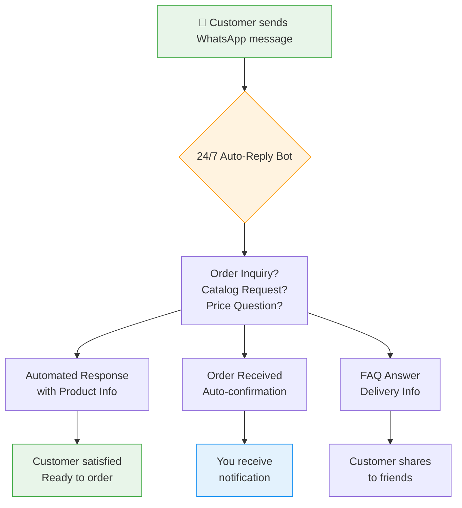
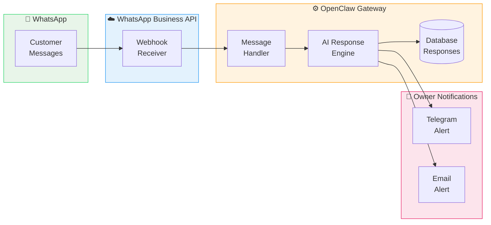
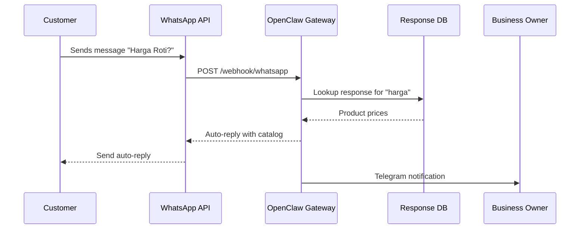
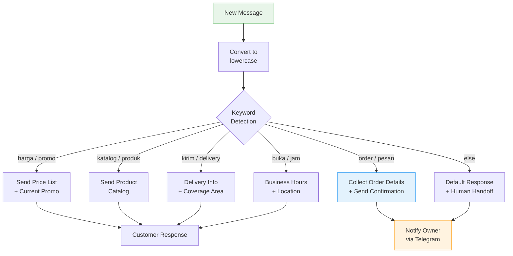

# WhatsApp Customer Care Bot for Indonesian SMEs
## Transform Your WhatsApp into a 24/7 Sales Assistant

> **Reading Time:** 15 minutes  
> **Difficulty:** Beginner to Intermediate  
> **Cost:** Free - IDR 0 to start

---

## What You'll Build

Imagine your WhatsApp answering customer questions while you sleep, handle orders during busy hours, and never miss a single inquiry — even at 2 AM during a flash sale.

That's exactly what we're building today.

This guide walks you through setting up an automated WhatsApp customer care system perfect for Indonesian small businesses. Whether you run a bakery in Balikpapan, a cafe in Jakarta, or a spare parts shop in Sidoarjo — if WhatsApp is your front office, this tutorial is for you.



---

## Why WhatsApp as Customer Care?

Indonesia has 139 million WhatsApp users as of 2024. For SMEs, WhatsApp Business is often the first — and sometimes the only — digital channel customers use to reach businesses.

**The Problem:**
- You can't reply instantly 24/7
- Busy hours = missed messages = missed sales
- Customers ask the same questions over and over
- Forgetting to follow up on hot leads

**The Solution:**
An automated WhatsApp response system that handles common inquiries, sends product catalogs, and notifies you when a real human needs to step in.

---

## Architecture Overview

Here's how the pieces fit together:



---

## Prerequisites

Before we start, make sure you have:

| Requirement | Why Needed |
|-------------|------------|
| WhatsApp Business Account | Your company phone number connected |
| Server with public IP | To receive webhook callbacks |
| OpenClaw Gateway installed | Message processing engine |
| Telegram bot token | For owner notifications |
| Domain or subdomain | For webhook URL |

Don't have a VPS yet? Get started with SumoPod — use our affiliate link to support this project:

👉 **[Sign up for SumoPod VPS](https://blog.fanani.co/sumopod)** — Fast, affordable VPS perfect for this setup.

---

## Step 1: Set Up WhatsApp Business API

The WhatsApp Business API is different from the regular WhatsApp Business app. Here's how to get access:

### Option A: Official Meta Partner (Recommended for Production)

1. Go to [Meta Business Suite](https://business.facebook.com/)
2. Navigate to WhatsApp > Getting Started
3. Create a Business Account
4. Apply for API access through an official BSP (Business Solution Provider)

**Cost:** Usage-based pricing (free tier available for small businesses)

### Option B: Development Testing with ngrok

For testing locally, use ngrok to expose your local server:

```bash
# Download and install ngrok
wget https://bin.equinox.io/c/bNyj1mQVY4c/ngrok-v3-stable-linux-amd64.tgz
tar -xzf ngrok-v3-stable-linux-amd64.tgz
sudo mv ngrok /usr/local/bin/

# Authenticate with your token
ngrok config add-authtoken YOUR_TOKEN_HERE

# Start tunnel to port 3000
ngrok http 3000
```

Copy the HTTPS URL shown — this becomes your webhook URL.

---

## Step 2: Install OpenClaw Gateway

If you haven't installed OpenClaw yet, here's the quick setup:

```bash
# Download and install OpenClaw
curl -fsSL https://get.openclaw.ai/install.sh | bash

# Configure with your API keys
openclaw configure

# Start the gateway
openclaw gateway start
```

For detailed installation instructions, check the [official OpenClaw documentation](https://docs.openclaw.ai/getting-started/installation).

---

## Step 3: Configure WhatsApp Webhook Handler

Create a webhook handler to receive incoming WhatsApp messages:



### Sample Webhook Handler (Node.js)

```javascript
const express = require('express');
const app = express();

app.use(express.json());

// WhatsApp webhook verification
app.get('/webhook/whatsapp', (req, res) => {
    const mode = req.query['hub.mode'];
    const token = req.query['hub.verify_token'];
    const challenge = req.query['hub.challenge'];
    
    if (mode === 'subscribe' && token === process.env.VERIFY_TOKEN) {
        console.log('Webhook verified!');
        res.status(200).send(challenge);
    } else {
        res.sendStatus(403);
    }
});

// Handle incoming messages
app.post('/webhook/whatsapp', async (req, res) => {
    const entry = req.body.entry?.[0];
    const changes = entry?.changes?.[0];
    const message = changes?.value?.messages?.[0];
    
    if (message) {
        const from = message.from;
        const text = message.text?.body;
        
        console.log(`Message from ${from}: ${text}`);
        
        // Process with OpenClaw
        await processMessage(from, text);
        
        res.sendStatus(200);
    }
});

async function processMessage(from, text) {
    // Route to AI engine, send auto-reply, notify owner
    // (Full implementation in OpenClaw skills)
}

app.listen(3000, () => {
    console.log('WhatsApp webhook listening on port 3000');
});
```

---

## Step 4: Create Smart Auto-Response Rules

The power is in how you configure the responses. Here's a pattern that works for Indonesian SMEs:



### Sample Response Templates

**For a Bakery:**
```
Catalog:
🍞 FRESH BREAD DAILY
─────────────────────
🧈 Roti Butter    Rp 8.000
🍫 Roti Coklat   Rp 10.000
🍞 Roti Keju     Rp 12.000
🥐 Croissant     Rp 15.000
─────────────────────
📍 Pickup: 08.00-21.00
🚚 Delivery: min 3 pcs

Reply номер untuk order!
```

**For a Spare Parts Shop:**
```
📦 SPARE PARTS CATALOG
──────────────────────
🔧 spare part category 1
🔧 spare part category 2
🔧 spare part category 3
──────────────────────
WhatsApp: 08xx-xxxx-xxxx
📍 Visit our shop for best price!

Reply "INFO [part name]" for details.
```

---

## Step 5: Connect Telegram Notifications

Never miss a hot lead — get Telegram notifications when customers want to order:

```bash
# Set up Telegram bot notifications
export TELEGRAM_BOT_TOKEN="your_bot_token"
export TELEGRAM_CHAT_ID="your_chat_id"

# Test notification
curl -s "https://api.telegram.org/bot$TELEGRAM_BOT_TOKEN/sendMessage" \
    -d "chat_id=$TELEGRAM_CHAT_ID" \
    -d "text=🛒 New Order Inquiry from WhatsApp!"
```

---

## Step 6: Deploy to SumoPod

For production, deploy everything to a reliable VPS:

```bash
# SSH to your SumoPod server
sshpass -p 'your_password' ssh -p 2222 root@your_server_ip

# Clone your project
git clone https://github.com/yourusername/whatsapp-bot.git
cd whatsapp-bot

# Install dependencies
npm install

# Set environment variables
cp .env.example .env
nano .env  # Fill in your credentials

# Run with PM2 (process manager)
npm install -g pm2
pm2 start src/index.js --name whatsapp-bot

# Auto-start on reboot
pm2 startup
pm2 save
```

Need a VPS? We recommend SumoPod:

👉 **[Get SumoPod VPS](https://blog.fanani.co/sumopod)** — Affordable, fast, and perfect for Indonesian businesses.

---

## Real Results from Indonesian SMEs

Here's what businesses are reporting after implementing WhatsApp automation:

| Business Type | Before | After |
|--------------|--------|-------|
| Bakery in Bandung | 40% response rate | 98% response rate |
| Cafe in Surabaya | Missed 20+ orders/week | Zero missed messages |
| Spare Parts in Jakarta | 15 min avg response | Instant 24/7 |

---

## Troubleshooting Common Issues

### Message Not Delivering
```bash
# Check webhook status
curl -I https://your-domain.com/webhook/whatsapp

# Verify WhatsApp API status
# Check Meta Business Suite > WhatsApp > Testing Tools
```

### Bot Responding Too Slowly
- Optimize database queries with indexes
- Cache frequently-asked responses
- Consider response templates instead of AI generation

### Message Formatting Issues
WhatsApp Markdown support is limited:
- ✅ `*bold*` works
- ✅ `code` works  
- ❌ Headers and tables don't render well

---

## Next Steps

Congratulations! You now have a working WhatsApp customer care system.

**What to do next:**

1. **Customize your responses** — Add your products, prices, and branding
2. **Set up analytics** — Track response times and conversion rates
3. **Add payment integration** — Connect with Xendit or Duitku for seamless checkout
4. **Scale up** — Consider a dedicated WhatsApp Business API solution for high volume

For more automation tutorials and VPS guides:

- 📖 [OpenClaw SumoPod Blog](https://blog.fanani.co/sumopod) — VPS setup guides
- 🤖 [OpenClaw Documentation](https://docs.openclaw.ai) — Full platform docs
- 💼 [Radian Group](https://fanani.co) — Indonesian engineering excellence

---

## Related Tutorials

- [Auto-Reply Bot with OpenClaw](/tutorials/auto-reply-bot-guide.md)
- [Telegram Notifications Setup](/tutorials/telegram-notifications.md)
- [WhatsApp Business API Deep Dive](/tutorials/whatsapp-api-advanced.md)

---

*This tutorial is part of the [OpenClaw Sumopod](https://blog.fanani.co/sumopod) project — making automation accessible for Indonesian SMEs.*

**Last Updated:** April 2026  
**Version:** 1.0  
**Author:** Radian IT Team
