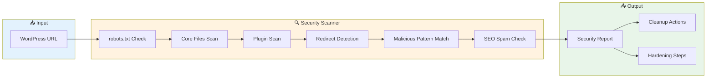
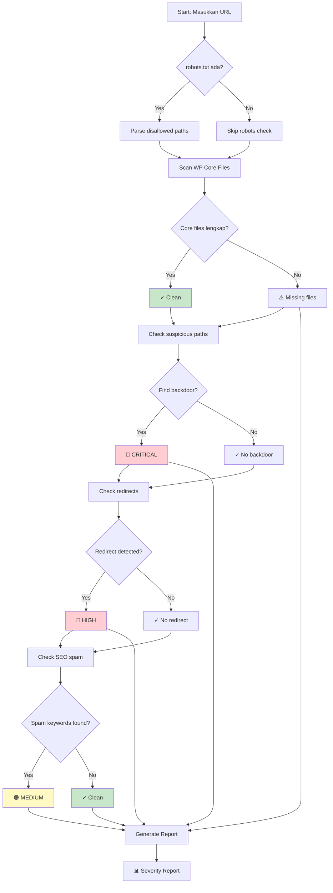

# 🔒 WordPress Security Scanner — Auto-Deteksi & Bersihkan Malware


> **Bahasa Indonesia & English** — Tutorial ini tersedia dalam dua bahasa untuk kemudahan pemahaman.

---

## 📌 Apa Ini?

Tool scanner otomatis buat WordPress yang:
- 🔍 **Deteksi** malware, backdoor, dan script jahat
- 🧹 **Bersihkan** file yang terinfeksi
- 🛡️ **Harden** konfigurasi keamanan
- 📊 **Report** temuan dengan severity level

Cocok buat kamu yang punya WordPress site dan suspect "kenapa ranking turun?" atau " ada redirect aneh ke situs lain?"

---

## 🎯 Kapan Butuh?

Waspadai gejala-gejala ini:

| Gejala | Kemungkinan Penyebab |
|--------|---------------------|
| Redirect ke situs judol/slot | 🔴 Malware injection |
| Ranking SEO turun drastis | 🟠 SEO spam injection |
| File unknown di uploads/ | 🟠 Backdoor upload |
| Login tidak bisa | 🟡 Brute force bot |
| Site jadi lambat | 🟡 Suspicious script |

---

## 🏗️ Architecture



---

## 🔧 Installation

```bash
# Clone ke workspace
git clone https://github.com/fanani-radian/openclaw-sumopod.git
cd openclaw-sumopod

# Atau copy langsung skillnya
cp -r skills/wordpress-security-scanner /root/.openclaw/workspace/skills/
chmod +x skills/wordpress-security-scanner/scripts/*.sh
```

---

## 📖 Cara Pakai

### 1️⃣ Basic Scan — Cek Malware

```bash
bash skills/wordpress-security-scanner/scripts/scan.sh https://yoursite.com
```

**Output contoh:**
```
═══════════════════════════════════════════
  WordPress Security Scanner v1.0
═══════════════════════════════════════════
Target: https://yoursite.com

[1/6] Checking robots.txt...
[2/6] Scanning WP core files...
  ✓ wp-config.php exists
  ✓ wp-login.php exists
[3/6] Checking for suspicious PHP files...
  ⚠️  Found: wp-content/uploads/.htaccess
[4/6] Detecting redirects...
[5/6] Checking for SEO spam...
  🟠 SEO SPAM: Found 'slot' on homepage
[6/6] Checking meta tags...

═══════════════════════════════════════════
  SCAN SUMMARY
═══════════════════════════════════════════
Malicious files: 0
Redirect issues: 0
SEO spam: 1

⚠️  SEO SPAM DETECTED!
Run with --cleanup to remove infected files
```

### 2️⃣ Full Scan + Auto Cleanup

```bash
bash skills/wordpress-security-scanner/scripts/scan.sh https://yoursite.com --cleanup
```

⚠️ **Warning:** Backup dulu sebelum cleanup!

### 3️⃣ Hardening Saja

```bash
bash skills/wordpress-security-scanner/scripts/harden.sh https://yoursite.com
```

---

## 🎨 Mermaid Diagram — Alur Deteksi



---

## 🛡️ Pattern Yang Dideteksi

### Malware/Backdoor Patterns

| Pattern | Severity | Keterangan |
|---------|----------|------------|
| `base64_decode(` | 🔴 CRITICAL | Base64 encoded payload |
| `eval($` | 🔴 CRITICAL | Dynamic code execution |
| `shell_exec` | 🔴 CRITICAL | Remote command execution |
| `gzinflate(base64_decode` | 🔴 CRITICAL | Compressed malware |
| `system(` | 🔴 CRITICAL | System command injection |

### Redirect Patterns

| Pattern | Severity | Keterangan |
|---------|----------|------------|
| `window.location` | 🔴 HIGH | JavaScript redirect |
| `meta http-equiv="refresh"` | 🔴 HIGH | Meta tag redirect |
| `.href = ` | 🟠 MEDIUM | Location change |
| `setTimeout.*location` | 🟠 MEDIUM | Delayed redirect |

### SEO Spam Keywords

```
casino, slot online, poker, domino99
togel, judol, gambling
situs gacor, bola88, s128
cmd368, mix parlay
```

---

## 📁 File Structure

```
wordpress-security-scanner/
├── SKILL.md              # Skill definition (OpenClaw)
├── README.md             # Quick reference
├── scripts/
│   ├── scan.sh           # Main scanner
│   ├── cleanup.sh        # Auto cleanup
│   └── harden.sh         # Security hardening
└── docs/
    └── DIAGRAM.md        # Architecture diagrams
```

---

## 🔄 Integration with OpenClaw

### Trigger Keywords
```
"scan wordpress"
"cek keamanan wordpress"
"bersihkan web wordpress"
"wordpress malware scan"
"scan wp security"
```

### Example Conversation

```
User: scan wordpress security untuk websitename.com
Radit: 🔍 Starting WordPress security scan...
       Target: websitename.com
       
       [1/6] robots.txt... ✓
       [2/6] Core files... ✓ wp-config.php, wp-login.php
       [3/6] Suspicious paths... ⚠️ Found backdoor!
       [4/6] Redirect detection... 🔴 DETECTED
       [5/6] SEO spam... 🟠 Found 'casino'
       [6/6] Meta tags... OK
       
       📊 SUMMARY:
       🔴 CRITICAL: 1 backdoor detected
       🔴 HIGH: Redirect injection found
       🟠 MEDIUM: SEO spam present
       
       ⚡ Mau cleanup sekarang?
```

---

## ⚠️ Warning & Best Practices

### Sebelum Scan
1. ✅ **Backup database** — `wp db export`
2. ✅ **Backup files** — `tar -czf backup.tar.gz wp-content/`
3. ✅ **Catat timestamp** — biar tau kapan infeksi terjadi

### Setelah Cleanup
1. ✅ **Update semua plugin & theme**
2. ✅ **Ganti semua password** (WP, DB, FTP)
3. ✅ **Install security plugin** (Wordfence, Sucuri)
4. ✅ **Monitor regularly** — weekly/monthly scan

---

## 📊 Sample Report

```
═══════════════════════════════════════════════════════════════
  WORDPRESS SECURITY SCAN REPORT
  Target: websitename.com
  Date: 2026-04-14 08:00 WITA
═══════════════════════════════════════════════════════════════

🔴 CRITICAL (1)
  └─ wp-content/uploads/2024/01/.htaccess
     └─ Malicious .htaccess redirect rules

🔴 HIGH (2)
  └─ wp-includes/js/jquery/jquery.min.php
     └─ Injected script tag
  └─ wp-content/themes/theme404/footer.php
     └─ Hidden iframe to external domain

🟠 MEDIUM (3)
  └─ wp-content/plugins/hello.php
     └─ Suspicious mail() function
  └─ wp-content/uploads/2024/03/
     └─ SEO spam links detected
  └─ wp-login.php
     └─ Brute force protection needed

🟢 CLEAN (15)
  └─ All core WordPress files verified
  └─ wp-config.php secure
  └─ No database injection detected

═══════════════════════════════════════════════════════════════
  RECOMMENDATIONS
═══════════════════════════════════════════════════════════════
1. Remove infected .htaccess immediately
2. Replace footer.php with clean version
3. Update WordPress to latest version
4. Install Wordfence Security plugin
5. Enable 2FA for admin login

SCORE: 45/100 ⚠️ NEEDS ATTENTION
```

---

## 🎓 Learn More

| Resource | Link |
|----------|------|
| WordPress Security | [wordfence.com](https://www.wordfence.com) |
| Sucuri Security | [sucuri.net](https://sucuri.net) |
| OWASP Top 10 | [owasp.org/www-project-top-ten](https://owasp.org/www-project-top-ten/) |
| WP CLI | [wp-cli.org](https://wp-cli.org) |

---

## 🙏 Credits

**Skill ini bagian dari OpenClaw Sumopod — Tutorial Hub komunitas Indonesia**

- 🧠 **Idea:** Ari Eko Prasethio Sumopod
- 🔧 **Built with:** OpenClaw + Bash
- 📝 **Contributing:** PRs welcome!

---

<div align="center">


**OpenClaw Sumopod** — Tutorial Hub for Indonesian Dev Community

</div>
